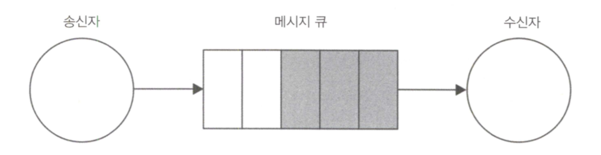
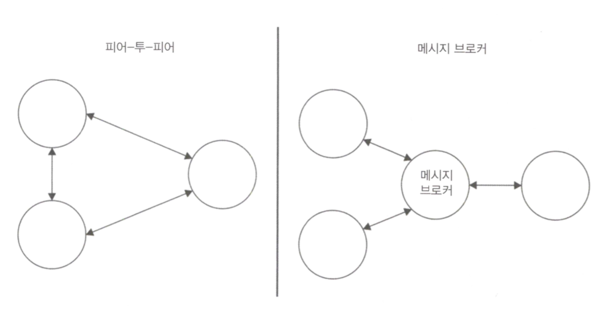
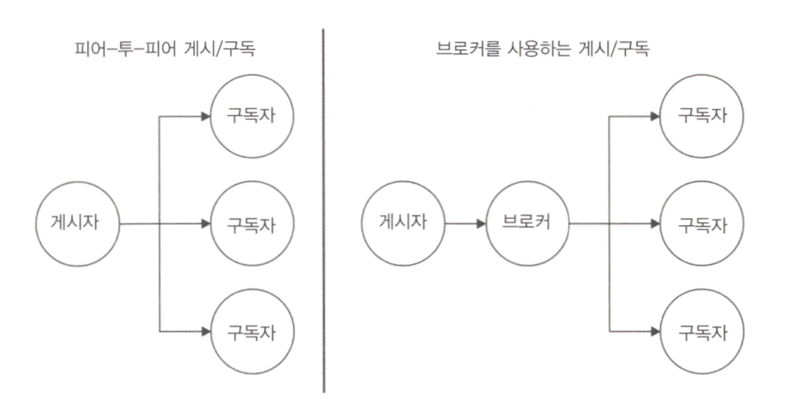
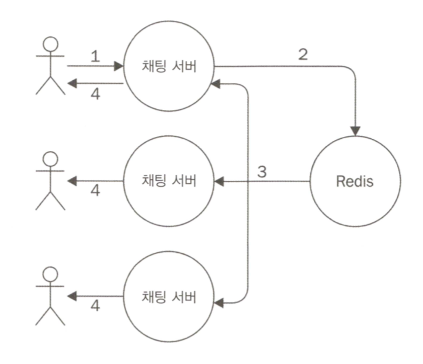
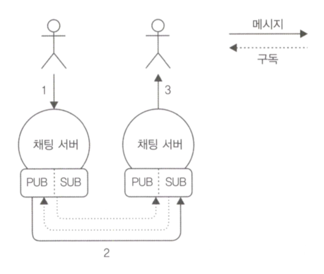

# 11. 메세징과 통합 패턴

여태까지 분할에 대해 알아봤는데, 이번에는 시스템 통합에 관한내용<br />
분산 어플리케이션 통합에는 두 가지 주요 기술이 있는데, `중앙 조정자를 만들어서 모든 정보를 보관하는 것`, `메세지를 사용하여 시스템 전체에 데이터, 이벤트 및 명령을 전파하는 것`<br />
후자를 알아보즈아~<br />
기업 통합 패턴(Enterprise Integration Patterns, GregorHohpe / BobbyWollf 저)에 65가지 바이블이 있으니 참고할 것

- 메시징 시스템의 기본 사항
- 게시(publish)/구독(subscribe) 패턴
- 파이프라인 및 작업 분배 패턴
- 요청(request)/응답(reply) 패턴

## 11-1. 메시징 시스템의 기본 사항

고려해야할 4가지 기본 요소가 있음

1. 단방향 또는 요청/응답 교환할 수 있는 통신의 방향
2. 내용을 결정하는 메시지의 목적
3. 즉시 또는 나중에(비동기식으로) 전송 및 수신할 수 있는 메시지 타이밍
4. 직접 또는 브로커를 통해 발생할 수 있는 메시지의 전달

### 11-1-1. 단방향 및 요청/응답 턴

가장 간단한 통신 패턴은 메시지가 소스 -> 대상으로 단방향 푸쉬(push)되는 경우. 많은 설명이 필요하지 않음

```
________              ________
|      |     push     |       |
| 시작점 | ===========> | 도착점 |
|______|              |_______|
```

단방향 통신의 일반적인 예 : WebSocket을 사용하여 연결된 브라우저에 메시지를 보내거나, 일련의 작업자들에게 작업을 배포하는 시스템

<hr />

그러나 단방향 통신에 비해 웹 서비스 호출같은 요청/응답(양방향) 패턴이 훨씬 인기 있음

```
________              ________
|      |   1.요청      |       |
|      | ===========> | 도착점  |
| 시작점 |   2.응답      |       |
|      | <=========== |       |
|______|              |_______|
```

<hr />

요청/응답 패턴은 구현하기 쉬워보이나, 통신이 비동기이거나 여러 개의 노드가 포함되어 있으면 복잡해짐

```
                  _____________________________________
________          |    ________           ________    |
|      |   1.요청  |    |       |   2.요청  |       |   |
|      | =========|==> |       | ========>|       |   |
|      |          |    |       |          |       |   |
|      |          |    |       |          |       |   |
|      |          |    |_______|          |_______|   |
|      |   3.응답  |                          ||       |
|      | <========|============================       |
|      |          |___________________________________|
________
```

각 노드의 통신 방향은 단방향이나, 전체 관점에서 보면 시작점에서 요청을 보내고 다른 노드에게 응답받음.<br />
실제 요청/응답 패턴과 단방향 순환의 차이점은 요청과 응답의 관계(응답은 요청과 동일한 컨텍스트에서 처리)

### 11-1-2. 메시지 유형

메시지는 다른 소프트웨어 컴포넌트를 연결하는 수단.<br />
메시지 목적에 따라 세가지 유형으로 식별 가능

- 명령 메시지
- 이벤트 메시지
- 도큐먼트 메시지

<b>명령 메시지(Command Message)</b>

6장 디자인 패턴에서 나온 직렬화 된 명령 객체. 수신 측에서 어떤 동작이나 작업을 수행하도록 하는 것.<br />
실행에 주어지는 인자 값 같은 기본적인 정보를 가지고 있어야함. RESTful 호출도 간단한 예

<b>이벤트 메시지(Event Message)</b>

다른 컴포넌트에서 뭔가 발생했음을 알리는데 사용.<br />
브라우저에서 롱 폴링(long polling)이나 WebSocket을 통해 데이터나 시스템이 변화되었을 때 서버로부터 알림받기 / 모든 노드를 동일한 페이지에서 유지할 수 있도록 함(분산 어플리케이션에서 중요한 통합 메커니즘)

<b>도큐먼트 메시지(Document Message)</b>

컴포넌트와 시스템 간의 데이터 전송을 의미. 일반적으로 명령 메시지에 대한 응답에는 요청 데이터 또는 작업의 결과만 포함되므로 도큐먼트 메시지인 경우가 많음(api요청시 json응답)

### 11-1-3. 비동기 메시징 및 큐

동기 - 전화 통화 / 비동기 - SMS<br />
여러 수신자에게 여러 개의 sms를 보내고, 순서와 상관없이 응답 받을 수 있음<br />
또 다른 중요한 이점으로 메시지를 저장한 이후, 일정 지연 후에 전달할 수 있다는 점~ 수신자가 메시지를 처리하기에 바쁘거나 메시지 전달을 보장하고자 할 때 유용



수신 불가시 메시지는 대기열에 쌓이고, 가능해질 때 즉시 발송.<br />

### 11-1-4. 피어 투 피어 또는 브로커 기반 메시징

수신자에게 직접 전달하면 P2P, 중앙 중계 시스템을 이용하면 브로커



P2P에서는 각 노드가 수신자 주소와 포트를 알아야하고 프로토콜, 메시지 형식을 이해하고 있어야함을 의미<br />
반면 브로커는 브리지 역할을 하기 때문에 세부 정보를 알지 못해도 많은 피어(peer)들과 통신<br />

브로커의 단점

- 브로커 장애 터지면 다 노답
- 규모나 처리에 따른 브로커 확장에 대한 부담, 피어 투 피어는 인과관계 있는 애들만 확장하면 됨
- 브로커 없이 메시지를 교환하면 더 빠름

## 11-2. 게시/구독 패턴

잘 알려진 단방향 메시징 패턴 -> 결국 분산된 관찰자 패턴임<br />



게시자는 메시지의 수신자가 누구인지 미리 알 필요가 없는 점이 특별함<br />
게시/구독(pub/sub) 패턴의 양쪽이 느슨하게 결함되어 있어, 진화하는 분산 시스템의 노드를 통합하는데 이상적

### 11-2-1. 간단한 실시간 채팅 어플ㄹ리케이션 만들기

서버 측 구현

```javascript
"use strict";

const WebSocketServer = require("ws").Server;

//static file server
const server = require("http").createServer(
  //[1]
  require("ecstatic")({ root: `${__dirname}/www` })
);

const wss = new WebSocketServer({ server: server }); //[2]
wss.on("connection", ws => {
  console.log("Client connected");
  ws.on("message", msg => {
    //[3]
    console.log(`Message: ${msg}`);
    broadcast(msg);
  });
});

function broadcast(msg) {
  //[4]
  wss.clients.forEach(client => {
    client.send(msg);
  });
}

server.listen(process.argv[2] || 8080);
```

클라이언트 측 구현

```html
<!DOCTYPE html>
<html>
  <head>
    <script>
      var ws = new WebSocket("ws://" + window.document.location.host);
      ws.onmessage = function(message) {
        var msgDiv = document.createElement("div");
        msgDiv.innerHTML = message.data;
        document.getElementById("messages").appendChild(msgDiv);
      };

      function sendMessage() {
        var message = document.getElementById("msgBox").value;
        ws.send(message);
      }
    </script>
  </head>
  <body>
    Messages:
    <div id="messages"></div>
    <input type="text" placeholder="Send a message" id="msgBox" />
    <input type="button" onclick="sendMessage()" value="Send" />
  </body>
</html>
```

여기서 `서로 다른 두 서버`에 연결된 클라이언트가 대화 `메시지를 교환`할 수 있도록 확장하는 것이 목표

### 11-2-2. 메시지 브로커로 Redis 사용하기

Redis는 브로커라기보다는 데이터베이스. 그러나 중앙 집중식 게시/구독 패턴을 구현하도록 설계된 명령 쌍이 존재.<br />
Redis를 메시지 브로커로 사용하여 채팅 서버를 통합해 보즈아~



각 서버는 구독자이면서 게시자.

```javascript
"use strict";

const WebSocketServer = require("ws").Server;
const redis = require("redis"); // [1]
const redisSub = redis.createClient();
const redisPub = redis.createClient();

//static file server
const server = require("http").createServer(
  require("ecstatic")({ root: `${__dirname}/www` })
);

const wss = new WebSocketServer({ server: server });
wss.on("connection", ws => {
  console.log("Client connected");
  ws.on("message", msg => {
    console.log(`Message: ${msg}`);
    redisPub.publish("chat_messages", msg); // [2]
  });
});

redisSub.subscribe("chat_messages"); // [3]
redisSub.on("message", (channel, msg) => {
  wss.clients.forEach(client => {
    client.send(msg);
  });
});

server.listen(process.argv[2] || 8080);
```

1. 두개의 다른 연결(채널 구독/메시지 게시)을 인스턴스화(Redis에서는 연결이 구독자 모드로 설정되면 구독 명령만 사용할 수 있기 때문에 두번째 연결이 필요)
2. 클라이언트에서 새 메시지를 맏으면 chat_message `채널`에 게시. 서버가 동일한 채널에 가입되어 있어서, Redis를 통해 다시 돌아올 것이기 때문에 메시지를 클라이언트에 직접 브로드캐스트 하지 않음.
3. 현재 서버 또는 다른 대화서버에서 게시된 모든 메시지를 수신하도록 리스너 등록. 메시지가 수신되면 모든 클라이언트에 메시지를 브로드 케스트

### 11-2-3. 0MQ(Zero MQ)를 사용한 피어 투 피어 게시/구독

단일 실패 지점이 존재하지 말아야 하는 경우 피어 투 피어가 유리

<b>채팅 서버를 위한 피어-투-피어 아키텍처 설계</b>

0MQ에는 PUB과 SUB 두가지 유형의 소켓이 존재. 일반적인 패턴은 PUB 소켓을 다른 SUB 소켓 수신 포트에 바인딩하는 것.<br />
필터가 존재해서 구독 필터가 적용된 후에만 브로드캐스트 수신.



<b>0MQ PUB/SUB 소켓 사용하기</b>

```javascript
"use strict";

const WebSocketServer = require("ws").Server;
const args = require("minimist")(process.argv.slice(2)); // [1]
const zmq = require("zmq");

//static file server
const server = require("http").createServer(
  require("ecstatic")({ root: `${__dirname}/www` })
);

const pubSocket = zmq.socket("pub"); // [2]
pubSocket.bind(`tcp://127.0.0.1:${args["pub"]}`);

const subSocket = zmq.socket("sub"); // [3]
const subPorts = [].concat(args["sub"]);
subPorts.forEach(p => {
  console.log(`Subscribing to ${p}`);
  subSocket.connect(`tcp://127.0.0.1:${p}`);
});
subSocket.subscribe("chat");

subSocket.on("message", msg => {
  // [5]
  console.log(`From other server: ${msg}`);
  broadcast(msg.toString().split(" ")[1]);
});

const wss = new WebSocketServer({ server: server });
wss.on("connection", ws => {
  console.log("Client connected");
  ws.on("message", msg => {
    // [4]
    console.log(`Message: ${msg}`);
    broadcast(msg);
    pubSocket.send(`chat ${msg}`);
  });
});

function broadcast(msg) {
  wss.clients.forEach(client => {
    client.send(msg);
  });
}

server.listen(args["http"] || 8080);
```

1. 명령어 인자 파싱하기위한 라이브러리
2. PUB 소켓을 만들고 --pub에 해당하는 포트에 바인드
3. SUB 소켓을 만들고 다른 인스턴스의 PUB 소켓에 연결. 'chat' 문자열로 시작되는 메시지만 수신하게 됨
4. WebSocket에서 새 메시지를 받으면 연결된 모든 클라이언트에 브로드캐스트 하지만 PUB 소켓을 통해서도 게시됨.
5. 우리는 SUB 소켓에서 도착하는 메시지를 들음. chat 접두어를 제거한 후 WebSocket 서버에 연결된 모든 클라이언트로 브로드캐스트

### 11-2-4. 영구 구독자(Durable subscribers)

메시징 시스템에서 중요한 추상화는 메시지 큐(MQ)<br />
메시지 큐의 경우, 대기열 시스템은 수신자가 메시지를 수신할 수 있을 때까지 메시지들을 저장하므로 메시지 발신자와 수신자가 동시에 활성화되고 연결될 필요는 없음.<br />
구독자가 연결된 동안에만 수신할 수 있는 설정후 잊어버리기(set and forget) 패러다임과 반대되는 것.<br />
