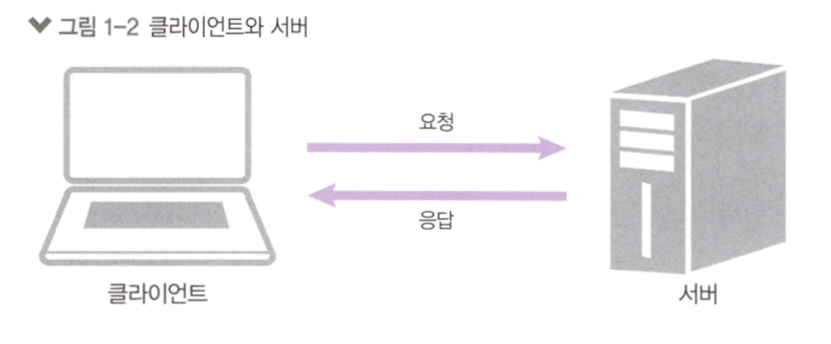
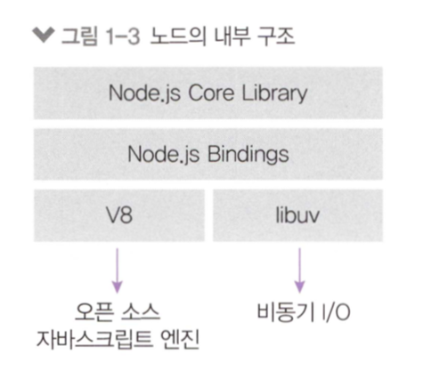
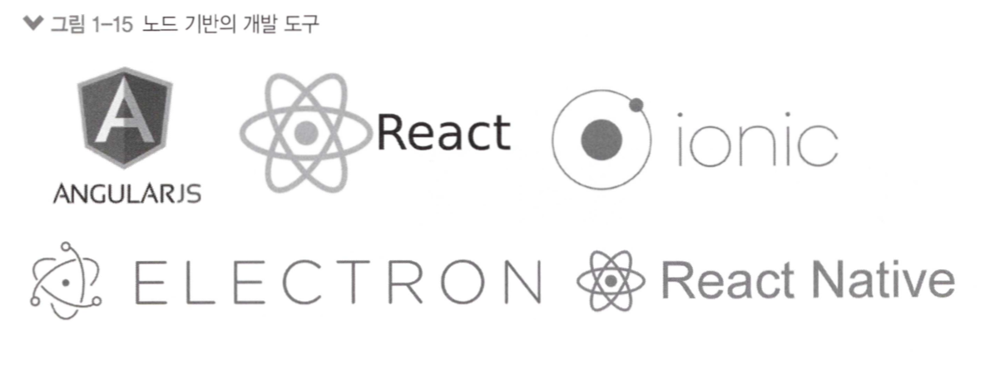

# 01 노드 시작하기


* * *
### 핵심 개념 이해하기

- Node.js는 이벤트 기반, 논블로킹 I/O 모델을 사용해 가볍고 효율적이다.
- Node.js의 패키지 생태계인 npm은 세계에서 가장 큰 오픈 소스 라이브러리 생태계다.
- 서버와 런타임으로 이용한다.

#### 서버

- 노드는 다양한 자바스크립트 애플리케이션을 실행할 수 있지만, 서버 애플리케이션을 실행하는 데 제일 많이 이용된다.
- 서버는 네트워크를 통해 클라이언트에 정보나 서비스를 제공하는 컴퓨터나 프로그램이다.



#### 자바스크립트 런타임

- 노드는 자바스크립트 런타임, 런타임은 특정 언어로 만든 프로그램을 실행할 수 있는 환경을 뜻하고, 따라서 노드는 자바스크립트로 만든 프로그램을 컴퓨터에서 실행할 수 있게 해줍니다.
- 기존에는 자바스크립트 프로그램을 브라우저에서만 실행하였으나, 2009년 V8엔진 기반의 노드 프로젝트를 시작하였고, 노드를 이용하여 브라우저 외의 환경에서 실행이 가능해졌습니다.


- libuv 라이브러리는 노드의 특성인 이벤트 기반, 논블로킹 I/O 모델을 구현하고 있습니다.

#### 이벤트 기반

- 이벤트 기반이란 이벤트가 발생할 때 미리 지정해둔 작업을 수행하는 방식(이벤트로는 클릭이나 네트워크 요청 등이 있음)
- 특정 이벤트가 발생할 때 무엇을 할지 미리 등록(=이벤트 리스너에 콜백함수를 등록) 


- 이벤트 루프 : 여러 이벤트가 발생할 때 어떤 순서로 콜백을 호출할 지 이벤트 루프가 판단

#### 논블로킹 I/O

- 논블로킹이란 이전 작업이 완료될 때까지 멈추지 않고, 다음 작업을 수행하는 것.


- 블로킹보다 논블로킹이 같은 작업을 더 짧은 시간 동안 처리할 수 있지만, 싱글 스레드라는 한계 때문에 자바스크립트의 모든 코드가 시간적 이득을 보는 것은 아니다.
- 노드 프로세스 외의 다른 컴퓨팅 자원을 활용할 수 있는 I/O 작업에서 주로 시간적 이득을 볼 수 있다.

``` javascript

    function longRunningTasck(){
        // 오래 걸리는 작업
        console.log('작업 끝');
    }
    console.log('시작');
    longRunningTask();
    console.log('다음 작업');

    /*
        시작
        작업 끝
        다음 작업
    */

    function longRunningTasck(){
        // 오래 걸리는 작업
        console.log('작업 끝');
    }
    console.log('시작');
    setTimeout(longRunningTask, 0);
    console.log('다음 작업');

    /*
        시작
        다음 작업
        작업 끝
    */
    
```

- setTimeout의 콜백 함수가 태스크 큐로 보내지므로 순서대로 실행되지 않는다는 것을 알 수 있음.

#### 싱글 스레드

- 자바스크립트와 노드는 싱글 스레드이고, 이는 한 번에 한 가지 일밖에 처리하지 못하므로 블로킹이 발생하면 다음일을 처리하지 못합니다. 그래서 논블로킹이 중요합니다.
- 여러 개의 일을 동시에 처리할 수 있는 __멀티스레드__가 __싱글스레드__보다 좋아 보이지만 항상 그런것은 아닙니다.
    - 쓰레드간 작업전환 시간
    - I/O 성능은 쓰레드 수와 상관없이 동일
    - 그렇다면 멀티스레드는 왜 쓸까? 코드 간결(분리), 자원공유가 효율적
* * *

### 서버로서의 노드

- 노드가 싱글 스레드와 논블로킹 모델을 사용하므로, 서버 모델 또한 동일하다.
- 노드 서버는 I/O가 많은 작업에 적합하다.
- 하지만 CPU 부하가 큰 작업에는 적합하지 않다.(CPU 연산을 많이하면 블로킹이 발생하여 싱글스레드가 감당하기 어려움)
    - 하나뿐인 스레드가 에러로 인해 멈추지 않도록 잘 관리해야함.
- 노드 서버는 웹 서버가 내장되어 입문자도 쉽게 접근이 가능하다. (서버 규모가 커지면 다른 웹 서버가 필요함)
- 가장 큰 장점은 자바스크립트를 이용 => 하나의 언어로 웹 사이트 개발 (개발 생산성 UP)


- 노드 서버 활용 
    - 개수는 많지만 크기가 작은 데이터를 주고 받는 실시간 서비스
    - 실시간 채팅 어플리케이션, 주식 차트
    - JSON데이터를 제공하는 API 서버
    
- 이미지나 비디오 처리, 대규모 데이터 처리 등 CPU를 많이 사용하는 서버로는 적합하지 않음.
- 활용 사례 : 미국항공우주국, 에어비엔비, 우버이츠, 넷플릭스, 링크드인, 페이팔, 이베이, 월마트 등 대기업에서도 사용 => 안정성과 보안성 측면에서 검증.

### 서버 외의 노드

- 서버 이외에도 웹, 모바일, 데스크톱 애플리케이션 개발에 이용
- 프론트앤드 앱 : Angular, React / 모바일 : React Native, Ionic Framework / 데스크톱 : Electron



### 함께 보면 좋은 자료

- [노드 공식 사이트](https://nodejs.org/ko)
- [노드 공식 사이트의 가이드](https://nodejs.org/en/docs/guides/)
- [이벤트 루프에 대한 시각적 설명](http://latentflip.com/loupe)
- [이벤트 루프에 대한 설명](https://nodejs.org/ko/docs/guides/event-loop-timers-and-nexttick/)
- [VS Code 공식 사이트](https://code.visualstudio.com/)