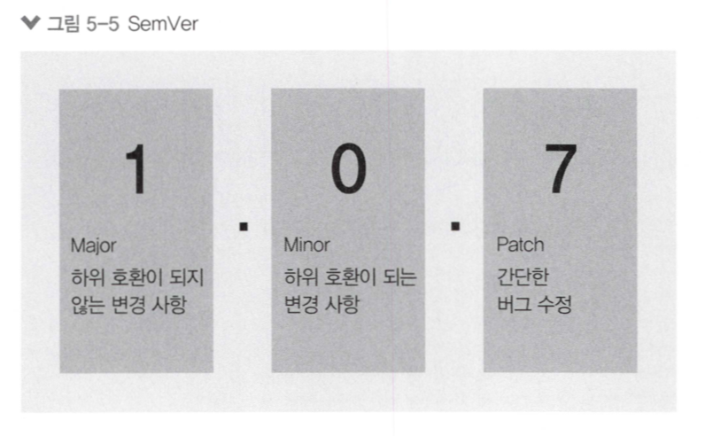

# 05 패키지 매니저

### npm (Node Package Manager)

- npm은 Node Package Manager
- 노드와 자바스크립트 생태계를 더욱 견고하게 함. (방대한 양의 패키지 존재)
- 패키지가 다른 패키지를 사용 할수도 있음.(의존성)

### package.json으로 관리

- 패키지 수도 많고, 패키지별로 버전이 달라서 package.json파일이 패키지와 버전을 관리함.
- npm init 명령어를 통해 실행하고, package name(패키지명), version(패키지의 버전), entry point(자바스크립트 실행 파일 진입점), test command(코드 테스트 시 입력할 명령어), git repository(코드를 저장해둔 Git 저장소), keywords(npm 공식 홈페이지에서 패키지를 쉽게 찾을 수 있는 키워드), author(작성자), license(해당 패키지 라이센스)를 입력하면 package.json 파일 생성.
- npm run [스크립트 명령어]를 입력하면 해당 스크립트 실행 (ex. npm run test / test 스크립트 외에도 scripts 속성을 여러 개를 등록하고 사용가능)
- npm install [패키지 이름] 명령어를 통해 패키지 설치.(package.json이 있는 폴더에서 콘솔 실행)

##### 개발용 패키지 설치

- 실제 배포 시에는 사용되지 않고, 개발 중에만 사용되는 패키지
- npm install --save-dev [패키지]

##### 전역 설치

- 현재 폴더의 node_modules에 설치하는 것이 아니라 npm이 설치되어 있는 폴더에 설치함.
- --glabal 옵션 (ex. npm install --global rimraf)
- 리눅스나 macOS에서 전역 설치 시 관리자 권한이 필요하므로 sudo를 앞에 붙여줘야함.

### 패키지 버전

- 노드 버전은 항상 세 자리로 관리. SemVer(Semantic Versioning, 유의적 버전의 약어) 방식의 버전 넘버링을 따르기 때문이다.
    * 첫번째 자리는 major 버전
    * 두번째 자리는 minor 버전
    * 세번째 자리는 patch 버전
    

- 새 버전을 배포한 후에는 그 버전의 내용을 절대 수정하면 안됨.

### 기타 npm 명령어

- npm outdated : 업데이트할 수 있는 패키지 확인.
- npm update [패키지명] : 패키지 업데이트
- npm uninstall [패키지명] : 패키지 삭제
- npm search [검색어] : 패키지 검색
- npm info [패키지명] : 패키지의 세부 정보 파악
- npm adduser : npm 로그인 (배포 시 필요)
- npm whoami : npm 로그인 유저 확인
- npm logout : npm 로그아웃
- npm version [버전] : package.json의 버전을 올려줌
- npm deprecate [패키지명][버전] [메시지] : 해당 패키지를 설치할 때 경고 메시지를 띄우게 함.
- npm publish : 자신이 만든 패키지 배포
- npm unpublish : 배포한 패키지 제거 (배포 후 24시간 이내)

