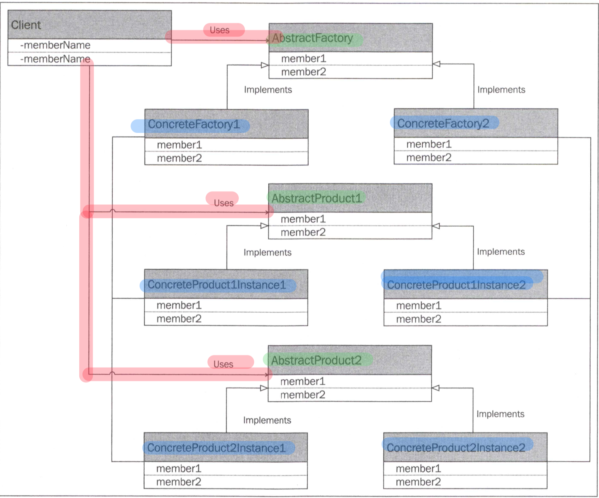
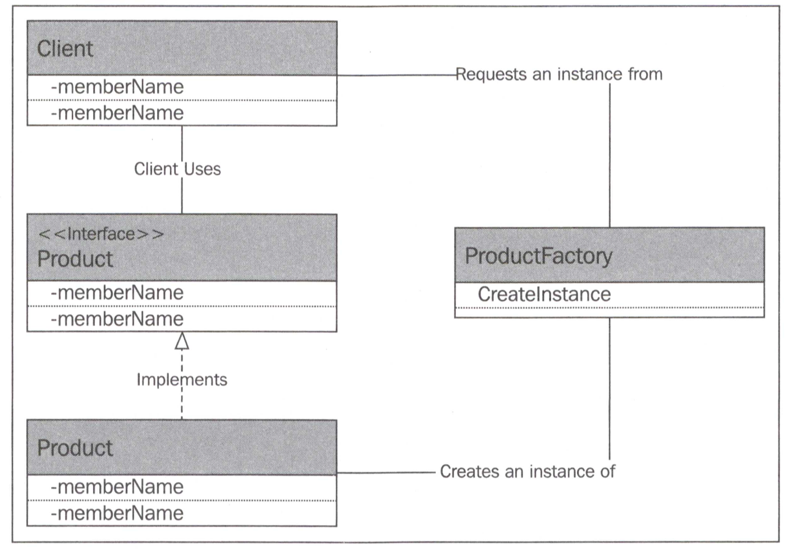
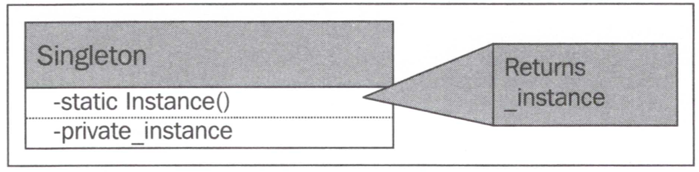

# 주요 개념 및 내용
Gof의 디자인패턴 중 생성 패턴에 대한 것.


## 생성패턴 5가지
- 추상팩토리
- 빌더
- 팩토리메서드
- 싱글턴
- 프로토타입

## 1. 추상팩토리 패턴
- 추상팩토리는 생성로직을 분리하여 `어떤 인스턴스를 생성하는데 중심을 두는 패턴.`
- 자바스크립트에는 `인터페이스가 없기 때문에 다른언어에 비해 구현이 쉽다.` / `컴파일러 검사를 할 수 없다는 단점`
  - `덕타이핑 개념` -> 자스의 타입리스 때문인지...
- 등장인물은 
  - 1.클라이언트
  - 2.팩토리
  - 3.프로덕트
- 대규모 변경이 필요한 경우 유용
- 유연성

### 클래스다이어그램


### 구현코드
```javascript
  // 1 추상팩토리

  // 1.1 King 클래스 구현 -> 실제는 클래스가 아니라 함수기반
  var KingJoffery = (function () {

    function KingJoffery() {
    }

    KingJoffery.prototype.makeDecision = function () {
      console.log("KingJoffery makeDecision call..");
    };

    KingJoffery.prototype.marry = function () {
      console.log("KingJoffery marry call..");
    };

    return KingJoffery;
  })();

  // 1.2 HandOfTheKing
  var LordTywin = (function () {
    function LordTywin() {
    }

    LordTywin.prototype.makeDecision = function () {
      console.log("LordTywin, makeDecision call");
    };

    return LordTywin;
  })();

  // 1.3 구체 팩토리
  var LannisterFactory = (function () {
    function LannisterFactory() {
    }

    LannisterFactory.prototype.getKing = function () {
      return new KingJoffery();
    };

    LannisterFactory.prototype.getHandOfTheKing = function () {
      return new LordTywin();
    };
    return LannisterFactory;
  })();

  var KingAerys = (function () {
    function KingAerys() {
    }
    KingAerys.prototype.makeDecision = function () {
      console.log("KingAerys, makeDecision call..");
    };

    KingAerys.prototype.marry = function () {
      console.log("KingAerys, marry call..");
    };
    return KingAerys;
  })();

  var LordConnington = (function () {
    function LordConnington() {
    }

    LordConnington.prototype.makeDecision = function () {
      console.log("LordConnington, makeDecision call");
    };
    return LordConnington;
  })();

  // 1.4 다른 지배가문 구체 팩토리
  var TargaryenFactory = (function () {
    function TargaryenFactory() {
    }

    TargaryenFactory.prototype.getKing = function () {
      return new KingAerys(); // 현재없다
    };

    TargaryenFactory.prototype.getHandOfTheKing = function () {
      return new LordConnington();  // 현재없
    };
    return TargaryenFactory;

  })();

  // 1.5 지배 가문을 필요로 하는 클래스
  var CourtSession = (function () {
    function CourtSession(abstractFactory) {
      this.abstractFactory = abstractFactory;
      this.COMPLAINT_THRESHOLD = 10;
    }

    CourtSession.prototype.complaintPresented = function (complaint) {
      if (complaint.severity < this.COMPLAINT_THRESHOLD) {
        this.abstractFactory.getHandOfTheKing().makeDecision();
      } else {
        this.abstractFactory.getKing().makeDecision();
      }
    };
    return CourtSession;
  })();


  var courtSeesion1 = new CourtSession(new TargaryenFactory());
  courtSeesion1.complaintPresented({severity: 8});
  courtSeesion1.complaintPresented({severity: 12});


  var courtSeesion2 = new CourtSession(new LannisterFactory());
  courtSeesion2.complaintPresented({severity: 8});
  courtSeesion2.complaintPresented({severity: 12});
```

## 2. 빌더 패턴
클래스를 생성할 때 복잡성을 감소 시키고, 사용자가 전문지식이? 없어도 사용할 수 있게끔 해주는 패턴
객체를 생성할때 복잡성을 감소시키는데 초점이 맞춰진 패턴

### 클래스다이어그램


### 구현코드
```javascript
// 2. 빌더패턴
  var Westeros;
  (function (Westeros) {
    var Ruler = (function () {
      function Ruler() {
        this.house = new Westeros.Houses.Targaryen();
      }

      return Ruler;
    })();
    Westeros.Ruler = Ruler;
  })(Westeros || (Westeros = {}));

  // 2.1 이벤트
  var Event = (function () {
    function Event(name) {
      this.name = name;
    }

    return Event;
  })();
  Westeros.Event = Event;

  // 2.2 포상
  var Prize = (function () {
    function Prize(name) {
      this.name = name;
    }

    return Prize;
  })();
  Westeros.Prize = Prize;

  // 2.3 참석자
  var Attendee = (function () {
    function Attendee(name) {
      this.name = name;
    }

    return Attendee;
  })();
  Westeros.Attendee = Attendee;

  // 2.4 토너먼트
  var Tournament = (function () {
    function Tournament() {
      this.events = [];
      this.attendees = [];
      this.prizes = [];
    }

    return Tournament;
  })();
  Westeros.Tournament = Tournament;

  // 2.5 서로다른 토너먼트를 생성하는 두개 빌더
  var LannisterTournamentBuilder = (function () {
    function LannisterTournamentBuilder() {
    }

    LannisterTournamentBuilder.prototype.build = function () {
      var tournament = new Tournament();
      tournament.events.push(new Event("Joust"));
      tournament.events.push(new Event("Melee"));

      tournament.attendees.push(new Attendee("Jamie"));

      tournament.prizes.push(new Prize("Gold"));
      tournament.prizes.push(new Prize("More Gold"));

      return tournament;
    };
    return LannisterTournamentBuilder;
  })();
  Westeros.LannisterTournamentBuilder = LannisterTournamentBuilder;

  var BaratheonTournamentBuilder = (function () {
    function BaratheonTournamentBuilder() {
    }

    BaratheonTournamentBuilder.prototype.build = function () {
      var tournament = new Tournament();
      tournament.events.push(new Event("Joust"));
      tournament.events.push(new Event("Melee"));

      tournament.attendees.push(new Attendee("Stannis"));
      tournament.attendees.push(new Attendee("Robert"));
      return tournament;
    };

    return BaratheonTournamentBuilder;
  })();
  Westeros.BaratheonTournamentBuilder = BaratheonTournamentBuilder;

  // 2.6 단순 실행 컨텍스트
  var TournamentBuilder = (function () {
    function TournamentBuilder() {
    }

    // 빌더를 매개변수로 받아서 처리하는 부분
    TournamentBuilder.prototype.build = function (builder) {
      return builder.build(); // 빌더의 build 함수 실행
    };
    return TournamentBuilder;
  })();
  Westeros.TournamentBuilder = TournamentBuilder;

  // 추가
  var CalorieBuilder = (function () {
    function f() {
      this.obj = {};
    }

    // 지방 칼로리 세팅
    f.prototype.fatBuild = function (calorie) {
      this.obj.fatCalorie = calorie;
      return this;
    };

    // 단백질 카로리 세팅
    f.prototype.proteinBuild = function (calorie) {
      this.obj.proteinCalorie = calorie;
      return this;
    };

    f.prototype.build = function () {
      return this;
    };
    return f;
  })();

  // 2.7 실행
  console.log(BaratheonTournamentBuilder.prototype.build());
  console.log(LannisterTournamentBuilder.prototype.build());

  console.log("===========================");

  console.log(Westeros.TournamentBuilder.prototype.build(new BaratheonTournamentBuilder()));;
  console.log(Westeros.TournamentBuilder.prototype.build(new LannisterTournamentBuilder()));;

  // 추가
  console.log(Westeros.TournamentBuilder.prototype.build(new CalorieBuilder().fatBuild(15).proteinBuild(20)));
```

## 3. 팩토리메서드
인스턴스 생성을 메서드로 분리. 어떤 클래스의 메서드로 분리를 할 수도 있다.  
대부분 정적클래스에 생성을 위임하는 경우가 많고 여기서는 `GodFactory` 객체에 위임.  
눈여겨 볼만한 객체가 바로 `GodFactory`인데, 구현코드를 보면 `GodFactory.Builde`를 `prototype`으로 연결시키지 않았다.
바로 사용을 하겠다는 의미. Java로 따지면 정적메서드 같은 경우에 해당한다.
팩토리메서드는 OOP 사상에서 가장 많이 쓰이는 패턴 중 하나라고 생각하는데, 자바스크립트에서도 유용할 것 같다.

책 내용 중 `전략패턴`과 `추상팩토리 구현체 생성`에서 자주 볼 수 있는듯 하다. 이 외에도 다양하게 조합해서 사용이 가능한 패턴 중 하나라서 자주 쓰이는게 아닌가 싶다. 가령 `Spring`에서도 사랑 받는 패턴 중 하나다.


### 클래스다이어그램


### 구현코드
```javascript
  // 3. 팩토리메서드
  // 3.1 세종류의 종교 God
  var Religion = {}; // 종교 전역
  var WateryGod = (function () {
    function WateryGod() {
    }

    WateryGod.prototype.prayTo = function () {
      console.log("WateryGod, Pray To ~");
    };

    return WateryGod;
  })();
  Religion.WateryGod = WateryGod;

  var AncientGod = (function () {
    function AncientGod() {
    }

    AncientGod.prototype.prayTo = function () {
      console.log("AncientGods, Pray To");
    };

    return AncientGod;
  })();
  Religion.AncientGods = AncientGod;

  var DefaultGod = (function () {
    function DefaultGod() {
    }

    DefaultGod.prototype.prayTo = function () {
      console.log("DefaultGod, Pray To ");
    };

    return DefaultGod;
  });

  // 3.2 각 God 생성을 위한 팩토리
  var GodFactory = (function () {
    function GodFactory() {
    }

    // prototype이 필요없는 이유는?
    GodFactory.Build = function (godName) {
      if (godName === 'watery') {
        return new WateryGod();
      } else if (godName === 'ancient') {
        return new AncientGod();
      } else {
        return new DefaultGod();
      }
    };
    return GodFactory;
  })();

  // 3.3 종교, 기도의목적에 따른 분류
  var GodDeterminant = (function () {
    function GodDeterminant(religionName, prayPurpose) {
      this.religionName = religionName;
      this.prayPurpose = prayPurpose;
    }

    return GodDeterminant;
  })();

  // 3.4 실행
  var Prayer = (function () {
    function Prayer() {
    }

    Prayer.prototype.pray = function (godName) {
      GodFactory.Build(godName).prayTo();
    };
    return Prayer;
  })();

  console.log("\n**** 3.팩토리메서드 실행 ****\n");
  Prayer.prototype.pray("watery");
  Prayer.prototype.pray("ancient");
  Prayer.prototype.pray("asd");

```
## 4. 싱글톤 
객체의 `인스턴스가 단 한개`가 존재하도록 구현하는 패턴.
자바스크립트에서는 비평을 받는 중. 그 이유는 전역변수를 미화해서 구현하고 있기 때문인데, 자바스크립트에서
전연변수의 사용은 왠만하면 사용을 금하고 있다. 이유는 다들 알고있는 내용이기 때문에 생략.  


전역변수가 아닌 클래스, 한번 래핑된 클래스를 사용한다면 필요할까?
일단 자바스크립트는 `private 생성자`란 개념이 없다.

`new키워드` 대신 `Object.create()`활용하여 함수 연결로 싱글톤화  


### 클래스다이어그램



### 구현코드
```javascript

  // 4 싱글톤
  // 4.1 Westeros에 Wall -> 싱글톤구현
  var Westeros;
  (function (Westeros) {

    // Wall 싱글톤 구현
    var Wall = (function () {
      function Wall() {
        this.height = 0;
        if (Wall._instance) {
          return Wall._instance;
        }
        Wall._instance = this;
      }

      Wall.prototype.setHeight = function (height) {
        this.height = height;
      };
      Wall.prototype.getStatus = function () {
        console.log("Wall is " + this.height + " meters tall");
      };
      Wall.getInstance = function () {
        if (!Wall._instance) {
          Wall._instance = new Wall();
        }
        return Wall._instance;
      };
      Wall._instance = null;
      return Wall;
    })();
    Westeros.Wall = Wall;
  })(Westeros || (Westeros = {}));

  // 4.2 실행
  console.log("\n**** 4.싱글톤 실행 ****\n");
  var instance1 = Westeros.Wall.getInstance();
  instance1.setHeight(20);
  console.log(instance1);
  instance1.getStatus();

  var instance2 = Westeros.Wall.getInstance();
  instance2.setHeight(20 * 2);
  console.log(instance1); // 40
  console.log(instance2); // 40
  instance1.getStatus();
  instance2.getStatus();

  // 4.3 추가
  var Singleton = (function () {
    this.instance = null;
    this.name2 = "";
    function Singleton() {
    }

    Singleton.getInstance = function () {
      if (!this.instance) {
        this.instance = Object.create(this);  // this.instance -> this와 연결
      }
      return this.instance; // this.instance 반환 -> 즉 this(Singleton 함수를 반환)
    };

    Singleton.test = function () {
      console.log(this.name2);
    };

    return Singleton;
  })();

  // 4.3.1 테스트
  var single1 = Singleton.getInstance();
  var single2 = Singleton.getInstance();
  single1.name2 = "테스트";
  console.log(single1);
  console.log(single2);
  single1.test();
  single2.test();

  single2.name2 = "테스트2";
  console.log(single1);
  console.log(single2);
  single1.test();
  single2.test();

  console.log("==============");
  var single3 = new Singleton();
  single3.name2 = "test";
  console.log(single1); // name2 : '테스트2' -> function
  console.log(single2); // name2 : '테스트2' -> function
  console.log(single3); // name2 : 'test'   -> Singleton  
  
```

## 5. 프로토타입
객체의 값을 `복사하여 값의 세팅과정을 간소화` 시켜주는 패턴.  
규모가 큰 어플리케이션 구축에서는 필수적인 내용.  
`TODO` 얕은복사의 정확한 방법과 방식을 알아둬야함

책내용 중 복잡한코드는 버그발생률이 높으니 가급적 new를 사용하자는 말은 개소리같음.  
new로 도배를 하게 되는 경우 유지보수성이 현저히 떨어지게됨.  
예를들어 new DBOracle를 DBMySQL로 변경해야하는 경우가 발생하여 객체를 수정하고자 한다면?  
수많은 소스를 수정해야할 수 있다. 이럴 경우 팩토리메서드로 구현하는게 맞는거 같은데, 직접전이 사용호출 쪽에서는  
new를 사용하는건 아닌거 같다.

```
TODO  
프론트에서는 ... 음 래핑객체로 매개변수 넘기는 과정이 하드코딩인가?  
이 부분은 좀더 생각해보자
```

### 클래스다이어그램

TODO 자료 찾기


### 구현코드
```javascript
  // 5 프로토타입
  // 5.1 구현
  var Westeros2;
  (function (Westeros2) {
    (function (Families) {
      var Lannister = (function () {
        function Lannister() {
        }

        Lannister.prototype.clone = function () {
          var clone = new Lannister();
          for (var atter in this) {
            clone[atter] = this[atter]; // 현재 객체의 모든 속성을 복사 :  TODO -> (깊은,얕은복사)
          }
          return clone;
        };
        return Lannister;
      })();
      Families.Lannister = Lannister;
    })(Westeros2.Families || (Westeros2.Families = {}));
    var Families = Westeros2.Families;
  })(Westeros2 || (Westeros2 = {}));

  var jamie = new Westeros2.Families.Lannister();
  // var jamie = Object.create(new Westeros2.Families.Lannister());
  jamie.swordSkills = 9;
  jamie.charm = 6;
  jamie.wealth = 10;
  console.log(jamie);

  var tyrion = jamie.clone();
  console.log(jamie);
  console.log(tyrion);
  tyrion.charm = 10;

  console.log(jamie);
  console.log(tyrion);

```

