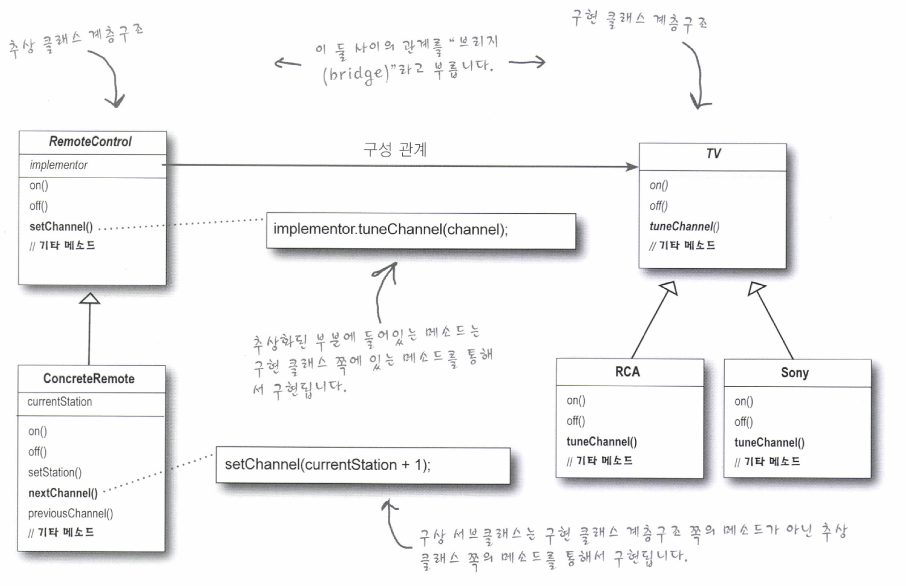
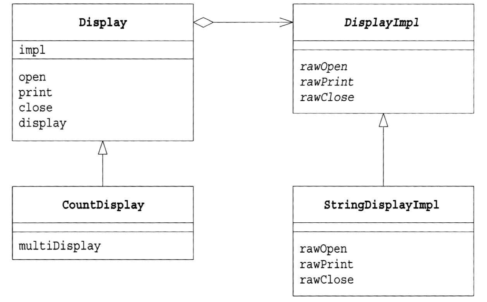
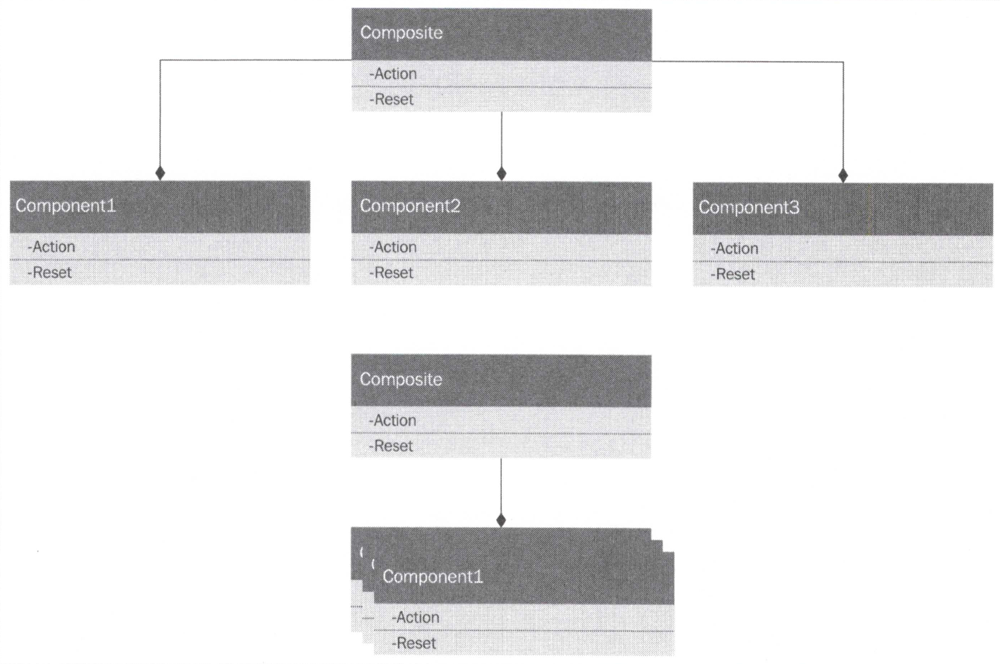
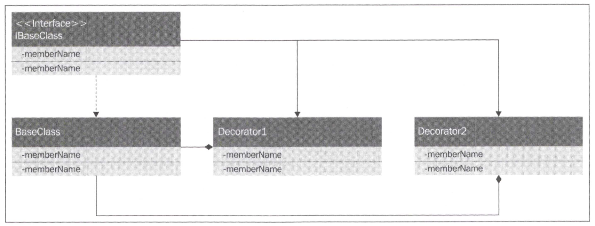
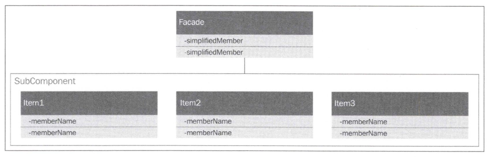
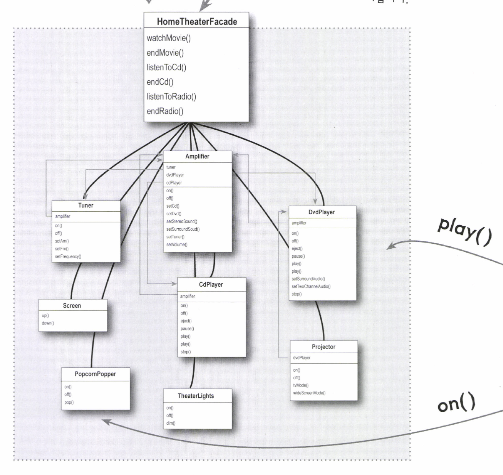

# 주요 개념 및 내용
Gof의 디자인패턴 중 구조 패턴에 대한 것.  

## 구조패턴 7가지
- 적응자 (Adapter)
- 가교 (Bridge)
- 복합체 (Composite)
- 장식자 (Decorator)
- 퍼사드 (Facade)
- 플라이웨이트(Flyweight)
- 프록티 (Proxy)

## 적응자 (Adapter)
레거시 프로젝트에서 사용 중인 인터페이스의 수정에 따라 새로운 인터페이스를 추가하고자 할 때  
레거시 의 수정을 최소한으로 하면서 추가시키는 작업. 즉 어댑터로 붙이는 작업을 통해 기존의 코드를 위임시켜 새로운 기능을 실행할 수 있도록 해주는 것!

### 클래스다이어그램


### 구현코드
```javascript
  // 1. 적응자 (Adapter)
  // 1.1 기존 Ship 인터페이스 (커스텀)
  var Ship = (function () {
    function Ship() {
    }

    Ship.prototype.setRudderAngleTo = function (angle) {
      console.log("방향키" + angle + "도를 돌립니다");
    };

    Ship.prototype.setSailConfiguration = function (configuration) {
      console.log(configuration + "항해를 설정 합니다");
    };

    Ship.prototype.setSailAngle = function (sailId, sailAngle) {
      console.log(sailId + "로 항해 설정, " + sailAngle + "도로 항해를 진행합니다");
    };

    Ship.prototype.getCurrentBearing = function () {
      console.log("현재 베어링 상태 확인");
      return 10;
    };

    Ship.prototype.getCurrentSpeedEstimate = function () {
      console.log("계산된 현재속도 반환하기");
      return 10;
    };

    Ship.prototype.shiftCrewWeightTo = function (weightToShift, locationId) {
      console.log(weightToShift + "무게, " + locationId + " 쉬프")
    };
    return Ship;
  })();

  // 1.2 어댑터 구현
  var ShipAdapter = (function () {
    function ShipAdapter() {
      this._ship = new Ship();
    }

    ShipAdapter.prototype.turnLeft = function () {
      this._ship.setRudderAngleTo(-30);
      this._ship.setSailAngle(3, 12);
    };

    ShipAdapter.prototype.turnRight = function () {
      this._ship.setRudderAngleTo(30);
      this._ship.setSailAngle(5, -9);
    };

    ShipAdapter.prototype.goForward = function () {
      // _ship의 또다른 일을 수행
      this._ship.getCurrentBearing();
      this._ship.getCurrentSpeedEstimate();
    };
    return ShipAdapter;
  })();

  // 1.3 새로운 인터페이스 -> JS는 인터페이스가 없기 때문에 생략이 가능
  var SimpleShip = (function (adapter) {
    function SimpleShip() {
      this.adapter = adapter;
    }

    SimpleShip.prototype.turnLeft = function () {
      this.adapter.turnLeft();
    };

    SimpleShip.prototype.turnRight = function () {
      this.adapter.turnRight();
    };

    SimpleShip.prototype.goForward = function () {
      this.adapter.goForward();
    };
    return SimpleShip;
  })(new ShipAdapter());

  // 1.4 실행 -> 새로운 인터페이스 (SimpleShip) 적용
  var ship = new SimpleShip(SimpleShip);
  ship.turnLeft();
  ship.turnRight();
  ship.goForward();

  // 1.4 실행 -> 인터페이스 없이 Adapter를 그대로 사용 (JS는 어댑터가 없기 때문)
  console.log("====================");
  var ship2 = new ShipAdapter();
  ship2.turnLeft();
  ship2.turnRight();
  ship2.goForward();
```

## 가교 (Bridge)
브리지 패턴은 기능구현계층과 추상(구현)클래스계층의 분리인데, 여기에서는 어댑터를 만들어서 각 클래스를 연결시키고 있다.  
GoF의 디자인패턴과는 상이한 부분이 보인다. 인터페이스가 없어서 그런걸까? 좀더 이해가 필요해 보인다.

클래스 계층이 1개라면 기능과 구현이 혼재하게 됨. 이것을 분리하기 위한 패턴이 브리지 패턴

1. 기능의 클래스 계층
  - 한 상위 클래스에 기능이 추가될 때, `클래스 상속을 통한 구조`
2. 구현의 클래스 계층
  - 일반적인 `추상클래스,인터페이스를 구현하는 하위 클래스의 계층 구조`


### 구성
- ~~God 3개가 존재
- 위 3개에 따른 Adapter 3개 존재 -> 브리지 역할 이라는데 이런 패턴이아니다 실상
- ~~God에서 클래스 3개가 사용
- 아래소스는 수정이 필요해 보임

### 클래스다이어그램
- JS
  
- JAVA
  
  

### 구현코드
```javascript

  // 2 가교 (Bridge)

  // 2.1 가교 (Bridge) 관련 클래스 생성 - 추가
  class Sacrifice {
    getPray() {
      return "나의 기도 ~ 기도기도";
    }
  }

  class HumanSacrifice {
    getPray() {
      return "사람의 기도~";
    }
  }

  class PrayerPurposeProvider {
    getPurpose() {
      return "자바, 자바스크립트 마스터하기";
    }
  }
  
  // 2.2 여러 신들
  var Religion = {};
  var OldGods = (function () {
    function OldGods() {
    }

    OldGods.prototype.prayTo = function (sacrifice) {
      console.log("We Old Gods hear your prayer" + sacrifice.getPray());
    };
    return OldGods;
  })();
  Religion.OldGods = OldGods;

  var DrownedGod = (function () {
    function DrownedGod() {
    }

    DrownedGod.prototype.prayTo = function (humanSacrifice) {
      console.log("*BUBBLE* GURGLE" + humanSacrifice.getPray());
    };
    return DrownedGod;
  })();
  Religion.DrownedGod = DrownedGod;

  var SevenGods = (function (prayerPurpose) {
    function SevenGods() {
    }

    SevenGods.prototype.prayTo = function (prayerPurpose) {
      console.log("Sorry there are a lot ~~ 나의 기도 목적 : " + prayerPurpose);
    };
    return SevenGods;
  })();
  Religion.SevenGods = SevenGods;

  // 2.3 각어댑터 구현
  var OldGodsAdapter = (function () {
    function OldGodsAdapter() {
      this._oldGods = new OldGods();
    }

    OldGodsAdapter.prototype.prayTo = function () {
      var sacrifice = new Sacrifice();
      this._oldGods.prayTo(sacrifice);
    };

    return OldGodsAdapter;
  })();
  Religion.OldGodsAdapter = OldGodsAdapter;

  var DrownedGodAdapter = (function () {
    function DrownedGodAdapter() {
      this._drownedGod = new DrownedGod();
    }

    DrownedGodAdapter.prototype.prayTo = function () {
      var sacrifice = new HumanSacrifice();
      this._drownedGod.prayTo(sacrifice);
    };
    return DrownedGodAdapter;
  })();
  Religion.DrownedGodAdapter = DrownedGodAdapter;

  var SevenGodsAdapter = (function () {
    function SevenGodsAdapter() {
      this.prayerPurposeProvider = new PrayerPurposeProvider();
      this._sevenGods = new SevenGods();
    }

    SevenGodsAdapter.prototype.prayTo = function () {
      this._sevenGods.prayTo(this.prayerPurposeProvider.getPurpose());
    };
    return SevenGodsAdapter;
  })();
  Religion.SevenGodsAdapter = SevenGodsAdapter;

  // 2.4 실행
  console.log("\n**** 2.브릿지 실행 ****\n");
  var god1 = new Religion.SevenGodsAdapter();
  var god2 = new Religion.DrownedGodAdapter();
  var god3 = new Religion.OldGodsAdapter();

  var gods = [god1, god2, god3];
  for (let i = 0; i < gods.length; i++) {
    gods[i].prayTo();
  }
```

## 복합체 (Composite)
트리구조를 띄는 패턴. 복합객체와 단일체가 동일타입으로 재귀구조를 띄게 됨. 즉 `단일체는 마지막 leaf node`에 해당한다. 여기서 단일체는 싱글턴을 뜻하는게 아님.  
음... 그냥 데이터 자료구조라고 보면됨 DTO같은.. 아무 처리가 없는 단 동일타입이란 동일한인터페이스를 구현해야한다는 소리인데, 자바스크립트는 인터페이스가 없지  
그래서 `사용할 메서드가 Leaf와 Composite가 동일한 메서드를 사용해야하는 전제조건이 깔림.`

### 클래스다이어그램


### 구현코드
```javascript
  // 3 복합체 (Composite)
  // 3.1 리프노드
  var SimpleIngredient = (function () {
    function SimpleIngredient(name, calories, ironContent, vitaminCContent) {
      this.name = name;
      this.calories = calories;
      this.ironContent = ironContent;
      this.vitaminCContent = vitaminCContent;
    }

    SimpleIngredient.prototype.getName = function () {
      return this.name;
    };

    SimpleIngredient.prototype.getCalories = function () {
      return this.calories;
    };

    SimpleIngredient.prototype.getIronContent = function () {
      return this.ironContent;
    };

    SimpleIngredient.prototype.getVitaminCContent = function () {
      return this.vitaminCContent;
    };
    return SimpleIngredient;
  })();

  // 3.2 복합객체
  var CompoundIngredient = (function () {
    function CompoundIngredient(name) {
      this.name = name;
      this.ingredients = new Array();
    }

    CompoundIngredient.prototype.addIngredient = function (ingredient) {
      this.ingredients.push(ingredient);
    };

    CompoundIngredient.prototype.getName = function () {
      return this.name;
    };
    CompoundIngredient.prototype.getCalories = function () {
      var total = 0;
      for (var ingredient of this.ingredients) {
        total += ingredient.getCalories();
      }
      return total;
    };

    CompoundIngredient.prototype.getIronContent = function () {
      var total = 0;
      for (var ingredient of this.ingredients) {
        total += ingredient.getIronContent();
      }
      return total;
    };

    CompoundIngredient.prototype.getVitaminCContent = function () {
      var total = 0;
      for (var ingredient of this.ingredients) {
        total += ingredient.getVitaminCContent();
      }
      return total;
    };
    return CompoundIngredient;
  })();

  // 3.3 실행
  console.log("\n**** 3.복합체 ****\n");
  var egg = new SimpleIngredient("Egg", 155, 6, 0);
  var milk = new SimpleIngredient("Milk", 42, 0, 0);
  var sugar = new SimpleIngredient("Sugar", 387, 0, 0);
  var rice = new SimpleIngredient("Rice", 370, 8, 0);
  var ricePudding = new CompoundIngredient("Rice Pudding");
  ricePudding.addIngredient(egg);
  ricePudding.addIngredient(rice);
  ricePudding.addIngredient(milk);
  ricePudding.addIngredient(sugar);

  // 추가
  var riceMandu = new CompoundIngredient("Rice Mandu");
  riceMandu.addIngredient(new SimpleIngredient("Kimchi", 15, 5, 10));
  riceMandu.addIngredient(new SimpleIngredient("Meat", 50, 25, 62));
  riceMandu.addIngredient(new SimpleIngredient("Meal", 125, 15, 11));
  riceMandu.addIngredient(rice);

  ricePudding.addIngredient(riceMandu); // rice푸딩에  만두추가

  console.log(ricePudding.getCalories() + " calories");
  console.log(ricePudding.getIronContent() + " IronContent");
```

## 장식자 (Decorator)
말그대로 객체를 꾸며주는 패턴.  
자바에서는 파일 입출력이 예시다.  
매개변수로 적절한 객체를 계속 넘김으로써 추가, 추가, 추가를 계속 진행한 후 최종 데이터를 받아내는 패턴

### 클래스다이어그램



### 구현코드
```javascript
  // 4 장식자 (Decorator)
  // 4.1 베이스 갑옷
  var BasicArmor = (function () {
    function BasicArmor() {
    }

    BasicArmor.prototype.calculateDamageFromHit = function (hit) {
      return hit.Strength * 0.5;
    };

    BasicArmor.prototype.getArmorIntegrity = function () {
      return 1;
    };
    return BasicArmor;

  })();

  // 4.2 사슬메일 갑옷 
  var ChainMail = (function () {
    function ChainMail(decoratedArmor) {
      this.decoratedArmor = decoratedArmor;
    }

    ChainMail.prototype.calculateDamageFromHit = function (hit) {
      hit.Strength = hit.Strength * 0.8;
      return this.decoratedArmor.calculateDamageFromHit(hit);
    };

    ChainMail.prototype.getArmorIntegrity = function () {
      return 0.9 * this.decoratedArmor.getArmorIntegrity();
    };
    return ChainMail;
  })();

  // 4.3 실행
  var armor = new ChainMail(new BasicArmor());
  console.log(armor.calculateDamageFromHit({Location: "Head", Weapon:"pennis", Strength: 12}));
  console.log(armor.calculateDamageFromHit({Location: "Arm", Weapon:"Basic", Strength: 10}));
```

## 퍼사드 (Facade)
서브시스템의 `복잡성을 단순화` 시켜서 추상화수준을 한단계 올려서 제공하는 패턴.  
한번 래핑된 클래스가 사용자측에서 사용이 된다.  


### 클래스다이어그램
- js
  

- java
  

### 구현코드
```javascript
  // 5 퍼사드
  // 5.1 배 -> 로직실행의 중심
  var Transprotation = {};
  var Ship = (function () {
    function Ship() {
    }

    Ship.prototype.turnLeft = function () {
      console.log("left");
    };

    Ship.prototype.turnRight = function () {
      console.log("right");
    };

    Ship.prototype.goForward = function () {
      console.log("goforward");
    };
    return Ship;
  })();
  Transprotation.Ship = Ship;

  // 5.2 제독
  var Admiral = (function () {
    function Admiral() {
    }
    return Admiral;
  })();
  Transprotation.Admiral = Admiral;

  // 5.3 ?
  var SupplyCoordinator = (function () {
    function SupplyCoordinator() {
    }

    return SupplyCoordinator;
  })();
  Transprotation.SupplyCoordinator = SupplyCoordinator;

  // 5.4 퍼사드
  var Fleet = (function () {
    function Fleet() {
    }

    Fleet.prototype.setDestination = function (destination) {
      // 선박에 내리는 명령
      // destination.turnLeft();
      // destination.goForward();
      console.log("목적지 세팅");
    };

    Fleet.prototype.resupply = function () {
      console.log("재 공급하기");
    };

    Fleet.prototype.attack = function (destination) {
      console.log("공격하기");
    };

    return Fleet;
  })();

  // 5.5 실행
  console.log("\n**** 5.퍼사드 ****\n")
  var facade = Object.create(Fleet.prototype);
  facade.attack();
  facade.resupply();
  facade.setDestination();

```