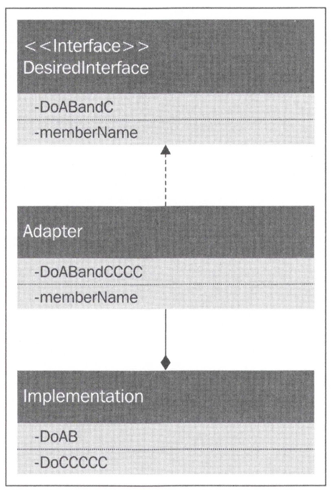
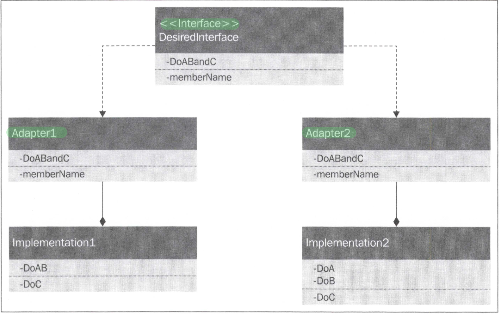

# 주요 개념 및 내용
Gof의 디자인패턴 중 구조 패턴에 대한 것.  

## 구조패턴 7가지
- 적응자 (Adapter)
- 가교 (Bridge)
- 복합체 (Composite)
- 장식자 (Decorator)
- 퍼사드 (Facade)
- 플라이웨이트(Flyweight)
- 프록티 (Proxy)

## 적응자 (Adapter)
레거시 프로젝트에서 사용 중인 인터페이스의 수정에 따라 새로운 인터페이스를 추가하고자 할 때  
레거시 의 수정을 최소한으로 하면서 추가시키는 작업. 즉 어댑터로 붙이는 작업을 통해 기존의 코드를 위임시켜 새로운 기능을 실행할 수 있도록 해주는 것!

### 클래스다이어그램


### 구현코드
```javascript
  // 1. 적응자 (Adapter)
  // 1.1 기존 Ship 인터페이스 (커스텀)
  var Ship = (function () {
    function Ship() {
    }

    Ship.prototype.setRudderAngleTo = function (angle) {
      console.log("방향키" + angle + "도를 돌립니다");
    };

    Ship.prototype.setSailConfiguration = function (configuration) {
      console.log(configuration + "항해를 설정 합니다");
    };

    Ship.prototype.setSailAngle = function (sailId, sailAngle) {
      console.log(sailId + "로 항해 설정, " + sailAngle + "도로 항해를 진행합니다");
    };

    Ship.prototype.getCurrentBearing = function () {
      console.log("현재 베어링 상태 확인");
      return 10;
    };

    Ship.prototype.getCurrentSpeedEstimate = function () {
      console.log("계산된 현재속도 반환하기");
      return 10;
    };

    Ship.prototype.shiftCrewWeightTo = function (weightToShift, locationId) {
      console.log(weightToShift + "무게, " + locationId + " 쉬프")
    };
    return Ship;
  })();

  // 1.2 어댑터 구현
  var ShipAdapter = (function () {
    function ShipAdapter() {
      this._ship = new Ship();
    }

    ShipAdapter.prototype.turnLeft = function () {
      this._ship.setRudderAngleTo(-30);
      this._ship.setSailAngle(3, 12);
    };

    ShipAdapter.prototype.turnRight = function () {
      this._ship.setRudderAngleTo(30);
      this._ship.setSailAngle(5, -9);
    };

    ShipAdapter.prototype.goForward = function () {
      // _ship의 또다른 일을 수행
      this._ship.getCurrentBearing();
      this._ship.getCurrentSpeedEstimate();
    };
    return ShipAdapter;
  })();

  // 1.3 새로운 인터페이스 -> JS는 인터페이스가 없기 때문에 생략이 가능
  var SimpleShip = (function (adapter) {
    function SimpleShip() {
      this.adapter = adapter;
    }

    SimpleShip.prototype.turnLeft = function () {
      this.adapter.turnLeft();
    };

    SimpleShip.prototype.turnRight = function () {
      this.adapter.turnRight();
    };

    SimpleShip.prototype.goForward = function () {
      this.adapter.goForward();
    };
    return SimpleShip;
  })(new ShipAdapter());

  // 1.4 실행 -> 새로운 인터페이스 (SimpleShip) 적용
  var ship = new SimpleShip(SimpleShip);
  ship.turnLeft();
  ship.turnRight();
  ship.goForward();

  // 1.4 실행 -> 인터페이스 없이 Adapter를 그대로 사용 (JS는 어댑터가 없기 때문)
  console.log("====================");
  var ship2 = new ShipAdapter();
  ship2.turnLeft();
  ship2.turnRight();
  ship2.goForward();
```

## 가교 (Bridge)


### 클래스다이어그램
- JS
  
- JAVA
  

### 구현코드
```javascript

  // 2 가교 (Bridge)

  // 2.1 가교 (Bridge) 관련 클래스 생성 - 추가
  class Sacrifice {
    getPray() {
      return "나의 기도 ~ 기도기도";
    }
  }

  class HumanSacrifice {
    getPray() {
      return "사람의 기도~";
    }
  }

  class PrayerPurposeProvider {
    getPurpose() {
      return "자바, 자바스크립트 마스터하기";
    }
  }
  
  // 2.2 여러 신들
  var Religion = {};
  var OldGods = (function () {
    function OldGods() {
    }

    OldGods.prototype.prayTo = function (sacrifice) {
      console.log("We Old Gods hear your prayer" + sacrifice.getPray());
    };
    return OldGods;
  })();
  Religion.OldGods = OldGods;

  var DrownedGod = (function () {
    function DrownedGod() {
    }

    DrownedGod.prototype.prayTo = function (humanSacrifice) {
      console.log("*BUBBLE* GURGLE" + humanSacrifice.getPray());
    };
    return DrownedGod;
  })();
  Religion.DrownedGod = DrownedGod;

  var SevenGods = (function (prayerPurpose) {
    function SevenGods() {
    }

    SevenGods.prototype.prayTo = function (prayerPurpose) {
      console.log("Sorry there are a lot ~~ 나의 기도 목적 : " + prayerPurpose);
    };
    return SevenGods;
  })();
  Religion.SevenGods = SevenGods;

  // 2.3 각어댑터 구현
  var OldGodsAdapter = (function () {
    function OldGodsAdapter() {
      this._oldGods = new OldGods();
    }

    OldGodsAdapter.prototype.prayTo = function () {
      var sacrifice = new Sacrifice();
      this._oldGods.prayTo(sacrifice);
    };

    return OldGodsAdapter;
  })();
  Religion.OldGodsAdapter = OldGodsAdapter;

  var DrownedGodAdapter = (function () {
    function DrownedGodAdapter() {
      this._drownedGod = new DrownedGod();
    }

    DrownedGodAdapter.prototype.prayTo = function () {
      var sacrifice = new HumanSacrifice();
      this._drownedGod.prayTo(sacrifice);
    };
    return DrownedGodAdapter;
  })();
  Religion.DrownedGodAdapter = DrownedGodAdapter;

  var SevenGodsAdapter = (function () {
    function SevenGodsAdapter() {
      this.prayerPurposeProvider = new PrayerPurposeProvider();
      this._sevenGods = new SevenGods();
    }

    SevenGodsAdapter.prototype.prayTo = function () {
      this._sevenGods.prayTo(this.prayerPurposeProvider.getPurpose());
    };
    return SevenGodsAdapter;
  })();
  Religion.SevenGodsAdapter = SevenGodsAdapter;

  // 2.4 실행
  console.log("\n**** 2.브릿지 실행 ****\n");
  var god1 = new Religion.SevenGodsAdapter();
  var god2 = new Religion.DrownedGodAdapter();
  var god3 = new Religion.OldGodsAdapter();

  var gods = [god1, god2, god3];
  for (let i = 0; i < gods.length; i++) {
    gods[i].prayTo();
  }
```