# 주요 개념 및 내용
Gof의 디자인패턴 중 생성 패턴에 대한 것.


## 행동패턴 11가지
- 책임 연쇄 (Chain of responsibility)
- 명령 (Command)
- 해석자 (Intepreter)
- 반복자 (Iterator)
- 중재자 (Mediator)
- 메멘토 (Memento)
- 감시자 (Observer)
- 상태 (State)
- 전략 (Strategy)
- 템플릿 메서드 (Template method)
- 방문자 (Visitor)


## 1. 책임 연쇄, 역할 사슬, Chain of responsibility
책염연쇄에 궁극적 목표는 `자기자신이 할 수 있으면 하고, 못하면 다른 클래스로 위임하면서 처리하는 방식`이다.  
그러다 종착점에서 어떤 클래스도 처리를 못할 경우, 예외처리를 한다든지 비즈니스에 맞는 작업처리를 해주면 된다.  

예를들면, **A->B->C->D** 가 물려 있는 경우, A가할 수 있는 일, B,C,D가 할 수 있는 일이 각각 다르며,
자기가 할 수 있는 일은 처리하여 리턴하고 못하면 계속 위임해서 처리하는 패턴임.  


### 클래스다이어그램
- js
  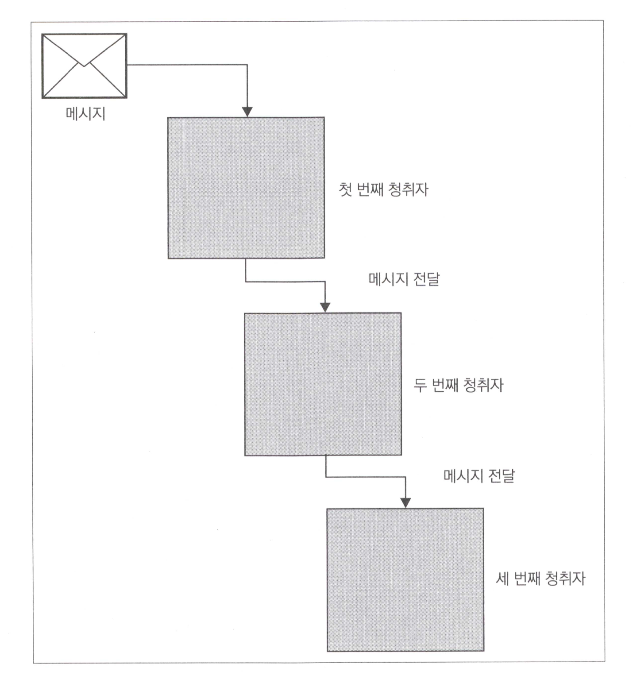

- java
  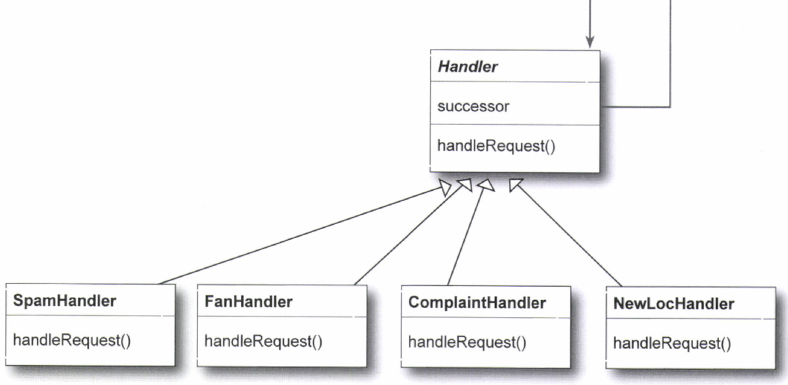


### 구현코드
```javascript
  // 1 책임연쇄
  // 1.1 불만 객체
  var Complaint = (function () {
    function Complaint(complainingParty, complaintAbout, complaint) {
      this.complainingParty = complainingParty;
      this.complaintAbout = complaintAbout;
      this.complaint = complaint;
    }

    return Complaint;
  })();

  // 1.2 불만 리스너 구현
  // 1.2.1 법원서기
  var ClerkOfTheCourt = (function () {
    function ClerkOfTheCourt() {
    }

    ClerkOfTheCourt.prototype.isAbleToResolveComplaint = function (complaint) {
      // 법원서기 불만처리가 가능한지 확인
      if (complaint.complaintAbout === '서기') {
        return true;
      }
      return false;
    };

    ClerkOfTheCourt.prototype.listenToComplaint = function (complaint) {
      // 법원서기의 불만처리 수행

      return complaint.complaint + " => 법원서기 처리 함";
    };

    return ClerkOfTheCourt;
  })();

  // 1.2.2 왕
  var King = (function () {
    function King() {
    }

    King.prototype.isAbleToResolveComplaint = function (complaint) {
      // 방이 할 수 있는지 확인

      return true;  // 디폴트 이므로 무조건 true 반환
    };

    King.prototype.listenToComplaint = function (complaint) {
      // 왕의 불만처리 수행
      return complaint.complaint + " => 나는 왕이다 모든것을 처리해주마~!!!";
    };

    return King;
  })();

  // 1.3 실행
  console.log("\n**** 1.책임연쇄 ****\n");
  var ComplaintResolver = (function () {
    function ComplaintResolver() {
      this.complaintListeners = new Array();
      this.complaintListeners.push(new ClerkOfTheCourt());
      this.complaintListeners.push(new King());
    }

    ComplaintResolver.prototype.resolveComplaint = function (complaint) {
      for (var i = 0; i < this.complaintListeners.length; i++) {
        if (this.complaintListeners[i].isAbleToResolveComplaint(complaint)) {
          return this.complaintListeners[i].listenToComplaint(complaint);
        }
      }
    };
    return ComplaintResolver;
  })();

  // 1.4 테스트 실행
  /*
    더워요~! => 법원서기 처리 함
    에어컨이 너무 약해요 => 법원서기 처리 함
    선풍기 에어콘 100대씩 설치해줘 => 나는 왕이다 모든것을 처리해주마~!!!
    배고픕니다 => 법원서기 처리 함
    장마 막아줘~ => 나는 왕이다 모든것을 처리해주마~!!!
   */
  var resolver = new ComplaintResolver();
  console.log(resolver.resolveComplaint(new Complaint("asd", "서기", "더워요~!")));
  console.log(resolver.resolveComplaint(new Complaint("asd", "서기", "에어컨이 너무 약해요")));
  console.log(resolver.resolveComplaint(new Complaint("asd", "왕", "선풍기 에어콘 100대씩 설치해줘")));
  console.log(resolver.resolveComplaint(new Complaint("asd", "서기", "배고픕니다")));
  console.log(resolver.resolveComplaint(new Complaint("asd", "왕", "장마 막아줘~")));
```

## 2. 명령 (Command)
메서드를 캡슐화(명령의 형태)하여 리시버들은 명령에 따라 움직임.  
주내용은 커맨드가 리시버 객체를 관리한다고 생각하면 됨.  

**등장인물**
1. 커맨드
2. 리시버
3. 인보커(이벤트 발생자)
4. `커맨드는 리시버를 소유한다.`

**중요**
1. `execute()` 구현
2. 다형성 극대 활용


### 클래스다이어그램
- JS
  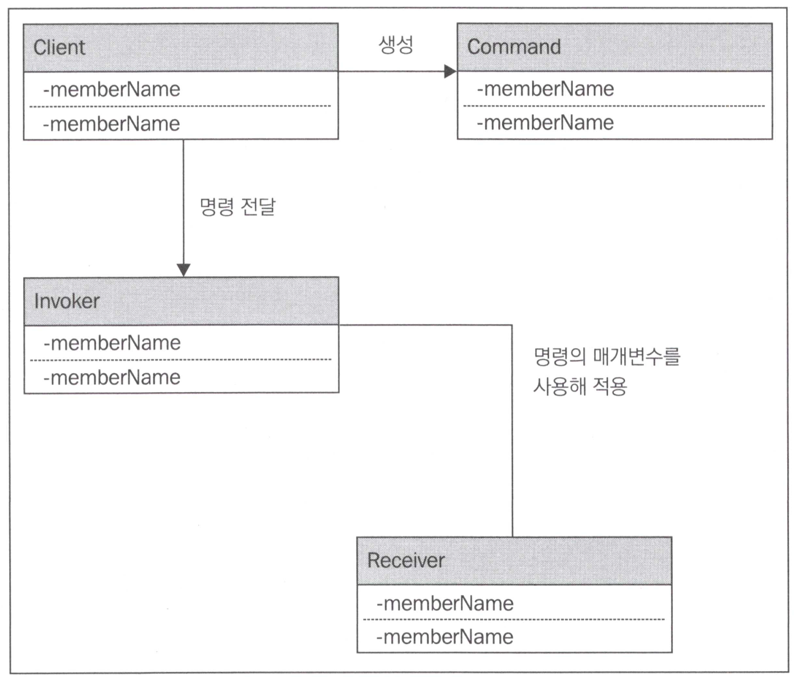

- Java
  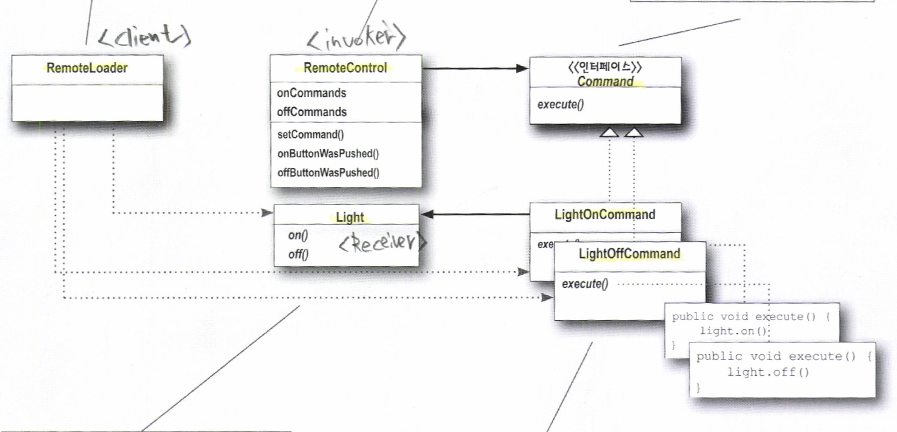


### 구현코드
```javascript
  // 2 명령 (Command)
  // 2.1 커맨드
  var BringTroopsCommand = (function () {

    // function BringTroopsCommand(location, numberOfTroops, when) {
      // this._location = location;
      // this._numberOfTroops = numberOfTroops;
      // this._when = when;
    // }

    function BringTroopsCommand(receiver) {
      this._receiver = receiver;
    }


    BringTroopsCommand.prototype.execute = function () {
      // receiver.bringTroops(this._location, this._numberOfTroops, this._when);
      this._receiver.bringTroops();
    };

    return BringTroopsCommand;
  })();

  // 2.2 리시버
  var LordInstructions = (function () {
    function LordInstructions(location, numberOfTroops, when) {
      this._location = location;
      this._numberOfTroops = numberOfTroops;
      this._when = when;
    }

    LordInstructions.prototype.bringTroops = function () {
      console.log("You have been instructed to bring ~! "
        + this._numberOfTroops + " troops to " + this._location + " by" + this._when);
    };
    return LordInstructions;
  })();

  // 2.4 실행
  console.log("\n**** 2.커맨드 ****\n");
  var lordInstructions = new LordInstructions(10, 10, "목요일");
  var bringTroopsCommand = new BringTroopsCommand(lordInstructions);
  bringTroopsCommand.execute();

  // 객체기반
  var LordReceiver = {
    bringTroops: function () {
      console.log("You have been instructed to bring ~! "
        + this._numberOfTroops + " troops to " + this._location + " by" + this._when);
    }
  };
  
  LordReceiver._location = 10;
  LordReceiver._numberOfTroops = 10;
  LordReceiver._when = "금요일";

  var BringCommand = {
    _receiver: Object.create(LordReceiver),
    execute: function () {
      this._receiver.bringTroops();
    }
  };

  BringCommand.execute();
```


## 3. 인터프리터 
**말 그대로 해석기.**  
`대부분 파서용으로 많이 활용` 할 수 있다.
파서 구현을 할때 클래스별로 쪼개고 싶은 경우에 활용하기 좋음.  
예를들어서 `JSON 파싱 or 간단 언어 규칙 구현 활용`에 최적 


### 클래스다이어그램
- Java
  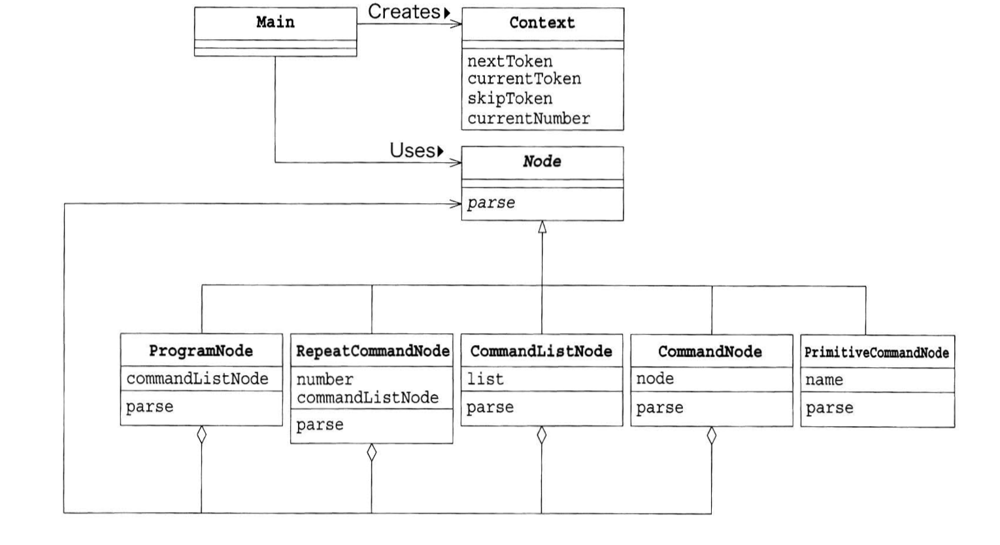
  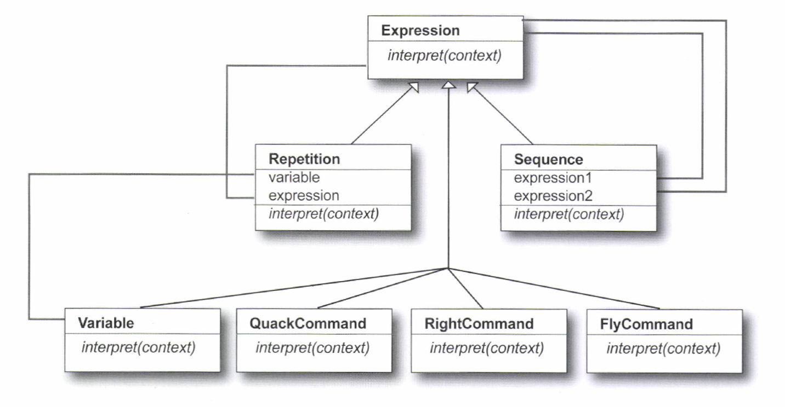


### 구현코드
```javascript
  // 3. 인터프리터
  // 3.1 데이터모델
  var Battle = (function () {
    function Battle(battleGround, agressor, defender, victor) {
      this.battleGround = battleGround;
      this.agressor = agressor;
      this.defender = defender;
      this.victor = victor;
    }

    return Battle;
  })();

  // 3.2 파서
  var Parser = (function () {
    function Parser(battleText) {
      this.battlText = battleText;
      this.currentIndex = 0;
      this.battleList = battleText.split("\n");
    }

    Parser.prototype.nextBattle = function () {
      if (!this.battleList[0]) {
        return null;
      }
      var segments = this.battleList[0].match(/\((.+?)\s?->\s?(.+?)\s?<-\s?(.+?)\s->\s?(.+)/);
      return new Battle(segments[2], segments[1], segments[3], segments[4]);

    };
    return Parser;
  })();

  // 3.4 실행
  console.log("\n**** 3. 인터프리터 ****");
  var text = "(Robert Baratheon -> River Trident <- RhaegarTargaryen -> Robert Baratheon";
  var p = new Parser(text);
  console.log(p.nextBattle());

```


## 4. 반복자 (Iterator)
이터레이터 패턴은 반복이 필요한 경우에 활용이 되는 패턴.  
자바 같은 객체지향프로그래밍 관점에서 이터레이터의 큰 장점은 인터페이스의 제공으로
다양한 반복실행 구조를  통합 해준다는것에 있고, 내부의 구현된 내용을 알 필요가 없는 경우에도 해당.


### 클래스다이어그램


### 구현코드
```javascript
  // 4. 반복자
  // 4.1 내부 next 구현
  var KingSuccession = (function () {
    function KingSuccession(inLineForThrone) {
      this.inLineForThrone = inLineForThrone;
      this.pointer = 0;
    }

    KingSuccession.prototype.next = function () {
      return this.inLineForThrone[this.pointer++];
    };

    return KingSuccession;
  })();

  // 4.2 실행
  console.log("\n**** 4. 이터레이터 ****");
  var king = new KingSuccession(["Robert Baratheon", "JofferyBaratheon", "TommenBarathreon"]);
  console.log(king.next());
  console.log(king.next());
  console.log(king.next());
  console.log(king.next());
  console.log(king.next());
```


## 5. 중재자
가운데에서 통신매개체 정도로 생각하면 됨.  
복잡한 통신구조를 `중앙집중화`하여 `통신 규약을 단순화`하는데 목적이 있음.  
중재자에서 모든걸 감안하여 처리해야 하다보니 중재자인터페이스의 복잡성이 올라가는 단점이 있기도 함.  
적절히 배분하는게 필요.  

**등장인물**  
1. 데이터모델 (예시 : **각가문**)
2. 중재자 (예시 : **왕**)

### 클래스다이어그램
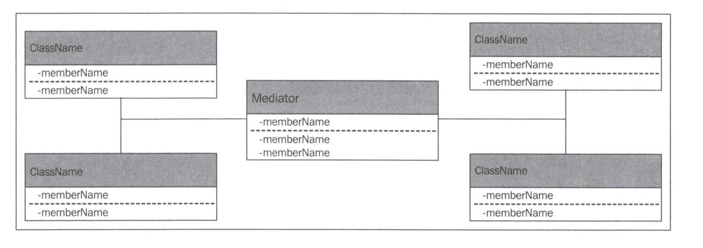

### 구현코드
```javascript
  // 5. 중재자
  // 5.1 각가문
  var Karastark = (function () {
    function Karastark(greatLord) {
      this.greatLord = greatLord; // 중재자
    }

    Karastark.prototype.receiveMessage = function (message) {
      console.log("Karastark 가문입니다");
      console.log("받은 메시지 : " + message);
    };

    Karastark.prototype.sendMessage = function (message) {
      this.greatLord.routeMessage(message);
    };
    return Karastark;
  })();

  var Bolton = (function () {
    function Bolton(greatLord) {
      this.greatLord = greatLord; // 중재자
    }

    Bolton.prototype.receiveMessage = function (message) {
      console.log("Bolton 가문입니다");
      console.log("받은 메시지 : " + message);
    };

    Bolton.prototype.sendMessage = function (message) {
      this.greatLord.routeMessage(message);
    };
    return Bolton;
  })();

  // 5.2 중재자 -> 메시지 전달
  var HouseStark = (function () {
    function HouseStark() {
      this.karstark = new Karastark(this);
      this.bolton = new Bolton(this);
    }

    HouseStark.prototype.routeMessage = function (message) {
      if (message.indexOf('Bolton =>') > -1) {
        this.bolton.receiveMessage(message);
      } else if (message.indexOf('Karastrak =>') > -1) {
        this.karstark.receiveMessage(message);
      }
    };
    return HouseStark;
  })();

  // 5.3 실행
  console.log("\n**** 5. 중재자 ****");
  var houseStark = new HouseStark();
  var bolton = new Bolton(houseStark);
  var karstark = new Karastark(houseStark);
  bolton.sendMessage("Karastrak => 전달한다받아라");
  bolton.sendMessage("Karastrak => 전달한다받아라2");

  karstark.sendMessage("Bolton => 전달한다받아라");
  karstark.sendMessage("Bolton => 전달한다받아라2");
```

## 6 메멘
어떤 상태를 저장하고, 이전 상태로 되돌리고, 작업의 `undo`와 `redo`의 기능을 극대화 시킬 수 있는 패턴    
다형성이나 인터페이스 구현과는 별개로 기능 구현에 초점이 맞춰져 있음  


### 클래스다이어그램
- JS
  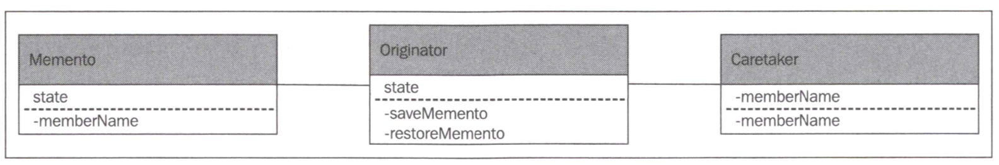
- Java
  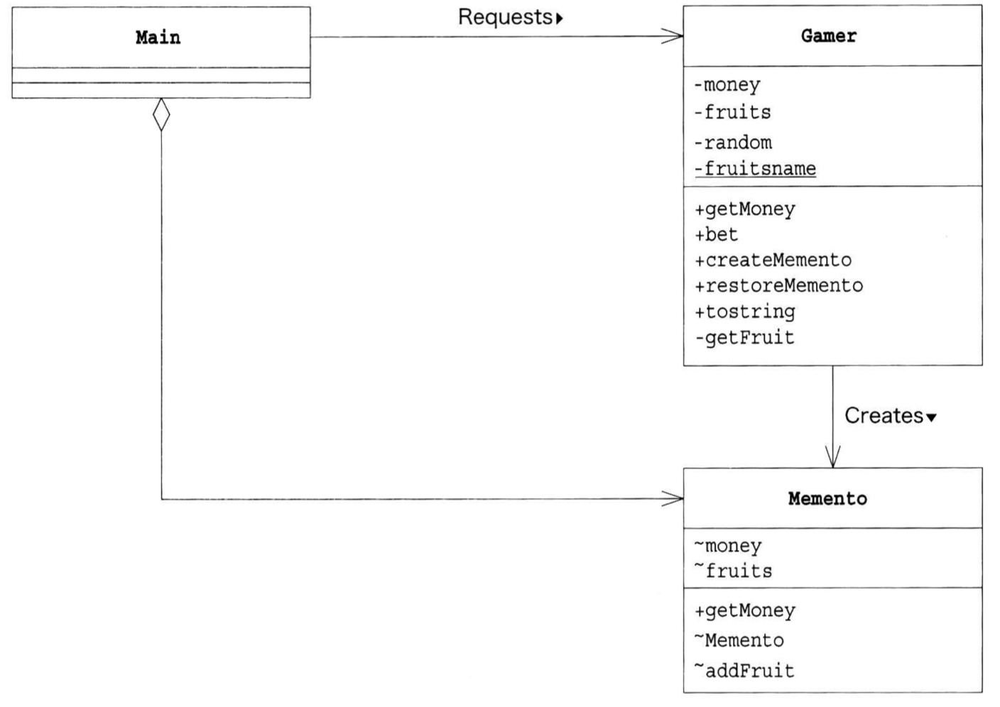

### 구현코드
```javascript
  // 6 메멘토
  // 6.1 구현
  var WorldState = {
    numberOfKings: undefined,
    currentKingInKingsLanding: undefined,
    season: undefined
  };

  // 6.2 메멘토
  var WorldStateProvider = {
    saveMemento: function () {
      var state = Object.create(WorldState);
      state.currentKingInKingsLanding = this.currentKingInKingsLanding;
      state.numberOfKings = this.numberOfKings;
      state.season = this.season;
      return state;
    },
    restoreMemento: function (memento) {
      this.numberOfKings = memento.numberOfKings;
      this.currentKingInKingsLanding = memento.currentKingInKingsLanding;
      this.season = memento.season;
      console.log(this);
    }
  };

  // 6.3 클라이언트
  var Soothsayer = {
    startingPoints: [],
    currentState: Object.create(WorldStateProvider),
    setInitialConditions: function (numberOfKings, currentKingInKingsLanding, season) {
      this.currentState.numberOfKings = numberOfKings;
      this.currentState.currentKingInKingsLanding = currentKingInKingsLanding;
      this.currentState.season = season;
    },
    alterNumberOfKingsAndForetell: function (numberOfKings) {
      this.startingPoints.push(this.currentState.saveMemento());
      this.currentState.numberOfKings = numberOfKings;
    },
    alterSeasonAndForetell: function (season) {
      this.startingPoints.push(this.currentState.saveMemento());
      this.currentState.season = season;
    },
    alterCurrentKingInKingsLandingAndForetell: function (currentKingInKingsLanding) {
      this.startingPoints.push(this.currentState.saveMemento());
      this.currentState.currentKingInKingsLanding = currentKingInKingsLanding;
    },
    tryADifferentChange: function () {
      this.currentState.restoreMemento(this.startingPoints.pop());
    },
  };

  // 6.4 실행
  console.log("\n**** 6. 메멘토 ****");
  Soothsayer.setInitialConditions(10,50, '가을');
  Soothsayer.alterNumberOfKingsAndForetell(10);
  Soothsayer.alterNumberOfKingsAndForetell(20);
  Soothsayer.alterNumberOfKingsAndForetell(30);
  Soothsayer.tryADifferentChange();
  Soothsayer.tryADifferentChange();
  Soothsayer.tryADifferentChange();
```

## 7. 옵저버
Observer(구독자)상태의 변화를 관찰하고 알림. 
`리액티브 프로그래밍의 근간이 되는 내용`, RxJS, RxJava 등  

**등장인물**
1. 구독자 (Observer)
2. 관찰자 (Observable)

**중요**
1. `notify` 구현 -> 상태변화를 감지 후 각 **구독자에게 내용 전달**
2. `update` 구현 -> 상태변화에 따라 각 **구독자 상태 변경**
3. `push/pull 방식` -> 예제는 push 방식
  - push : Observable -> Observer에 알림
  - pull : Observer가 변화가 있는지 체크 후 땡겨옴 **(GitHub, GitLab)**

### 클래스다이어그램
- JS
  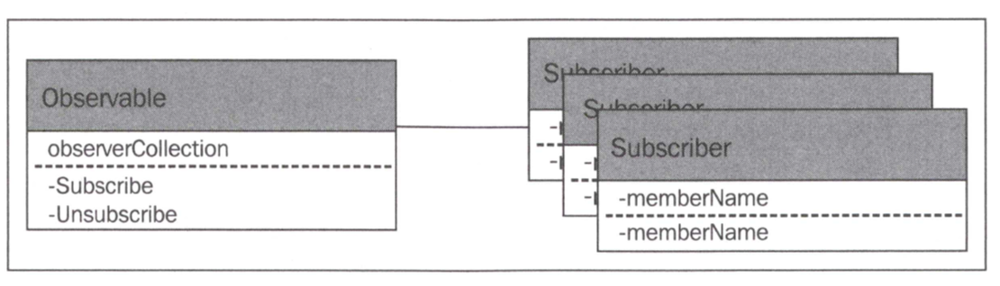

- Java
  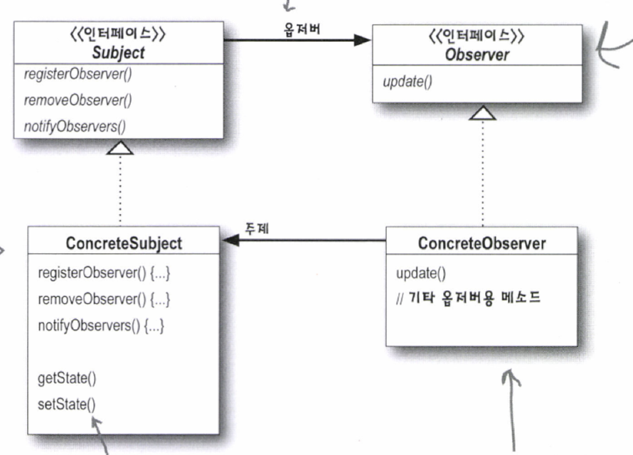


### 구현코드
```javascript
  // 7 옵저버
  // 7.1 옵저버블 (관찰자)
  var Spy = {
    partiesToNotify: [],
    painKillers: undefined,
    subscribe(subscriber) {
      this.partiesToNotify.push(subscriber);  // 관찰 대상자 등록 (옵저버)
    },
    unsubscribe(subscriber) {
      this.partiesToNotify.remove(subscriber);  // 관찰 대상자 취소
    },
    // 각 옵저버에 상태 알림
    setPainKillers(painKillers) {
      this.painKillers = painKillers;
      for (let fn of this.partiesToNotify) {
        fn(painKillers);
      }
    }
  };

  // 7.2 구독자(옵저버)
  var Player = {
    // update 메서드
    onKingPainKillerChange(newPainKillerAmount) {
      // 작업 수행
      console.log("Kill Number : "+newPainKillerAmount);
    }
  };

  // 7.3 실행
  console.log("\n**** 7. 옵저버 ****\n");

  Spy.subscribe(Player.onKingPainKillerChange);
  Spy.subscribe(a => {
    console.log("Second Observer 'a' is " + a);
  });
  Spy.setPainKillers(12); // 모든 옵저버에 통지
  Spy.setPainKillers(50); // 모든 옵저버에 통지
```

## 8. 스테이트 (State)
상태를 구현이아닌 클래스화를 통해 코드의 간결성 및 유지보수성을 높이는 패턴  
객체파일이 많아진다는 단점이 있으나, 자바스크립트에서는 다른언어에 비해 상대적으로 유용하게 느껴짐  

**등장인물**
1. 상태값들
2. 상태 관리자

### 클래스다이어그램
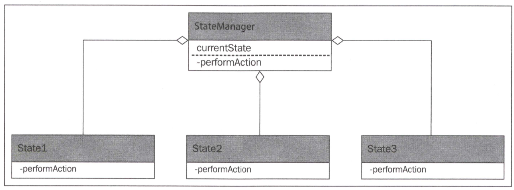

### 구현코드
```javascript
// 8.1 상태관리자
class BankAccountManager {

  constructor() {
    this.balance = 0; // 잔고
    this.currentState = new GoodStandingState(this); // 현재상태 저장
  }

  deposit(amount) {
    this.currentState.deposit(amount);
  }

  withDraw(amount) {
    this.currentState.withDraw(amount);
  }

  addToBalance(amount) {
    this.balance += amount;
  }

  getBalance() {
    return this.balance;
  }

  moveToState(newState) {
    this.currentState = newState; // 상태 저장
  }

  showInfo() {
    console.log("잔액 : " + this.balance);
    console.log(this.currentState);
  }
}

// 8.2 각 상태 구현
// 정지상태
class OnHold {
  constructor(manager) {
    this.manager = manager;
  }

  deposit(amount) {
    this.manager.addToBalance(amount);
    throw "Your account is on hold and you must go to the bank to resolve the issue";
  }

  withDraw(amount) {
    throw "Your account is on hold and you must go to the bank to resolve the issue";
  }
}

// 초과인출 상태
class OverdrawnState {
  constructor(manager) {
    this.manager = manager;
  }

  deposit(amount) {
    this.manager.addToBalance(amount);
    if (this.manager.getBalance() > 0) {
      this.manager.moveToState(new GoodStandingState(this.manager));
    }
  }

  withDraw(amount) {
    this.manager.moveToState(new OnHold(this.manager));
    throw "Cannot withdraw money from an aleady overdrawn bank account";
  }
}

// 양호상태
class GoodStandingState {
  constructor(manager) {
    this.manager = manager;
  }

  deposit(amount) {
    this.manager.addToBalance(amount);
  }

  withDraw(amount) {
    if (this.manager.getBalance() < amount) {
      this.manager.moveToState(new OverdrawnState(this.manager));
    }
    this.manager.addToBalance(-1 * amount);
  }
}

// 8.3 실행
  console.log("\n**** 8. 상태패턴 ****\n");
  var bankAccountManager = new BankAccountManager();
  bankAccountManager.deposit(10000);
  bankAccountManager.deposit(10000);
  bankAccountManager.showInfo();
  bankAccountManager.withDraw(20000);
  bankAccountManager.withDraw(10000);
  bankAccountManager.showInfo();
```

## 9. 전략패턴
예시가 일단 별로.  
동적으로 알고리즘을 바꿔서 적용하는 패턴.  
예시는 그런 내용을 담고 있지는 않은점이 아쉬움.  
예를들어, 가위바위보의 게임 승리조건을 바뀐다던지... 즉 요구사항에 대하여 대응하여 전략을 하나씩 추가하여 동적으로 변경이  
가능하게끔 구현해주는게 핵심이다.

스프링의 다양한 `ApplicationContext` 구현체를 예로들수 있다.  

**등장인물**
1. 전략
2. 전략을 위한 데이터모델
3. 클라이언트

### 클래스다이어그램


### 구현코드
```javascript
  // 9. 전략 (Strategy)
  // 9.1 결과
  var TravelResult = (function () {
    function TravelResult(durationIndays, probabilityOfDeath, cost) {
      this.durationInDays = durationIndays;
      this.probabilityOfDeath = probabilityOfDeath;
      this.cost = cost;
    }

    return TravelResult;
  })();

  // 9.2 여행 방법 및 비용
  var SeaGoingVessel = (function () {
    function SeaGoingVessel() {
    }

    SeaGoingVessel.prototype.travel = function (source, destination) {
      return new TravelResult(15, 0.25, 500);
    };

    return SeaGoingVessel;
  })();

  var Horse = (function () {
    function Horse() {
    }

    Horse.prototype.travel = function (source, destination) {
      return new TravelResult(30, 0.25, 50);
    };

    return Horse;
  })();

  var Walk = (function () {
    function Walk() {
    }

    Walk.prototype.travel = function (source, destination) {
      return new TravelResult(150, 0.55, 0);
    };

    return Walk;
  })();

  // 9.3 전략들
  // 가장 빠르고 안전한 방법
  var FavorFastestAndSafeStrategy = (function () {
    function FavorFastestAndSafeStrategy() {
    }

    FavorFastestAndSafeStrategy.prototype.travel = function () {
      var seaGoing = new SeaGoingVessel().travel();
      var horse = new Horse().travel();
      console.log("=== 가장 빠르고 안전한 방법 ===");
      console.log("비용 : " + (seaGoing.cost * 2 + horse.cost));
      console.log("죽음 확률 : " + ((seaGoing.probabilityOfDeath + horse.probabilityOfDeath)) / 2);
      console.log("기간 : " + ((seaGoing.durationInDays + horse.probabilityOfDeath)) / 2);

    };
    return FavorFastestAndSafeStrategy;
  })();

  // 가장 싼 방법
  var FavorCheapest = (function () {
    function FavorCheapest() {
    }

    FavorCheapest.prototype.travel = function () {
      var walk = new Walk().travel();
      var horse = new Horse().travel();
      console.log("=== 가장 값싼 방법 ===");
      console.log("비용 : " + (walk.cost + horse.cost));
      console.log("죽음 확률 : " + ((walk.probabilityOfDeath + horse.probabilityOfDeath)) / 2);
      console.log("기간 : " + ((walk.durationInDays + horse.probabilityOfDeath)) / 2);
    };
    return FavorCheapest;
  })();

  // 9.3 클라이언트
  var Client = (function () {
    function Client(strategy) {
      this.strategy = strategy;
    }

    Client.prototype.travel = function () {
      this.strategy.travel();
    };

    // 전략변경
    Client.prototype.setStrategy = function (strategy) {
      this.strategy = strategy;
    };
    return Client;
  })();

  // 9.4 실행
  console.log("\n**** 9. 전략 ****\n");
  var client = new Client(new FavorFastestAndSafeStrategy());
  client.travel();
  client.setStrategy(new FavorCheapest());
  client.travel();
```

## 10. 템플릿메서드
어떤 **하나의 퍼블릭 메서드**에서 `알고리즘화` 되어 **서브클래스에서 동적바인딩** 되어 호출되는 패턴  
즉 실제 구현은 서브클래스에서 담당하고 상위클래스에서는 틀만 제공을 해준다. 이 틀에 정의된 메서드들이   
오버라이딩 대상.  
**팩토리메서드 처럼 간단해서 해결책으로 많이 사용되는 패턴 중 하나**


**등장인물**
1. 상위 (틀 제공 담당)
2. 하위 (구현체)


### 클래스다이어그램
- JS
  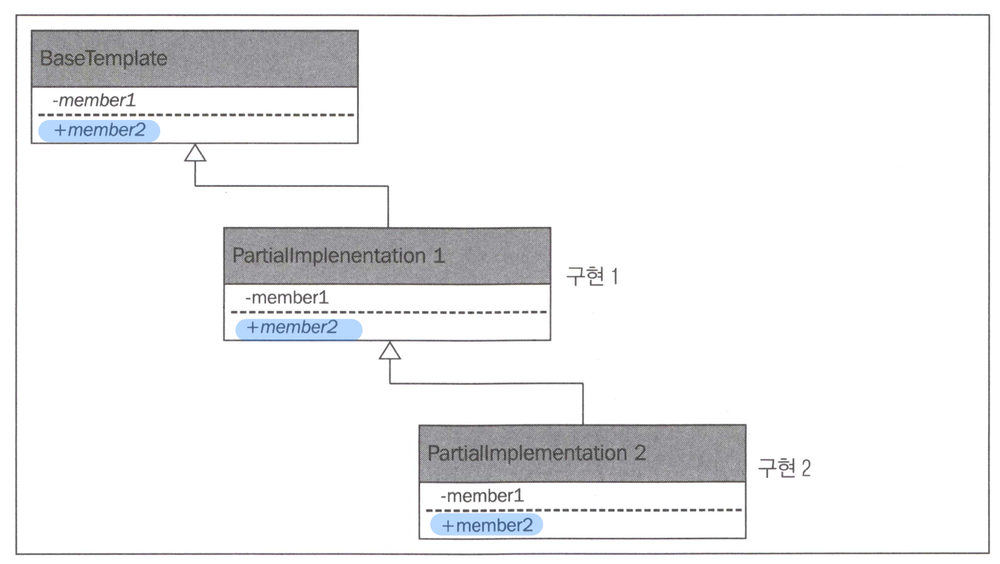

- Java
  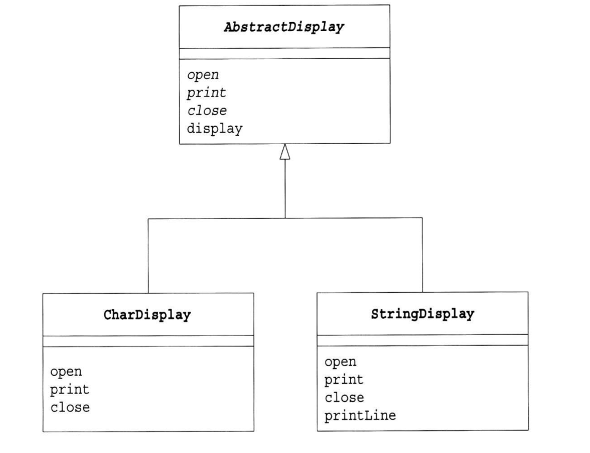

### 구현코드
```javascript
  // 10. 템플릿메서드
  // 10.1 기본 맥주 구현
  var BasicBeer = (function () {
    function BasicBeer() {
    }

    BasicBeer.prototype.create = function () {
      this.addIngredients();
      this.stir();
      this.ferment();
      this.test();
      if (this.testingPassed()) {
        this.distribute();
      }
    };

    BasicBeer.prototype.addIngredients = function () {
      throw "Add ingredients needs to be implemented";
    };

    BasicBeer.prototype.stir = function () {
      console.log("15번 휘젓기");
    };

    BasicBeer.prototype.ferment = function () {
      console.log("30일 동안 놓아둔다");
    };

    BasicBeer.prototype.test = function () {
      console.log("시음해보기~");
    };

    BasicBeer.prototype.testingPassed = function () {
      throw "Conditions to pass a test must be~";
    };

    BasicBeer.prototype.distribute = function () {
      console.log("50L 통으로 옮겨");
    };
    return BasicBeer;
  })();

  // 10.2 라즈베리 맥주 -> BasicBeer 상속 (상위)
  var RaspberryBeer = (function (_supper) {

    // __extends(RaspberryBeer, _supper);
    function RaspberryBeer() {
      _supper.apply(this, arguments);
    }

    RaspberryBeer.prototype = new _supper();
    // RaspberryBeer = Object.create(_supper); // RaspberryBeer.prototype -> BasicBeer

    // 오버라이딩
    RaspberryBeer.prototype.addIngredients = function () {
      console.log("라즈베리 맥주 요소 첨가");
    };

    // 오버라이딩
    RaspberryBeer.prototype.testingPassed = function () {
      console.log("라즈베리 시음하기")
    };

    return RaspberryBeer;
    // return RaspberryBeer;
  })(BasicBeer);

  // 10.3 실행
  console.log("\n**** 10. 템플릿메서드 ****\n");
  var beer = Object.create(RaspberryBeer.prototype);  // beer -> RaspberryBeer.prototype
  beer.create();

  var beer2 = new RaspberryBeer();  // beer -> RaspberryBeer.prototype
  beer2.create();


  var beer3 = new BasicBeer();
  beer3.create();
```

## 11. 방문자 (Visitor)
컴포지트 패턴과 비슷함.  
방문자 패턴의 가장 핵심은 컴포지트의 트리구조를 활용하여, 한 클래스에서의 기능 구현(예를들면, Client)을  
`서브클래스로 분리`시켜 **인터페이스에 맞는 메서드를 구현하여 처리**  

**등장인물**
1. 방문자
2. 방문대상의 데이터모델들

**중요**
1. 각 데이터모델은 **visit 구현**
2. 방문자는 visit 구현에서 **각 데이터모델의 visit 호출** (방문하면서 처리)
3. 한클래스 내에서 기능 구현을 -> **각 클래스로 분산시켜서 책임에 맡게 처리** -> `간결성, 다형성, 안정성, 유지보수성 확보`


### 클래스다이어그램
- JS
  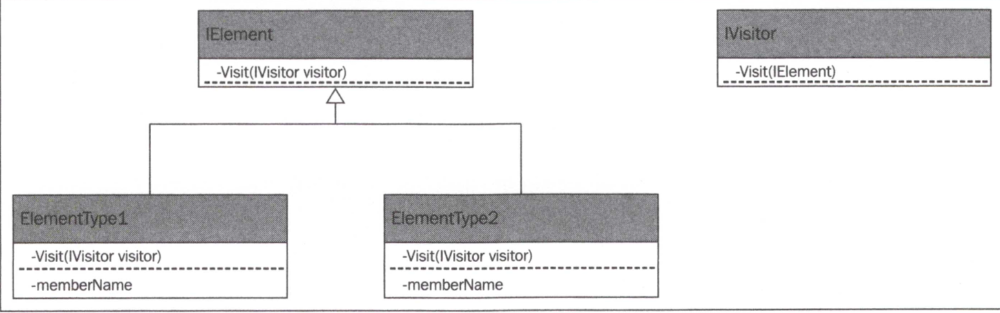

- Java
  
### 구현코드
```javascript
  // 11. 방문자 (Visitor)
  // 11.1 데이터모델
  var Knight = (function () {
    function Knight() {
      this._type = 'Knight';
    }

    Knight.prototype.printName = function () {
      console.log("Knight");
    };

    Knight.prototype.visit = function (visitor) {
      visitor.visit(this);
    };

    return Knight;
  })();
  var FootSoldier = (function () {
    function FootSoldier() {
    }

    FootSoldier.prototype.printName = function () {
      console.log("Knight");
    };

    FootSoldier.prototype.visit = function (visitor) {
      visitor.visit(this);
    };

    return FootSoldier;
  })();
  var Lord = (function () {
    function Lord() {
    }

    Lord.prototype.printName = function () {
      console.log("Knight");
    };

    Lord.prototype.visit = function (visitor) {
      visitor.visit(this);
    };

    return Lord;
  })();

  // 11.2 방문자
  var SelectiveNamePrinterVisitor = (function () {
    function SelectiveNamePrinterVisitor() {
    }

    SelectiveNamePrinterVisitor.prototype.visit = function (memberOfArmy) {
      if (memberOfArmy._type === 'Knight') {
        this.visitKnight(memberOfArmy);
      } else {
        console.log('Not a Knight');
      }
    };

    SelectiveNamePrinterVisitor.prototype.visitKnight = function (memberOfArmy) {
      memberOfArmy.printName();
    };

    return SelectiveNamePrinterVisitor;
  })();

  // 11.3 실행
  console.log("\n**** 11. 방문자 ****\n");
  var collections = [];
  collections.push(new Knight());
  collections.push(new FootSoldier());
  collections.push(new Lord());

  // 방문자 패턴 적용 전
  console.log("===== 방문자 패턴 적용 전 ====");
  for (let collection of collections) {
    // if ((typeof collection) == 'Knight') {
    // if (collection instanceof Knight) {
    if (collection._type === 'Knight') {
      collection.printName();
    } else {
      console.log("Not a knight");
    }
  }

  // 방문자 패턴 적용 후
  console.log("\n===== 방문자 패턴 적용 후 ====\n");
  var visitor = new SelectiveNamePrinterVisitor();
  for (let collection of collections) {
    collection.visit(visitor);
  }
```