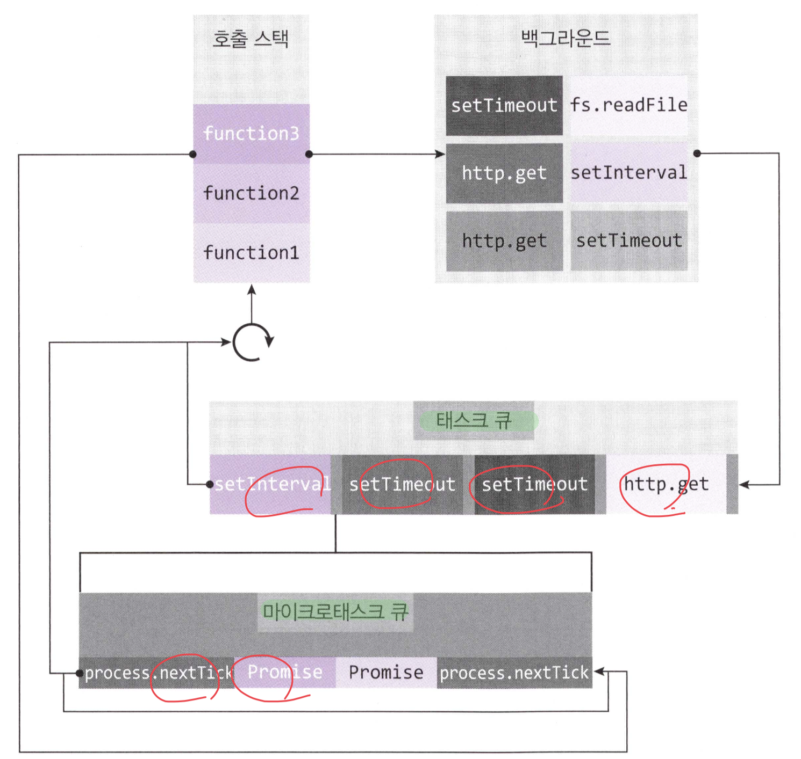
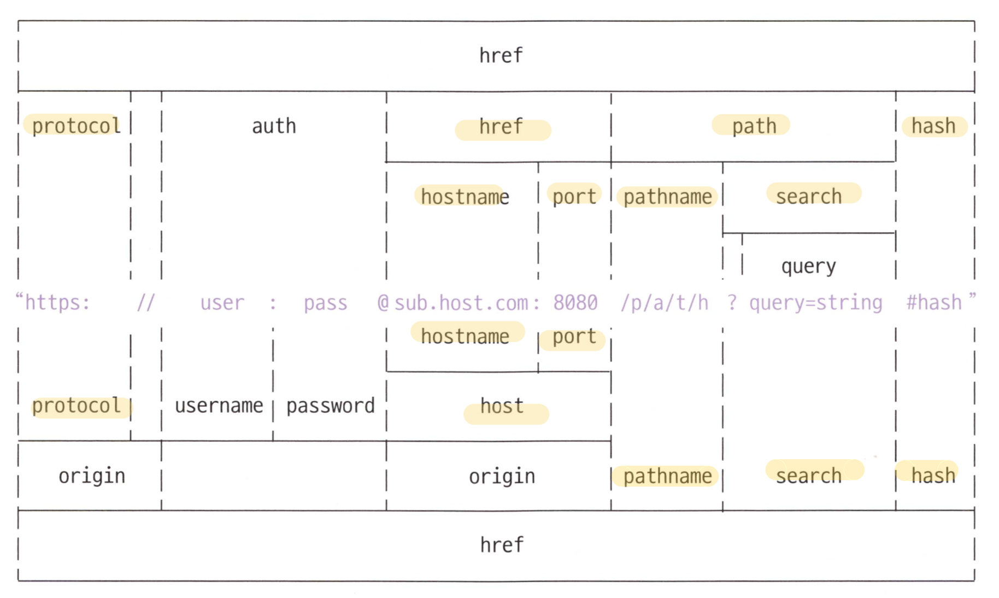

# 3 노드기능 알아보기

## 3.1 REPL 사용하기
- R : Read, 읽고
- E : Eval, 평가하고
- P : Print, 출력하고
- L : Loop, 반복하고

## 3.2 JS 파일 실행하기
기본적인 js 파일 실행.  
node 명령어로 실행 

```javascript

function helloNode() {
  console.log('Hello Node');
}

function helloWorld() {
  console.log('Hello World');
  helloNode();
}

helloWorld();
```

```bash
$ node helloWorld.js
```

## 3.3 모듈로 만들기  
**모듈 : 특정한 기능을 하는 함수나 변수들의 집함**  
파일하나 모듈하나로 설정하는게 관리에 용이  
`module.exports` 객체에 저장하면 다른 파일에서 `require()`를 통해 임포트 할 수 있음  
모듈화를 통해 독립적인 실행파일을 작성하고, 재사용 높은 프로그래밍이 가능해진다.  

```javascript
// 1. var.js
const odd = '홀수 입니다';
const even = '짝수 입니다';

module.exports = {
  odd,
  even
};  // 변수내보내기

// 2. func.js
const {odd, even} = require('./3.노드기능알아보기');  // 다른 파일에서 재사용중

function checkOdddOrEven(num) {
  return num % 2 ? odd : even;
}

module.exports = checkOdddOrEven; // 함수 내보내기

// 3. index.js
const {odd, even} = require('./3.노드기능알아보기');  // 다른 파일에서 재사용중
const checkNumber = require('./3.노드기능알아보기2');

function checkStringOddEven(str) {
  return str.length % 2 ? odd : even;
}

console.log(checkNumber(10));
console.log(checkStringOddEven('hello'));
```

## 3.4 노드 내장 객체 알아보기
Dom의 window location 같은 내장 객체처럼, Node에도 내장객체가 존재.  
**`내장객체`란 이미 만들어져 있는 객체로 그냥 전역적으로 사용이 가능한 객체들을 말함**  
책에서는 자주 사용되는 객체만 다룸. 궁금한건 문서 참조  

1. global
   전역객체로.. 데이터를 공유하여 사용할 수도 있으나 권장 x, 변경 되는 정보를 나중에 찾는데 어려움 발생..
   ```javascript
   // globalA.js
   module.exports = () => global.message;

   // globalB.js (실행)
   const A = require('./3.globalA');
   global.message = '안녕하세요';
   console.log(A());
   ```
2. console
   디버깅, 로깅의 기본 객체  
   - console.time : node 프로세스의 실행시간. `시작시간`
   - console.timeEnd : .time과 대응되는 레이블과 쌍을 이룸. `끝난시간`
   - console.log : 로깅
   - console.error : 에러정보 출력
   - console.dir : 객체 정보 출력
   - console.trace : 에러 추적

3. 타이머
타이머 기능, 내장 콜백함수에 의해 비동기처리 됨. 3가지 함수가 있다

- setTimeout(callback, ms) : 가장 많이쓰임,  ms 밀리초 후 callback 실행
- setInterval(callback, ms) : callback ms 밀리초 만큼 지난 후 반복실행.
- setImmediate(callback) : callback 즉시 실행. 

- clearTimeout(아이디) : setTimeout을 취소
- clearInterval(아이디) : setInterval을 취소
- clearImmediate(아이디) : setImmediate을 취소

### setTimeout(callback, 0)과 setImmediate(callback) 차이
실행 순서의차이.
파일시스템 접근, 네트워킹 같은 I/Odml 특수한 경우, setImmediate 우선권 높음. 그러나 항상 먼저실행되는건 아님.. 점유에 따라 달라지는것 같음.  
**헷갈리지 않도록 setTimeout(callback, 0) 사용하지 않는 것을 권장**

4. __filename, __dirname  
해당 내용은 `path 모듈`에서 자세히 다룸  
**__filename** : 현재 파일의 절대 경로  
**__dirname** : 현재 파일의 디렉토리 절대 경로   

5. module, exports
module.exports === exports -> `true` 즉 같은 객체.  
exports로 사용해도 되나 통일성을 위해 그냥 module. 을 붙여 사용하자  
**exports를 재정의 할 경우 모듈과 연결이 끊어지므로 주의 필요**

6. process
현재 실행 중인 node 프로세스의 정보를 알 수 있음  

```javascript
console.log(process.version);     // 설치된 노드 버전
console.log(process.arch);        // 프로세서 아키텍처 정보, ex) x64, ia32 ...
console.log(process.platform);    // os 플랫폼, linux, darwin, ...
console.log(process.pid);         // 현재 프로세스 아이디
console.log(process.uptime());    // 프로세스가 시작된 후 흐른 시간
console.log(process.execPath);    // 노드의 경로
console.log(process.cwd());       // 현재 프로세스가 실행되는 위치, 
console.log(process.cpuUsage());  // cpu 사용량
```
- ### process.env
  나중에  `dotenv 모듈` 사용  
  **서버의 중요한 키 정보를 저장함**  

- ### process.nextTick(callback)
  이벤트루프가 다른 콜백함수보다 nextTick 함수의 우선순위를 높게 잡아 `우선 처리`
  ```javascript
  setImmediate(() => {
    console.log('immediate');
  });

  process.nextTick(() => {
    console.log('nextTick');
  });

  setTimeout(() => {
    console.log('timeout');
  }, 0);

  Promise.resolve().then(() => console.log('promise'));

  // 출력 예상  
  // 1. nextTick  2. promise  3. timeout  4. immediate    
  ```
  process.nextTick, Promise를 `마이크로태스트`라고 따로 구분지음 -> 쌓이는 큐 영역이 다름  
  

  마이크로태스크 > 태스트 이므로, 남발하는 경우 이벤트루프에서 다른 콜백함수를 실행하지 못하는 경우가 발생할 수 있음  

- ### process.exit(코드)
  정상종료 : 0, 비정상종료 : 1  / 프로그램을 수동적으로 강제 종료 시킴

## 3.5 노드 내장 모듈 사용하기
노드에서 제공하는 모듈, 많은 것이 있지만 주로사용하는 것 위주로  

1. OS
운영체제 정보를 가져올 수 있음. 웹 브라우저에서는 가져올 수 없지만..  
```javascript
const os = require('os');
console.log('OS 정보 ------------------');
console.log(os.arch());
console.log(os.platform());
console.log(os.type());
console.log(os.uptime());
console.log(os.hostname());
console.log(os.release());
console.log('경로 ------------------');
console.log(os.homedir());
console.log(os.tmpdir());
console.log('cpu info ------------------');
console.log(os.cpus());
console.log(os.cpus().length);
console.log('memory info ------------------');
console.log(os.freemem());
console.log(os.totalmem());
```
node의 경우 싱글스레드이므로 코어수가 몇개든 간에 하나밖에 사용을 할 수 밖에 없다. 그러나 `cluster`모듈을 사용하면 코어 개수에 맞춰 프로세스를 늘릴 수 있다.  

2. path
파일, 폴더경로 관련한 모듈. `Windows타입과 POSIX(유닉스 기반 OS)`로 나뉨  

```javascript
const path = require('path');
const string = __filename;

console.log(path.sep);        // 경로 구분자
console.log(path.delimiter);  // 환경변수 구분자
console.log('-------------------------------');
console.log(path.dirname(string));  // 파일이 위치한 폴더 경로
console.log(path.extname(string));  // 파일의 확장자
console.log(path.basename(string)); // 파일명 + 확장자 
console.log(path.basename(string, path.extname(string))); // 파일명만
console.log('-------------------------------');
console.log(path.parse(string));  // 파일경로를 -> root, dir, base, ext, name 으로 분리해줌
console.log(path.format({         // path.parse 한 객체를 파일 경로로 합침
  dir: '/Users/users/zerocho',
  name: 'path',
  ext: '.js'
}));  // /Users/users/zerocho/path.js
console.log(path.normalize('/Users//users\\\\zerocho\\\path.js'));  // 정상경로로 변경. ..? 잘안되는거같은데.. (/Users/users\\zerocho\path.js)
console.log('-------------------------------');
console.log(path.isAbsolute("/Users")); // 절대 경로 확인
console.log(path.isAbsolute("./home"));
console.log('-------------------------------');
console.log(path.relative('/Users/users/zerocho/path.js', '/Users'));     // 첫번째 경로 -> 두번째 경로로 가는 방법 (../../..)
console.log(path.join(__dirname, "..", "..", "/users", ".", "/zerocho")); // 하나의 경로로 합침
console.log(path.resolve(__dirname, "..", "/users", ".", "/zerocho"));    // join과 비슷하나 차이는 / 만나면 절대 경로로 인식 -> 앞의 경로를 무시하고 path.join은 상대경로로 처리
```

3. url
`인터넷 주소를 쉽게 조작`하도록 도와주는 모듈  
```javascript
const url = require('url');
const URL = url.URL;

// format
const myURL = new URL('http://www.gilbut.co.kr/book/bookList.aspx?sercate1=001001000#anchor');
console.log(myURL);
console.log(url.format(myURL));
console.log('-------------------------------');

// parse
const parseUrl = url.parse('http://www.gilbut.co.kr/book/bookList.aspx?sercate1=001001000#anchor');
console.log(parseUrl);
console.log(url.format(parseUrl));
```

`format` : WHATWG 구분 방식, `재조립`  
`parse` : 노드 url 구분 방식, `분해`  
username, password  ->  auth / searchParams -> query   
search -> Url 정보에서 ? 부분 부터  
  

#### node경로를 꼭 사용해야 하는 경우
host없이 pathname 부분만 오는 경우 -> /book/bookList.apsx 같은...  


#### searchParams
```javascript
const myUrl2 = new URL('http://www.gilbut.co.kr/book/bookList.aspx?page=3&limit=10&category=node&category=javascript');
console.log(myUrl2.searchParams);
console.log(myUrl2.searchParams.getAll('category'));
console.log(myUrl2.searchParams.get('limit'));
console.log(myUrl2.searchParams.has('page'));
console.log(myUrl2.searchParams.keys());
console.log(myUrl2.searchParams.values());
myUrl2.searchParams.append('filter', 'es3');
myUrl2.searchParams.append('filter', 'es5');
console.log(myUrl2.searchParams.getAll('filter'));

myUrl2.searchParams.append('filter', 'es6');
console.log(myUrl2.searchParams.getAll('filter'));

myUrl2.searchParams.delete('filter');
console.log(myUrl2.searchParams.getAll('filter'));

console.log(myUrl2.searchParams.toString());
/*
  (출력문)
  URLSearchParams {
    'page' => '3',
    'limit' => '10',
    'category' => 'node',
    'category' => 'javascript' }
  [ 'node', 'javascript' ]
  10
  true
  URLSearchParams Iterator { 'page', 'limit', 'category', 'category' }
  URLSearchParams Iterator { '3', '10', 'node', 'javascript' }
  [ 'es3', 'es5' ]
  [ 'es6' ]
  []
  page=3&limit=10&category=node&category=javascript
*/
```

4. querystring
WHATWG 방식의 url 대신 노드의 url을 사용할 때 `search`부분을 사용하기 쉽게 객체로 만드는 모듈  
```javascript
const url = require('url');
const querystring = require('querystring');

const parseUrl2 = url.parse('http://www.gilbut.co.kr/book/bookList.aspx?page=3&limit=10&category=node&category=javascript');
const query = querystring.parse(parseUrl2.query);
console.log(query);
console.log(querystring.stringify(query));

/*
  (출력문)
  [Object: null prototype] { page: '3', limit: '10', category: [ 'node', 'javascript' ] }
  page=3&limit=10&category=node&category=javascript
*/
```
- **querystring.parse(쿼리)** : url의 query부분 객체로 분해  
- **querystring.stringify(객체)** : 분해된 query 객체를 문자열로 재조립   


5. crypto
암호화를 도와주는 모듈  
- 단방향 : 한쪽으로만 암호화 진행. 복호화 불능. 주로 `해시기반 알고리즘`  sha256, sha512
```javascript
const crypto = require('crypto');
console.log(crypto.createHash('sha512').update('비밀번호').digest('base64'));
console.log(crypto.createHash('sha512').update('비밀번호').digest('hex'));
console.log(crypto.createHash('sha512').update('비밀번호').digest('latin1'));
console.log(crypto.createHash('sha512').update('다른 비밀번호').digest('base64'));
/*
  (출력문)
  dvfV6nyLRRt3NxKSlTHOkkEGgqW2HRtfu19Ou/psUXvwlebbXCboxIPmDYOFRIpqav2eUTBFuHaZri5x+usy1g==
  76f7d5ea7c8b451b773712929531ce92410682a5b61d1b5fbb5f4ebbfa6c517bf095e6db5c26e8c483e60d8385448a6a6afd9e513045b87699ae2e71faeb32d6
  ƒ…DŠjjýžQ0E¸v™®.qúë2Ö
  cx49cjC8ctKtMzwJGBY853itZeb6qxzXGvuUJkbWTGn5VXAFbAwXGEOxU2Qksoj+aM2GWPhc1O7mmkyohXMsQw==
*/
```
- createHash(알고리즘) : 해시알고리즘 명시. md5(x), sha1(x), sha256, sha512
- update(문자열) : 문자열 변환
- digest(인코딩) : 인코딩 할 알고리즘 명시. `base64`, hex, latin1

#### 현재주로 사용되는 알고리즘  
`pbkdf2, bcrypt, scrypt` 로 암호화   
pbkdf2는 단순하여 뒤에 2개보다 취약하므로, 보안이 중요한 경우 뒤에 2개를 사용, 주로 `scrypt`  
salt라는 문자열을 붙이고 -> 해시 알고리즘을 반복해서 적용
```javascript
// 64바이트 길이 문자열 생성(salt) -> 비밀번호, salt, 반복횟수, 출력바이트, 해시알고리즘 -> 반환된 결과 
crypto.randomBytes(64, (err, buf) => {  
  const salt = buf.toString('base64');
  console.log('salt : ', salt);
  crypto.pbkdf2('비밀번호', salt, 100000, 64, 'sha512', (err1, derivedKey) => {
    console.log('password : ', derivedKey.toString('base64'));
  })
});
/*
  (출력문)
  salt :  eaBnvslLefI+mzJig0bYb9E+rnK9k5nkHpALpsblAxSMypdV394C5Ki9nooWIKblLVEOXfSH/rcuXl/o0xafBA==
  password :  X/d+pRcIL1uZnVnYqCcydXVaPSx+jJnuHFM3JNiUp6ejedpxX4HtrLW6IbSOkA2sawVRq3qcmni+YLBSr/k78g==
*/
```

- 양방향 : 암복호화.  
```javascript
// deprecate 됨.
const cipher = crypto.createCipher('aes-256-ccm', '열쇠');
let result = cipher.update('암호화 할 문장', 'utf8', 'base64');
result += cipher.final('base64');
console.log('암호화 : ', result);

const decipher = crypto.createDecipher('aes-256-ccm', '열쇠');
let result2 = decipher.update(result, 'base64', 'utf8');
result2 += decipher.final('utf8');
console.log(result2);

```

6. util  
편의 기능 제공  

```javascript
const crypto = require('crypto');
const util = require('util');

const dontUseMe = util.deprecate((x, y) => {
  console.log(x + y);
},'dontUseMe 함수는 deprecated 되었으니 더이상 사용을 금합니다');
dontUseMe(1, 2);
/*
  (node:9593) DeprecationWarning: dontUseMe 함수는 deprecated 되었으니 더이상 사용을 금합니다
*/

const randomBtyesPromise = util.promisify(crypto.randomBytes);  // 콜백 -> 프로미스 패턴으로
randomBtyesPromise(64)
    .then(buf => {
      console.log('buf : ', buf.toString('base64'));
    })
    .catch((err) => {
      console.log(err);
    });
/*
  buf :  chT+LjpZBVQpN/f4dfk8fKBziqExopoEApT3GxAS2lBEcrfRuECfe/JlFvZuxuePHuu7d/bu2o4p69pLRz6Y3g==
*/
```

## 3.6 파일 시스템 접근
fs 모듈 : 파일시스템에 접근하는 모듈   
```javascript
// readme.txt
// 저를 읽어주세요

// js파일 
// 읽기
const fs = require('fs');
fs.readFile('./readme.txt', (err, data) => {
  if (err) {
    throw err;
  }
  console.log(data);
  console.log(data.toString());
});
/*
(출력문)
<Buffer ec a0 80 eb a5 bc 20 ec 9d bd ec 96 b4 ec a3 bc ec 84 b8 ec 9a 94>
저를 읽어주세요
*/

// 쓰기 
fs.writeFile('./writeme.txt', '글이 입력됩니다', err => {
  if (err) {
    throw err;
  }

  fs.readFile('./writeme.txt', (err1, data) => {
    if (err1) {
      throw err1;
    }
    console.log(data.toString());
  });
});
```
**readFile의 반환** -> `Buffer`라는 형식으로 반환   


1. 동기, 비동기 / 블로킹, 논블로킹
`동기, 비동기` : 함수가 바로 return 되는지 여부  
`블로킹, 논블로킹` : 백그라운드 작업 완료 여부  
**동기/블로킹 , 비동기/논블로킹이 대부분**  

동기 : readFileSync, 비동기 : readFile
```javascript

console.log(' 시작 ');

fs.readFile('./readme2.txt', (err, data) => {
  if (err) {
    throw err;
  }
  console.log('1번 : ',data.toString());
});

fs.readFile('./readme2.txt', (err, data) => {
  if (err) {
    throw err;
  }
  console.log('2번 : ',data.toString());
});

fs.readFile('./readme2.txt', (err, data) => {
  if (err) {
    throw err;
  }
  console.log('3번 : ',data.toString());
});

console.log(' 끝 ');

console.log(' 시작 2');
let data = fs.readFileSync('./readme2.txt');
console.log('1번', data.toString());
data = fs.readFileSync('./readme2.txt');
console.log('2번', data.toString());
data = fs.readFileSync('./readme2.txt');
console.log('3번', data.toString());
console.log(' 끋 2');
```

2. 버퍼와 스트림 이해하기
IO 처리 방식  
- 버퍼 이용 : 데이터를 모아서 전송하는 방식
- 스트림 이용 : 데이터를 조금씩 지속적으로 전송하는 방식

  1. Buffer  
     - 한글 3바이트로 인식  
     - 버퍼는 1바이트 단위
     - from(문자열) : 문자열 -> 버퍼 / length : 버퍼크기 (바이트단위)
     - toString(버퍼) : 버퍼 -> 문자열. base64, hex 같은 인코딩 명시->변환
     - concat(배열) : 배열의 버퍼를 연결해서 하나로 만들어줌
     ```javascript
      const buffer = Buffer.from('저를 버퍼로 바꿔보세요');
      console.log(buffer);
      console.log(buffer.length);
      console.log(buffer.toString());

      const array = [Buffer.from('띄웜 '), Buffer.from('띄웜 '), Buffer.from('띄워쓰기')];
      const buffer2 = Buffer.concat(array);
      console.log(buffer2.toString());

      const buffer3 = Buffer.alloc(5);
      console.log(buffer3);
      /*
      출력
      <Buffer ec a0 80 eb a5 bc 20 eb b2 84 ed 8d bc eb a1 9c 20 eb b0 94 ea bf 94 eb b3 b4 ec 84 b8 ec 9a 94>
      32
      저를 버퍼로 바꿔보세요
      띄웜 띄웜 띄워쓰기
      <Buffer 00 00 00 00 00>
      */
     ```
  2. 스트림
     - 나눠서 보냄. `chunk` 라고함
     - require('fs') 모듈 호출
     - fs.createReadStream(파일경로, 옵션)으로 생성 (읽기)
     - **.on 메서드를 통해 이벤트 등록. data : 시작, end : 끝, error : 에러처리**
     - highWaterMark 옵션 : 자르는 바이트 크기. 기본 : 64KB
     - fs.createWriteStream(파일경로, 옵션)으로 생성 (쓰기)
     - finish 이벤트 등록
     - wirte(문자열) : 저장할 문자열
     - **end() : 종료 후 처리 -> 이때 finish 이벤트가 실행 됨**
     ```javascript
      // 읽기
      const fs = require('fs');
      const readStream = fs.createReadStream('./readme3.txt', {highWaterMark: 16});
      const data = [];

      readStream.on('data', (args => {
        data.push(args);
        console.log(" data : ", args, ", length : ", args.length);
      }));
      readStream.on('end', args => {
        console.log('end : ', Buffer.concat(data).toString());
      });

      readStream.on("error", (err) => {
          console.log("error : ", err);
        }
      );

      // 쓰기
      const writeStream = fs.createWriteStream('./writeme2.txt');
      writeStream.on('finish', () =>{
        console.log("파일 쓰기 완료");
      });
      writeStream.write('이글을 씁니다.\n');
      writeStream.write('한 번 더 씁니다.');
      writeStream.end();
     ```
    3. 파이프 
       - 스트리 연결
       - 읽고 쓰고 -> 파일복사 기능
       ```javascript
        const readStream1 = fs.createReadStream('./readme4.txt');
        const writeStream1 = fs.createWriteStream('./write3.txt');
        readStream1.pipe(writeStream1); // 읽고 -> 쓰기 pipe로 연결

        // 수동 구현 
        readStream1.on('data', args => { 
          writeStream1.write(args); // 읽어서 쓰기
        });
        readStream1.on('end', args => {
          writeStream1.end();       // 끝나면 end 호출하여 처리 완료
        });
        readStream1.on('error', err => {
          console.log(" error : ", err);
        });

        // zlib 이용 -> gz 파일 압축
        const zlib = require('zlib');
        const readStream2 = fs.createReadStream('./readme4.txt');
        const gzip = zlib.createGzip();
        const writeStream2 = fs.createWriteStream('./readme4.txt.gz');
        readStream2.pipe(gzip).pipe(writeStream2);  // 읽어서 gz로 묶고, 파일 쓰기
       ```
3. 기타 fs 메서드
  - 파일 및 폴더 접근, 생성
    - fs.access(경로, 옵션, 콜백) : 폴더나 파일 접근여부 체크 -> 파일폴더 없는 경우 `에러코드 : ENOENT`
      - F_OK : 파일존재여부
      - R_OK : 읽기권한여부
      - W_OK : 쓰기권한여부
    - fs.mkdir(경로, 콜백) : 폴더 만들기
    - fs.open(경로, 콜백) : 파일 열기
    - fs.rename(기존경로, 새경로, 콜백) : 파일이름 변경
  ```javascript
  const fs = require('fs');

  // 파일 접근 
  fs.access('./folder', fs.constants.F_OK | fs.constants.R_OK | fs.constants.W_OK, (err) => {
    if (err) {
      if (err.code === 'ENOENT') {  // 폴더, 파일 없는 경우
        console.log('폴더 없음');
        fs.mkdir('./folder', (err1) => {  // 폴더 생성
          if (err1) {
            throw err1;
          }
          console.log('폴더 생성 완료 !');
          fs.open('./folder/file.js', 'w', (err2, fd) => {  // 파일만들기 : w(쓰기), r(읽기), a(기존파일에 추가)
            if (err2) {
              throw err2;
            }
            console.log('빈파일 생성 완료', fd);  // fd : 파일아이디 -> fd로 read, write 가능
            // fs.write(fd, "console.log('생성가능?');", (err3, written) => {
            //   console.log(written);
            // });
            fs.rename('./folder/file.js', './folder/newFile.js', err3 => {  // 이름변경
              if (err3) {
                throw err3;
              }
              console.log('이름변경 성공');
            });
          });
        });
      } else {
        throw err;
      }
    } else {
      console.log('이미 폴더 있음');
    }
  });
  ```

  - 파일 및 폴더 삭제
    - fs.readdir(경로, 콜백) :  폴더안 내용 확인. 파일 및 폴더
    - fs.unlink(경로, 콜백) : 파일 삭제. 없으면 에러발생
    - fs.rmdir(경로, 콜백) : 폴더 삭제. 
  ```javascript
  fs.readdir('./folder', (err, files) => {
    if (err) {
      throw err;
    }
    console.log('폴더 내용 확인', files);
    fs.unlink('./folder/newFile.js', err1 => {
      if (err1) {
        throw err1;
      }
      console.log('파일 삭제 성공');
      fs.rmdir('./folder', err2 => {
        if (err2) {
          throw err2;
        }
        console.log('폴더 삭제 성공');
      });
    });
  });  

  // 8.5버전 부터 추가된 메서드 : copyFile
  fs.copyFile('./readme4.txt', './writeCopy.txt', err => {
    if (err) {
      throw err;
    }
  });

  // 10버전부터 추가된 .promises -> 실험중이므로 아직 사용을 권장하지 않음
  const promises = fs.promises;
  promises.copyFile('./readme4.txt', './writePomise.txt')
          .then(value => console.log('작업완료 : ', value))
          .catch(reason => console.log('실패 : ', reason));    
  /*
  출력
  -> (node:96103) ExperimentalWarning: The fs.promises API is experimental
  */
  ```

## 3.7 이벤트 이해하기
이벤트를 만들고, 호출하고, 삭제 할 수 있음.  
`events`모듈 사용  
- on(등록이벤트명, 콜백) : 이벤트명으로 콜백 함수 등록, 호출시 콜백함수 실행 -> `추가 가능`
- addListener(이벤트명, 콜백) : on과 같은 기능
- once(이벤트명, 콜백) : 콜백이 한번만 실행됨. 여러번 호출 해도 실행은 안되고, 에러는 안남
- emit(이벤트명) : 이벤트 호출
- removeAllListeners(이벤트명) : 등록된 이벤트를 전부 삭제.
- removeListener(이벤트명,리스너) : 해당이벤트를 하나 삭제
- off(이벤트명, 콜백) : `노드10버전부터 추가` -> removeListener로 추가
- listenerCount(이벤트명) : 이벤트에 연결된 이벤트 갯수

```javascript
const EventEmitter = require('events');

const myEvent = new EventEmitter();
myEvent.addListener('event1', () => {
  console.log('이벤트 1');
});
myEvent.on('event2', () => {
  console.log('이벤트 2');
});
myEvent.on('event2', () => {
  console.log('이벤트 2 추가');
});
myEvent.emit('event1');
myEvent.emit('event2');

myEvent.once('event3', () => {
  console.log('이벤트 3');
});
myEvent.emit('event3');   // 호출 딱 한번만 됨
myEvent.emit('event3');   // 호출 안됨

myEvent.on('event4', () => {
  console.log('이벤트 4');
});
myEvent.removeAllListeners('event4');
myEvent.emit('event4'); // 호출안됨, 에러안남

const listener = () => {  // 람다
  console.log('이벤트 5');
};
myEvent.on('event5', listener);
myEvent.removeListener('event5', listener);
myEvent.emit('event5'); // 호출 안됨

console.log(myEvent.listenerCount('event2')); // 2
/*
(출력)
이벤트 1
이벤트 2
이벤트 2 추가
이벤트 3
2
*/
```


## 3.8 예외처리하기
노드의 경우 `싱글스레드`이기 때문에 **에러가나면 서버가 그대로 죽는다**.  
멀티스레드 환경인 경우 스레드가 하나 죽더라도, 서버가 죽지는 않기 때문에, 노드의 경우 예외처리에 각별히 신경을 써야함   

**에러가 발생 할 것 같은 부분에**
**`try~catch`문을 사용하여 예외처리를 하면 서버가 멈추지 않는다!**
**throw를 하는 경우 반드시 try~catch로 잡아줘야 한다**

```javascript
setInterval(() => {
  console.log('시작');
  try {
    throw new Error('서버 고장!');
  } catch (e) {
    console.log(e);
  }
}, 1000);
/*
시작
Error: 서버 고장!
    at Timeout.setInterval [as _onTimeout] (/Users/myungsubso/Desktop/DEV/WebStorm/node_test/routes/3장.노드알아보기/3.8예외처리.js:4:11)
    at ontimeout (timers.js:436:11)
    at tryOnTimeout (timers.js:300:5)
    at listOnTimeout (timers.js:263:5)
    at Timer.processTimers (timers.js:223:10)
시작
Error: 서버 고장!
    at Timeout.setInterval [as _onTimeout] (/Users/myungsubso/Desktop/DEV/WebStorm/node_test/routes/3장.노드알아보기/3.8예외처리.js:4:11)
    at ontimeout (timers.js:436:11)
    at tryOnTimeout (timers.js:300:5)
    at listOnTimeout (timers.js:263:5)
    at Timer.processTimers (timers.js:223:10)
...
*/
```

```javascript
// 실행됨, 계속 에러 로그 찍고, 죽지 않음
const fs = require('fs');
setInterval(() => {
  fs.unlink('./abcd.js', err => {
    if (err) {
      console.log(err);
    }
  });
}, 1000);
```

```javascript
process.on('uncaughtException', error => {
  console.error('예기치 못한 에러', error);
});

setInterval(() => {
  throw new Error('서버 고장');
}, 1000);

setInterval(() => {
  console.log('실행됩니다');
}, 2000);
/*
예기치 못한 에러 Error: 서버 고장
    at Timeout.setInterval [as _onTimeout] (/Users/myungsubso/Desktop/DEV/WebStorm/node_test/routes/3장.노드알아보기/3.8예외처리.js:26:9)
    at ontimeout (timers.js:436:11)
    at tryOnTimeout (timers.js:300:5)
    at listOnTimeout (timers.js:263:5)
    at Timer.processTimers (timers.js:223:10)
실행됩니다
실행됩니다
실행됩니다
실행됩니다
실행됩니다
*/
```

`uncaughtException` 는 최후의 보류 수단으로.. 복구작업을 넣어둬도 완벽히 복구된다는 보장이 없다.
서버 운영은 에러와 싸움이다...
