# 10. 확장성과 구조적 패턴

## 10.1 어플리케이션 확장에 대한 소개

- Node.js 어플리케이션 확장
  단일스레드, non-blocking I/O, 단일스레드 -> 짧은 요청 처리에 유용, 서버의 성능에 관계없이 제한적  
  성능 향상 -> 멀티프로세스와 멀티머신에 확장하는 것  
  고가용성 설계 -> 소프트웨어 설계시 중요한 요소

- 확장성의 세가지 차원
  1. 멀티 프로세스와 멀티 시스템으로 어플리케이션 `부하를 분할`하는 `부하분산`
    - 스케일 큐브 : 3가지 측면
      x축 : 복제  
      y축 : 서비스/기능별 분해
      z축 : 데이터 파티션 분할
      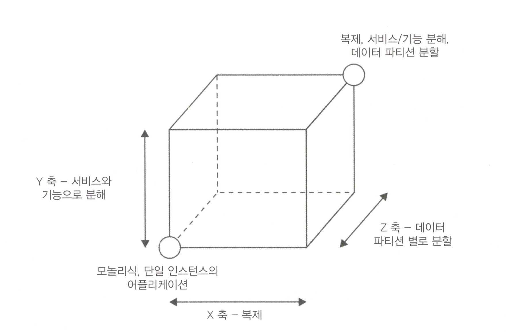  
      x축 -> 단일 어플리케이션, 심플 간단한.. 동일 어플리케이션을 n번 복제하고, 각인스턴스 작업량의 1/n씩을 처리하도록 하는 설계
      y축 -> 기낭 단위 분해 및 확장성과 관련. MSA  
      z축 -> 확장성의 차원. 각 인스턴스를 전체 데이터의 일부의 처리만을 담당하도록 분할. 주로 `데이터베이스에서 사용되는 기술`, `수평분할 또는 샤딩`

## 10.2 복제 및 로드 밸런싱
  ### 10.2.1 클러스터 모듈
  
  Node.js에서 단일시스템에서 실행되는 `여러 개의 인스턴스` 간에 어플리케이션의 부하를 분배하는 가장 간단한 패턴 -> `클러스터 모듈 사용`  
  마스터 -> 여러 프로세스(워커)에 분산처리
  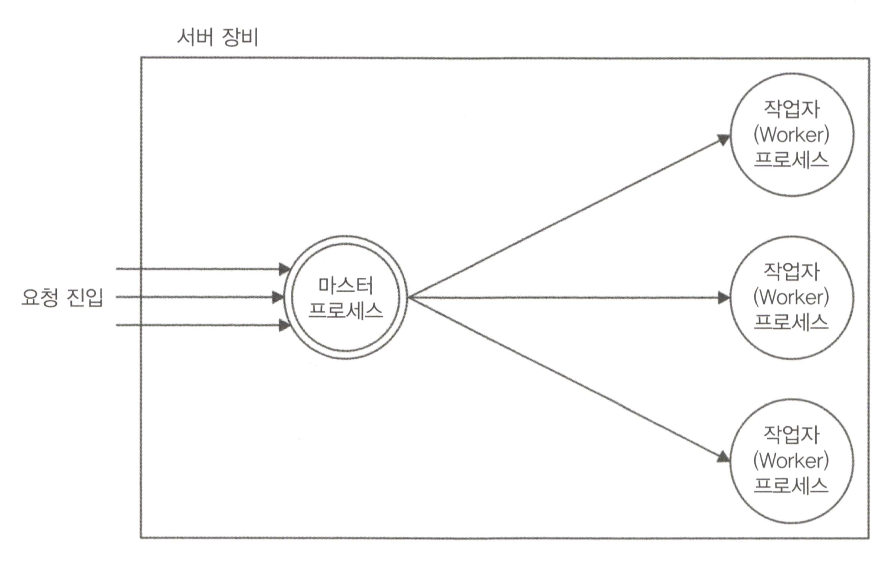  
    
  ### 분산처리 예
  ```javascript
  // app.js
  const http = require('http');
  const pid = process.pid;

  http.createServer((req, res) => {
    for (let i = 1e7; i > 0; i--) {
      console.log(`Handling from ${pid}`);
      res.end(`Hello request ${pid}\n`);
    }
  }).listen(5000, () => {
    console.log(`Started ${pid}`);
  });
  ```

  ```bash
  # 초당 요청 측정, 서버에 200개의 동시연결을 10초동안 로드 명령
  # 4개의 프로세서 경우 -> 초당 90개 트랜잭션으로 구성, 평균 CPU 활용률은 20%
  $ siege -c200 -t10s http://localhost:5000
  $ ab -c200 -t10 http://localhost:5000

  # 설치(Mac brew)
  $ brew install siege
  ```

  ```javascript
  // 클러스터 (분산 처리)
  const cluster = require('cluster');
  const os = require('os');

  if (cluster.isMaster) {
    const cpus = os.cpus().length;
    console.log(`Clustering to ${cpus} cpus`);

    for (let i = 0; i < cpus; i++) {
      cluster.fork();
    }
  } else {
    require('./app');
  }
  ```
  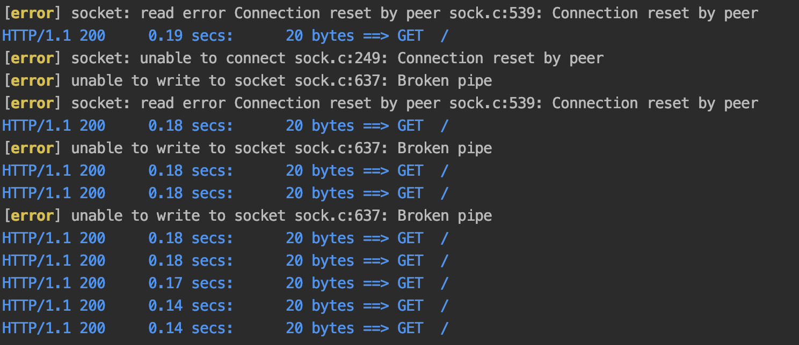
  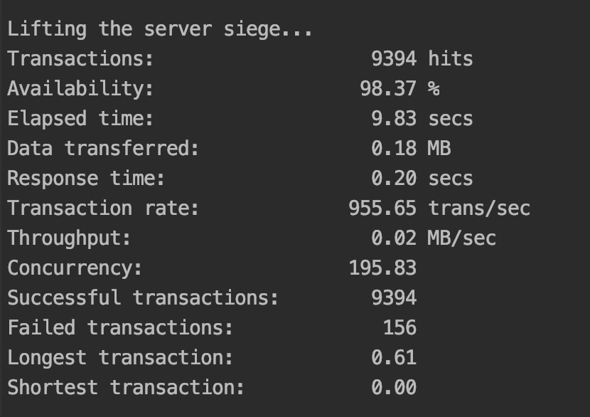
  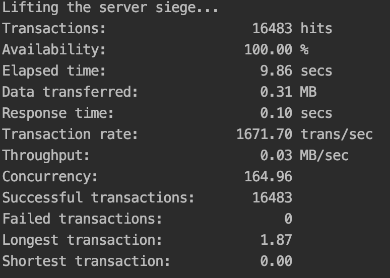

  ### 복원성, 가용성
  복원성 : 오작동, 갑작스런 정지에 대한 `서비스 유지하는 능력` -> `시스템 가용성에 기여`  
  다중의 인스턴스, 시스템 생성 -> 하나가 죽어도 다른 인스턴스가 요청 처리  

  코드수정
  ```javascript
  // app.js
  const http = require('http');
  const pid = process.pid;

  http.createServer((req, res) => {
    for (let i = 100; i > 0; i--) {
      console.log(`Handling from ${pid}`);
      res.end(`Hello request ${pid}\n`);
    }
  }).listen(5000, () => {
    console.log(`Started ${pid}`);
  });

  // 갑자기 정지시켜보기
  setTimeout(() => {
    throw new Error('Ooops');
  }, Math.ceil(Math.random() * 3) * 1000);    


  // clusterApp.js
  const cluster = require('cluster');
  const os = require('os');

  if (cluster.isMaster) {
    const cpus = os.cpus().length;
    console.log(`Clustering to ${cpus} cpus`);

    for (let i = 0; i < cpus; i++) {
      cluster.fork();
    }

    // 오류로 죽음 -> 재생성
    cluster.on('exit', (worker, code) => {
      if (code != 0 && !worker.suicide) {
        console.log('Worker crashed. Starting a new worker');
        cluster.fork();
      }
    });

  } else {
    require('./app');
  }
  ```
    **테스트 결과**
    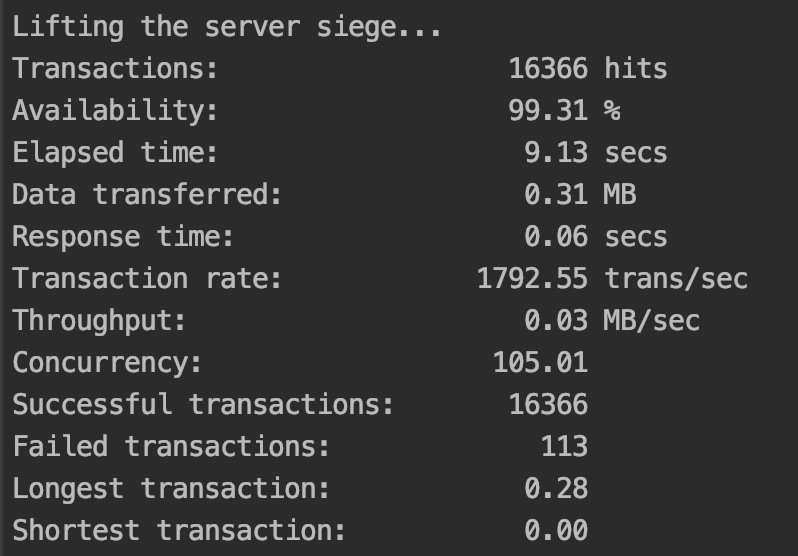
    **서버가 다운(인스턴스가 다운)되는 중에도 서비스는 유지 되고 있음이 핵심**  
    이런 유형처럼 어플리케이션 에러로 인한 종료는(new Error 같은) 어떻게 할 수가 없음... 그래서 이런 `인프라적으로 해결`
    - Tranacions : 요청수
    - Availability : 가용성
    - Failed transactions : 실패 요청  

  ### 다운타임이 없는 (Zero-downtime), 재시작(restart)
  개인블로그 같은 일반전인 (트랜잭션이 낮은) 경우 `앞의 예(클러스터)`를 사용할 수 있으나, `SLA(Service Level Agreement)` or `지속적인 전달(CD)` 프로세스의 일부는 **매우 자주 업데이트** 됨. 이런 경우에는 앞의 예로는 한계.  
  한번에 하나씩 작업자를 다시시작  -> 나머지 작업자들은 어플리케이션을 계속 동작 가능, 서비스유지 -> 새로운 기능(업데이트)는 클러스터 된 서버에 추가  
  ```javascript
  const cluster = require('cluster');
  const os = require('os');


  if (cluster.isMaster) {
    const cpus = os.cpus().length;
    console.log(`Clustering to ${cpus} cpus`);

    for (let i = 0; i < cpus; i++) {
      cluster.fork();
    }
    cluster.on('exit', (worker, code) => {
      if (code != 0 && !worker.exitedAfterDisconnect) {
        console.log('Worker crashed. Starting a new worker');
        cluster.fork();
      }
    });


    process.on('SIGUSR2', () => { // SIGUSR2 시그널 수신
      console.log('Restarting workers');
      const workers = Object.keys(cluster.workers);

      // 순차 반복 함수 (이터레이터, 재귀 구조)
      function restartWorker(i) {
        if (i >= workers.length) {
          return; // 탈출
        }
        const worker = cluster.workers[workers[i]];
        console.log(`Stopping worker : ${worker.process.pid}`);
        worker.disconnect();  // 해당 시그널을 보낸 프로세스 작업 중지

        // 이벤트 exit -> 새로운 작업자 생성
        worker.on('exit', () => {
          if (!worker.suicide) return;
          const newWorker = cluster.fork(); // 새작업자 생성

          // 새로운 연결에 대한 listen 준비 -> 다음 단계 호출하여 다음 작업자 재시작 하는 방식.
          // 다음 단계 호출하여 다음 작업자 재시작
          newWorker.on('listening', () => {
            restartWorker(i + 1);
          });
        })
      }

      restartWorker(0);
    });
  } else {
    require('./app');
  }
  ```

  ### 10.2.2 상태 저장 통신 다루기
  stateful(상태저장) 통신에서는 `cluster`모듈이 제대로 작동 안됨.  
  동일한 상태저장 세션에 속하는 다른 요청 -> 다른 인스턴스에 의해 처리 가능성 때문  
  모든 종류의 상태 비저장(stateless), 로드밸런싱 알고리즘에 적용됨 ?? 뭔소리지

  - 여러 인스턴스에서 상태공유
    **모든 인스턴스에서 상태 공유**  
    -> PostgreSQL, MongoDB, CouchDB 공유DB저장소 이용
    -> `단점 : 항상 가능하지 않다는 점`. ex) 메모리에 통신 상태 저장하는 기존라이브러리 사용 중, 솔루션도입 -> 코드변경 필요
    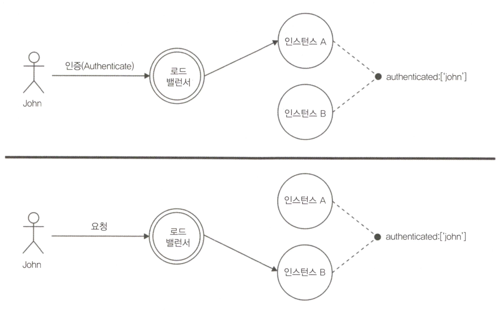
    
  - 고정로드 밸런싱 (sticky load balancing)
    세션과 관련된 `모든 요청을 동일한 인스턴스로 라우팅`
    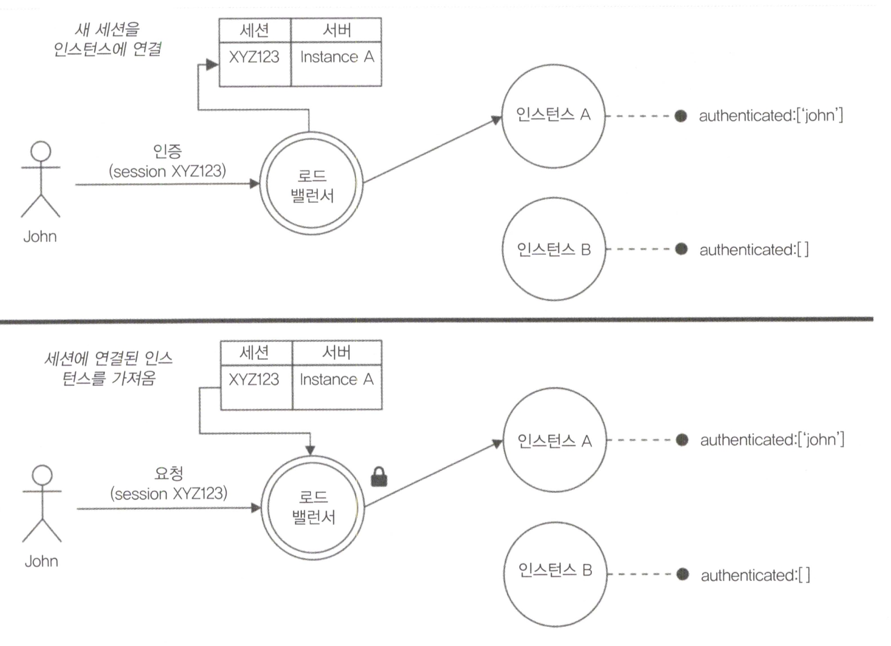

  - 역방향 프록시를 사용하여 확장
    클러스터 사용대신 `다른포트` or 독립실행형 인스턴스를 여러 개 시작 -> 역방향 프록시 or 게이트웨이 를 사용하여 해당 인스턴스에 엑세스하여 트래픽을 분산
    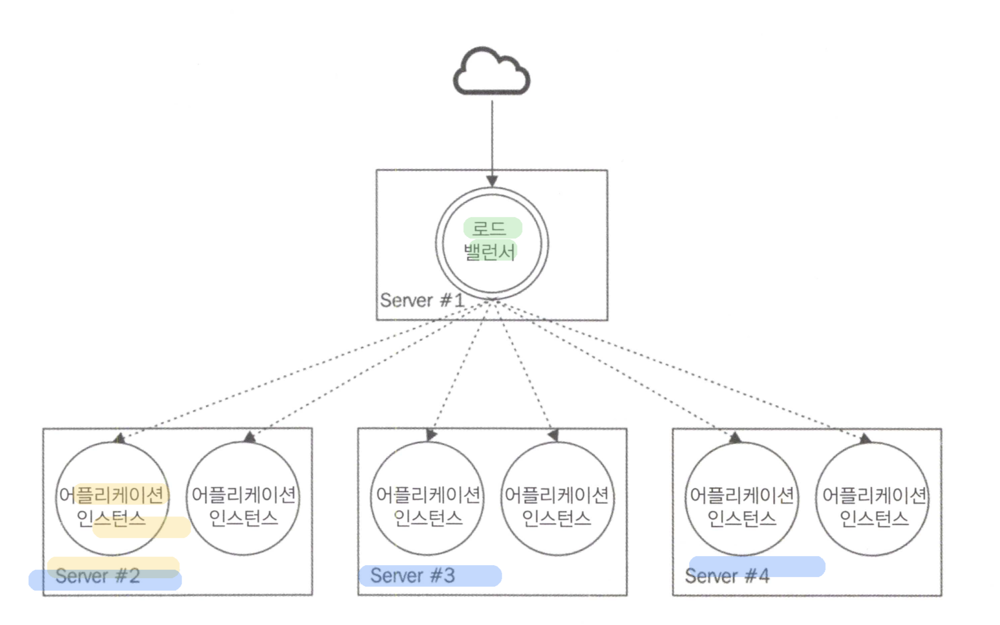
  
  - Nginx로 로드밸런싱하기
    ```bash
    # nginx 설치
    $ brew install nginx

    # Nodejs 기반 모니터링 forever, pm2
    $ npm install forever -g

    # OS 기반 모니터 upstart, systemd, monit or supervisor
    ```

    전부 다른 포트로 실행됨 8081, 8082 ....
    ```bash
    # 목록확인
    forever list 

    # nginx.conf (/usr/local/nginx, /etc/nginx, /usr/local/etc/nginx 중에 위치)
    http {
      # ...
      upstream nodejs_design_patterns_app{
        server 127.0.0.1:8081;
        server 127.0.0.1:8082;
        server 127.0.0.1:8083;
        server 127.0.0.1:8084;
      }
      # ...
      server {
        listen: 80;
        location / {
          proxy_pass http://nodejs_design_patterns_app;
        }
      }
      # ... 
    }

    # 재실행, 4개의 포트로 트래픽 분산 처리
    $ nginx -s reload

    # http://localhost 입력 -> 4개의 포트로 트래픽분산
    ```

    - 서비스레지스트리 사용
      어플리케이션 용량을 동적 조정. `동적스케일링` -> 어플리케이션의 가용성과 응답성을 유지. `IT 인프라 비용도 줄일 수 있음`  
      트래픽 최고조 -> 서버 자동 증가 (스케일 아웃)
      중앙 저장소, 레지스트리 사용 -> 실행 및 중지 서버 및 서비스를 확인.  
      각 인스턴스는 온라인이 되는순간 레지스트리에 서비스 등록, 중단 -> 등록취소

    - http-proxy 와 Consul을 사용한 동적 로드 밸런싱 구현
      Consul : 서비스 레지스트로 활용  
      멀티 서비스 아키텍처  
      1. `http-proxy` : Node.js에 프록시와 로드밸런서를 간단하게 생성
      2. `portfinder` : 시스템의 빈 포트를 발견하는 라이브러리
      3. `consul` : 서비스등록을 허용하는 라이브러리


      ```javascript
      // app.js
      const http = require('http');
      const pid = process.pid;
      const consul = require('consul');
      const portfinder = require('portfinder');
      const serviceType = process.argv[2];

      // getPort -> 빈포트를 찾는 부분. 포트번호는 8000번 부터 탐색 위로
      portfinder.getPort((err, port) => {
        const serviceId = serviceType + port;

        // 서비스 등록
        consul.agent.service.register({
          id: serviceId,
          name: serviceType,
          address: 'localhost',
          port,
          tags: [serviceType]
        }, () => {
          const unregisterService = (err) => {

            // 서비스 제거하는 부분
            consul.agent.service.deregister(serviceId, () => {
              process.exit(err ? 1 : 0);
            });
          };

          // 이벤트 등록
          process.on('exit', unregisterService);    // 종료
          process.on('SIGINT', unregisterService);  // 중지
          process.on('uncaughtException', unregisterService); // 예외 발생 시

          // 발견된 포트로 http 서버 실행
          http.createServer((req, res) => {
            for (let i = 10; i > 0; i--) {
              console.log(`Handling request from ${pid}`);
              res.end(`${serviceType} response from ${pid}\n`);
            }
          }).listen(port, () => {
            console.log(`Started ${serviceType} (${pid}) on port ${port}`);
          })
        });
      });

      // loadBalancer.js
      const routing = [
        {
          path: '/api',
          service: 'api-service',
          index: 0
        },
        {
          path: '/',
          service: 'webapp-service',
          index: 0
        }
      ];

      const http = require('http');
      const httpProxy = require('http-proxy');
      const consul = require('consul')(); // 레지스트리 실행

      const proxy = httpProxy.Server({}); // 프록시 서버 인스턴스화

      // 웹서버 시작
      http.createServer((req, res) => {
        let route;
        routing.some(entry => {

          route = entry;

          // route path로 시작하는지 체크
          return req.url.indexOf(route.path) === 0;
        });

        // 레지스트리에서 구현된 서비스의 목록 확인
        consul.agent.service.list((err, services) => {
          const servers = [];
          Object.keys(services).filter(id => {
            if (services[id].Tags.indexOf(route.service) > -1) {
              servers.push(`http://${services[id].Address}:${services[id].Port}`)
            }
          });

          if (!servers.length) {
            res.writeHead(502);
            return res.end('Bad gateway');
          }

          // 목적지로 라우팅, 라운드 로빈 방식
          route.index = (route.index + 1) % servers.length;

          // 선택한 서버(라우팅된)로 요청 전달. 응답보내기
          proxy.web(req, res, {target: servers[route.index]});
        });
      }).listen(8080, () => console.log('Load balancer on port 8080'));

      // curl localhost:8080/api -> Bad Gateway
      ```
      ```bash
      # 로드밸런싱을 하기 위해 인스턴스 3개 생성. curl localhost:8080/api 
      $ forever start app.js api-service
      $ forever start app.js api-service
      $ forever start app.js webapp-service
      ```
      - 피어-투-피어 로드밸런싱(peer-to-peer load balancing)
        `분산 지점을 클라이언트에 두는 방식`  
        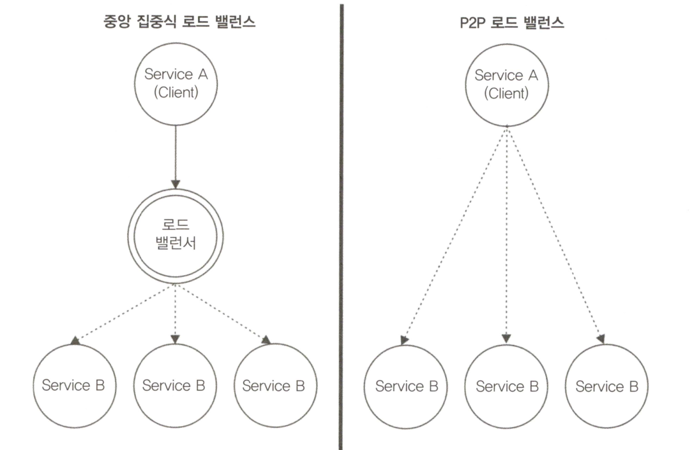
        ```javascript
        // balancedRequest.js
        const http = require('http');
        const servers = [
          {host: 'localhost', port: '9081'},
          {host: 'localhost', port: '9082'}
        ];

        let i = 0;

        module.exports = (options, callback) => {
          i = (i + 1) % servers.length;
          options.hostname = servers[i].host;
          options.port = servers[i].port;

          return http.request(options, callback);
        };

        // client.js
        const request = require('./balancedRequest');

        for (let i = 10; i >= 0; i--) {
          request({method: 'GET', path: '/'}, res => {
            let str = '';
            res.on('data', chunk => {
              str += chunk;
            }).on('end', () => {
              console.log(str);
            });
          }).end();
        }
        ```
## 10.3 복잡한 어플리케이션 분해
  ### 10.3.1 단일(Monolitic)아키텍처
  `단일(하나의) 시스템`에서 모든 컴포넌트가 유기적으로 연결되는 아키텍처 -> **각 컴포넌트가 모듈화 구조를 갖을 때 좋은 설계**가 되는 아키텍처(ex LinuxOS -> 하나의 모듈이 장애나면 다운 될 수도 있음 : 커널모드, 사용자모드 : 마이크로 커널 아키텍처)  
  **단일 어플리케이션 -> 단일 커널과 유사 -> 높은 결합력 -> 시스템 변경의 어려움(젠가 게임 같은) -> 개발프로세스 및 규칙(표준)을 수립하여 개발을 하게 됨**
  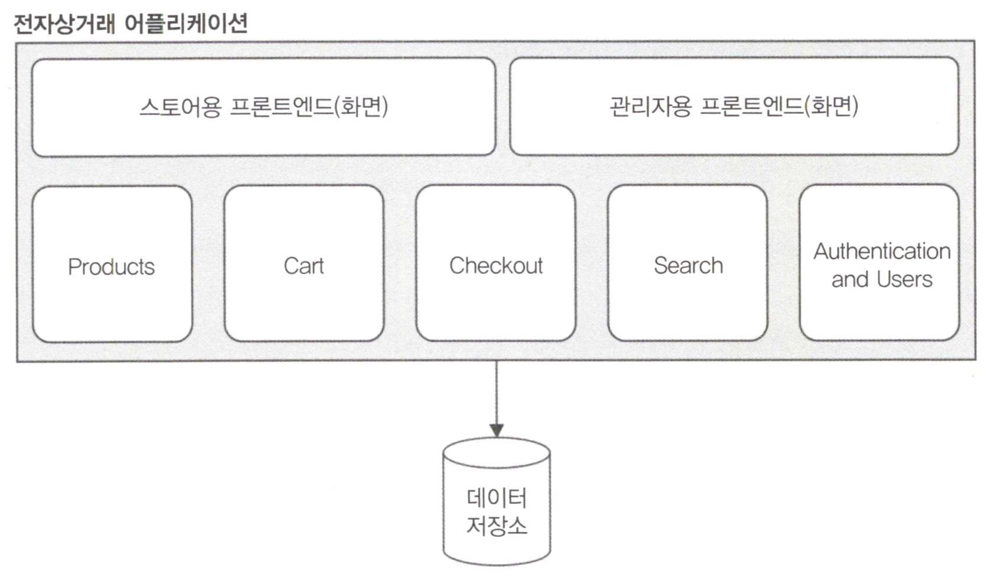

  ### 10.3.2 마이크로 서비스 아키텍처
  `각 프로그램은 한가지 일만 잘 수행` -> MSA 철학 
  스케일 큐브 y축에 해당. MSA가 능사는 아님. 선택은 항상 적절해야함. 느슨한 결합, 높은 응집력, 통합 복잡성의 조합이 중요  
  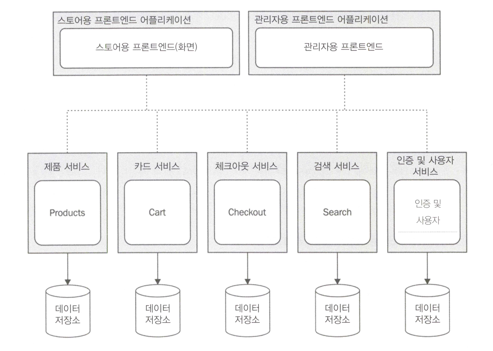
  서비스의 `데이터 소유권`은 MSA의 중요 특성. DB 분할 -> 적절한 격리 및 독립성의 수준을 유지하는 것이 중요.  
  공유 DB를 사용 할 경우, 서비스가 함께 동작하기가 수월.  
  또한 서로 다른 서비스들 간의 결합(데이터 기반)을 가져와 다른 어플리케이션들의 장점 중 일부를 제거하게 됨.  
  MSA 참고 관련글 : https://martinfowler.com/articles/microservices.html

  장점 : 충돌, 버그 및 변경, 중단이 전체 **시스템으로 전파되지 않는다는 것**. 목표는 작고, 변경하기 쉽고, 다시 빌드할 수 있는 `진정한 독립적인 서비스를 구축하는 것`. ex) Checkout 서비스가 심각한 버그로 인해 충돌 -> **나머지 시스템도 정상적 동작**. 일부 서비스가 영향을 받을 수 있지만, 전체 시스템이 죽는 것은 아님.   
  모놀리식 -> 전체시스템에 영향을 미치게 됨. -> 다운 및 재시작이 빈번 

  대규모 단일 어플리케이션 1개 -> 여러 개의 소규모 서비스에 분할 -> 훨씬 쉽게 재사용, 독립적인 유닛 구성 가능  
  ex) 엘라스틱서치, 재사용 가능한 검색 서비스의 좋은 예. 7장 모듈연결의 인증서버  
  단일 어플리케이션에 비해 정보 은닉 수준이 훨씬 높다. 일반적인 `웹서비스 or 메시지 브로거`와 같은 인터페이스를 통해 이루어짐. 

  단점 : 관리 노드 증가 -> 통합, 배포 및 코드 공유 측면에서 복잡성이 높아짐.  
  서비스간 상호작용을 어떻게? 많은 서비스 어플리케이션을 어떻게 구현? 확장 및  모니터닝 가능? 코드 공유는 ? 재사용여부? 
  -> 다행. `클라우드 서비스와 현대적 DevOps 방법론이 해답을 제공`, Node.js도 많은 도움 됨.  
  **모듈 시스템 -> 다른 프로젝트 간 코드를 공유하기에 완벽한 동반자** Node.js는 MSA를 사용하여 구현된 것과 같은 분산시스템 노드로 만들어짐.  
  
  ### 10.3.3 마이크로 서비스 아키텍처의 통합 패턴
  가장 어려운 과제 -> 모든 노드를 연결, 공종 작업을 수행하는 것  
  서비스간의 유기적 프로세스 흐름 설계 중요. 검색시 제품은 항상 최신유지, 제품 구매-> 제품상태변경 유지, 등...
  통합 전략 -> 커플링(결합, 상호작용 등) 고려, 분산형 구조 설계 -> 모듈 or 서브 시스템 설계시 지역적 사용과 동일한 관행 원칙을 수반-> 재사용 가능성과 확장성 괕은 특성도 고려 필요.  
  - API 프록시
    **클라이언트 <-> 원견API간 통신을 프록시하는 서버**. 일반적으로 `API 게이트웨이`라함.  
    여러 API 엔드포인트에 대한 `단일 접근점` 제공.  
    로드밸런싱, 캐싱, 인증 밍 트래픽 제한 제공, 모든 견고한 API 솔루션을 구현하는데 유용
    본질적으로 `역방향프록시`, 요청 처리를 위한 `로드밸런싱` 이기도 함  
    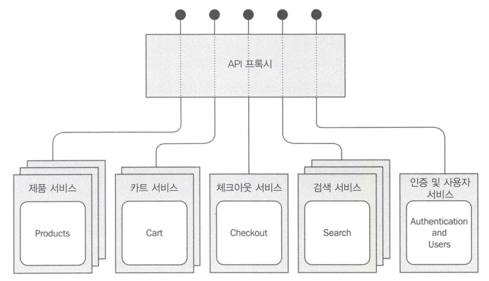
    각 서비스 -> 여러시스템으로 확장되는 경우, 노드 수가 많을 수 있으므로 MSA는 인프라에서 매우 유용, 단일 뷰 제공  

  - API 오케스트레이션
    서비스 집합을 통합하고 구성하는 방법.  
    넷플릭스 API 담당자 말씀 : http://thenextweb.com/dd/2013/12/17/future-api-design-orchestration-layer
    `OL`(API OrchestrationLayer)는 일반적으로 모델링된 **데이터 요소 혹은 기능을 사용하는 추상화 계층**으로, 해당 개발자나 어플리케이션을 위해 보다 구체적인 방법을 마련한다.   
    store 계층 -> 오케스트레이션 계층 사용 -> 서비스 구성, 조정, 복잡, 구체적 기능 구현
    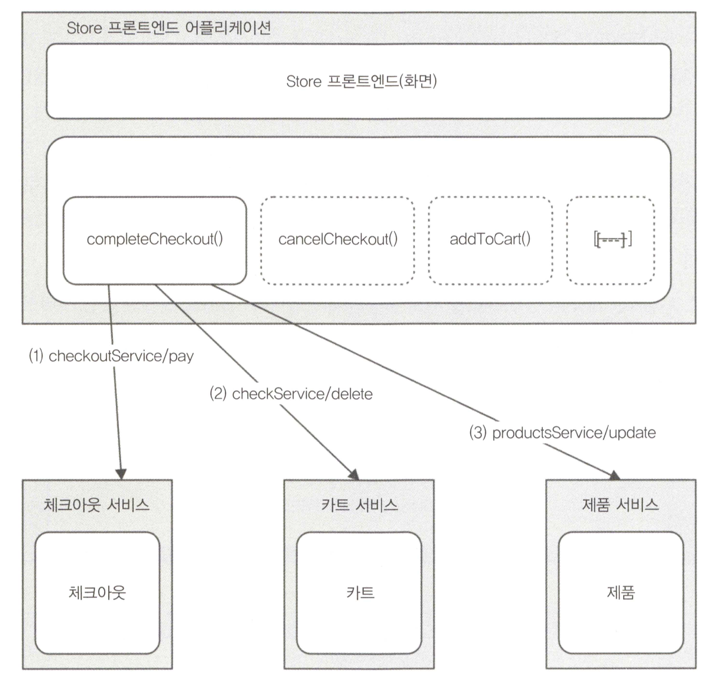  
    1. checkoutService/pay 호출하여 트랜잭션 완료
    2. 지불성공 처리 -> cart 서비스에 물품 구매되었고, 카트에서 제거해도 된다고 알림. cartService/delete 호출 수행
    3. 결제가 완료 -> 구입한 제품 상태 Update. productService/update 호출 수행

    -> **3개의 서로다른 서비스**에서 **3개의 작업 수행** -> `전체시스템에 일관성 유지` -> 서비스 조정한 New API 구성  

    카트(제품ID목록 검색) -> 제품(제품에 대한 전체정보 검색)  
    오케스트레이션 : 어플리케이션 간의 추상화 역할. 서비스 결합, 조종. 여러 서비스와 특정 어플리케이션 간의 추상화 역할  
    독립 서비스에 API 오케스트레이션 구성  
    API 프록시와 중요한 차이는 `다양한 서비스의 의미론적 통합을 수행`임. 단순 프록시가 아니며, 공개API와 다른API를 공개함.?  
    

    - 메시지 브로커와 통합
      `오케스트레이션`은 설계, 디버그 및 확장이 쉽지만, 각서비스의 동작 방식에 대해 완벽하게 알고 있어야함  
      **전체 시스템의 정보 동기화 작업 -> 서비스 절반에 걸쳐 분산패턴**  
      -> 서비스간의 직접적인 관계 생성하게 됨  
      -> 노드 간의 상호 연결 수의 증가 -> 높은 커플링(결합)을 초래 -> 시스템 복잡 가중  
         : 핵심은 `각 서비스를 격리 상태로 유지` 하는 것. 즉 1개의 서비스가 다른서비스가 없어도, 추가 되어도 작동해야함  

      **해결책**  
      `메시지 브로커 도입`(분산시스템에 대한 `관찰자 패턴`)  
      : 메시지 수신자 / 발신자 분리 (중앙집중식 **게시(publish)/구독(subscribe)**) 패턴 구현   
      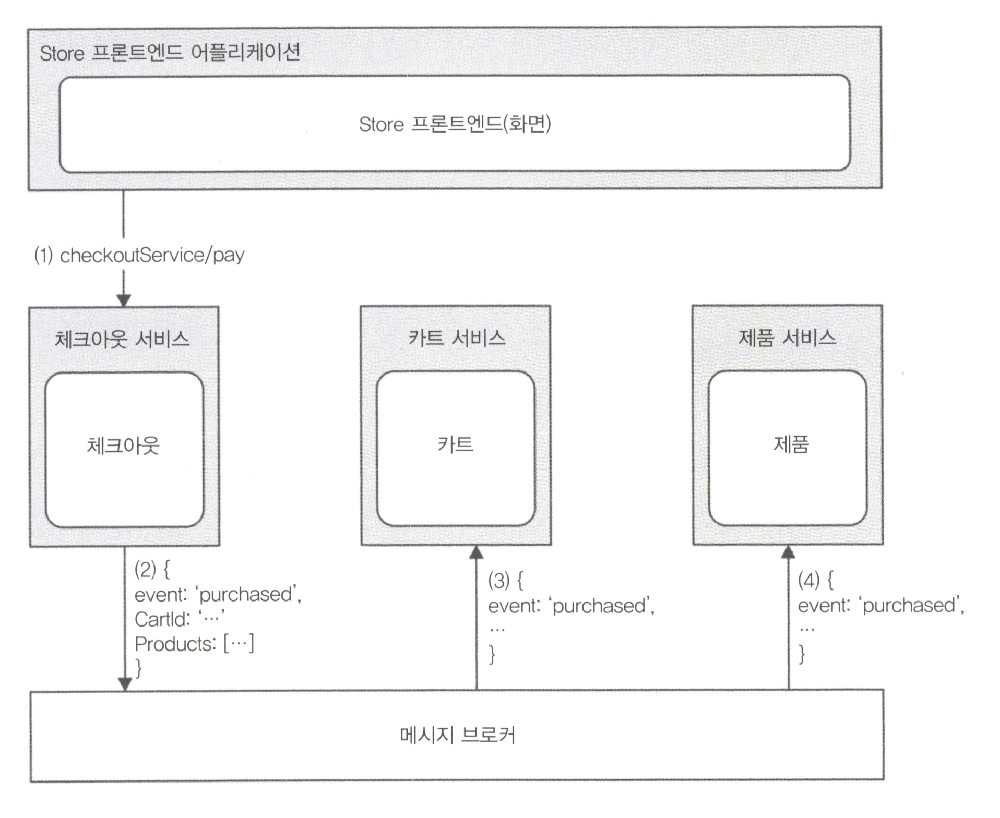  
      1. `Store 프론트엔드` -> `체크아웃 서비스`, checkoutService/pay 연산 호출
      2. 작업이 완료 되면 -> 체크아웃 서비스는 작업의 세부사항, 즉 cartID 및 방금 구입한 products(제품목록)을 첨부하여 이벤트 생성 -> 이 **이벤트 메시지브로커 게시** -> 이 시점에서 체크아웃 서비스는 누가 메시지를 받을 것인지는 알 수 없음
      3. `카트 서비스` -> 브로커에 구독자로 등록되어 있고, 체크아웃 서비스에서 **방금 게시한 'purchased' 이벤트를 받게 됨** -> 카트 서비스는 메시지에 포함된 ID로 식별된 장바구니를 자신의 DB에서 제거함으로써 반응
      4. `제품 서비스` -> 메시지 브로커에 등록되어 있고, `동일한 구매이벤트`를 받음 -> 이 정보를 기반으로 DB 업데이트 -> 메시지에 포함된 제품 정보 갱신  

      
      정보를 전파, 정보를 동기화 하는 책임은 `서비스 자체에 분산`  
      **전체 시스템 동작을 관할하고 알고 있어야하는 전지 전능한 서비스는 없다.**  
      `각 서비스는 자체적으로 통합 담당해야함`  
      `메시지 브로커` : 서비스 분리, 서비스 상호작용의 복잡성 감소, 영구 메시지큐, 보장된 메시지 순서 등 기능 제공
