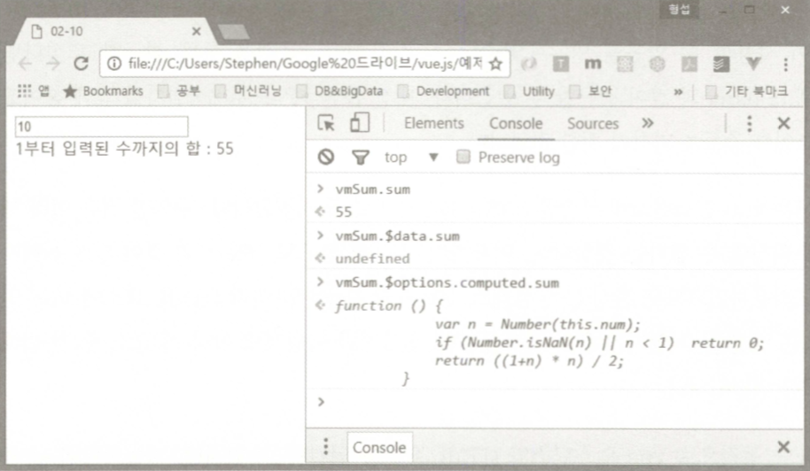
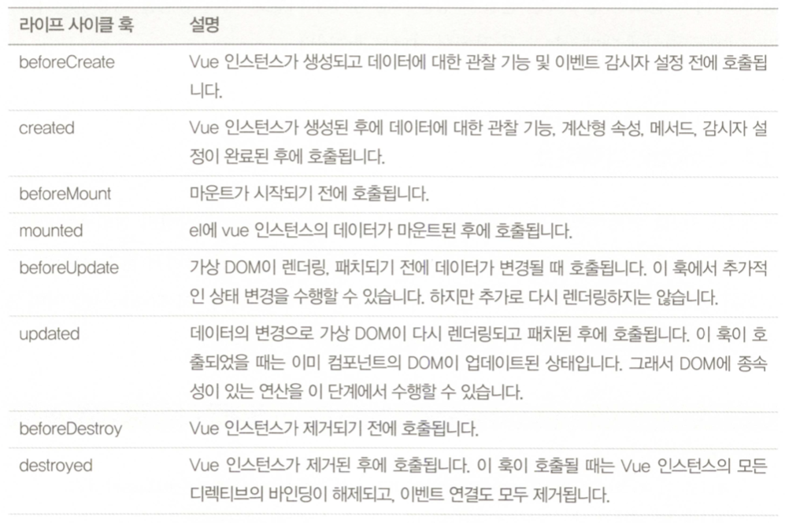
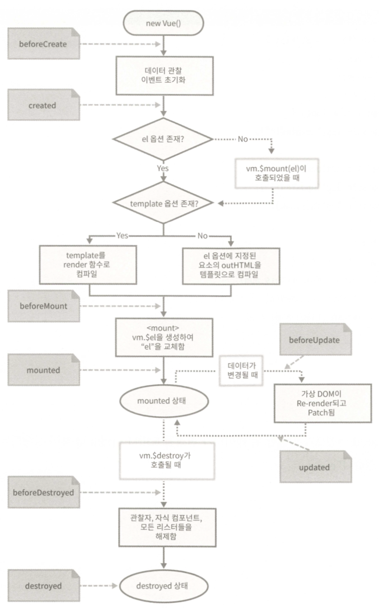

## 3장 Vue 인스턴스

#### 1. var app = new Vue({ ... }) => 뷰 인스턴스라고 부른다.

#### 2. 인스턴스 생성시 전달하는 속성들은 담은 객체를 options 객체라고 부른다.
```javascript
var vm = new Vue({
  el: '#simple',
  data: {
    name: '윤현영'
  }
});
```

1. **data 옵션**
	- data 옵션에 주어진 모든 속성들은 Vue 인스턴스 내부에서 직접 이용되지 않고 Vue 인스턴스와 Data 옵션에 주어진 객체 사이에 프록시를 두어 처리한다.

2. **el 옵션**
	- Vue 인스턴스에 연결할 HTML DOM 요소를 지정, 여러개 요소에 지정할 수 없음, 여러개 지정 시 첫번째 요소에만 연결된다.
	- 동적으로 Vue 인스턴스와 HTML 요소 연결 가능하지만{vm.$mount('#test')} Vue 인스턴스 생성 시 미리 지정할 것을 권장

3. **computed 옵션**
	- 지정 값이 함수지만 Vue 인스턴스는 프록시 처리하여 마치 속성처럼 취급
	- vmSum.$options.computed.sum 실제 함수 확인도 가능

	- 계산형 속성은 쓰기 작업도 가능 - set 메서드 구현 후 속성 호출 시 set -> get 순으로 호출한다.

#### 3. 메서드 속성: {{ sum() }} 와 같이 사용
- 계산형 속성과의 차이점: 내부 작동 방식이 다르다.
- 계산형 속성은 종속된 값에 의해 결괏값이 캐싱된다. (올)
- 화살표 함수를 사용하면 안된다 --> this가 Vue 인스턴스를 가리키지 않고 전역객체를 가리킨다.

#### 4. 관찰 속성: watch
- 속성의 이름과 해당 속성이 변경되었을 때 호출됨, 주로 긴 처리 시간이 필요한 비동기 처리에 적합, 계산형 속성은 값을 직접 리턴해야하기 때문

#### 5. v-cloak - 로드 지연시간으로 인해 콧수염이 표시되는 것을 방지

#### 6. Vue 인스턴스 라이프 사이클



```javascript
// Lifecycle example
var vmSum = new Vue({
  el: "#example",
    data: {
    num: 0
  },
  created: function() {
    console.log("Created!!");
  },
  updated: function() {
    console.log("updated!!");
    console.log(this.num);
  }
});
```