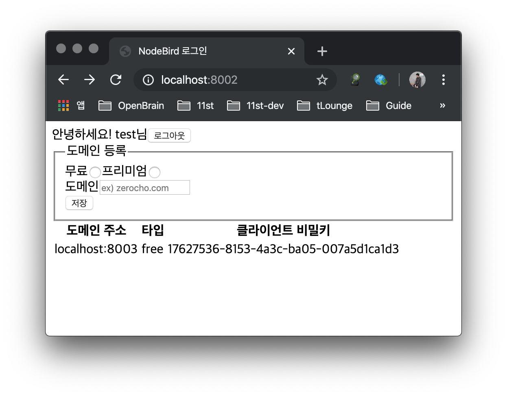
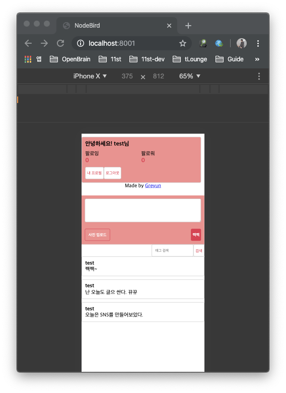
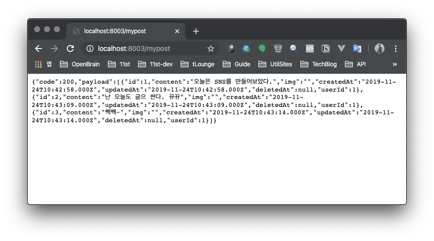
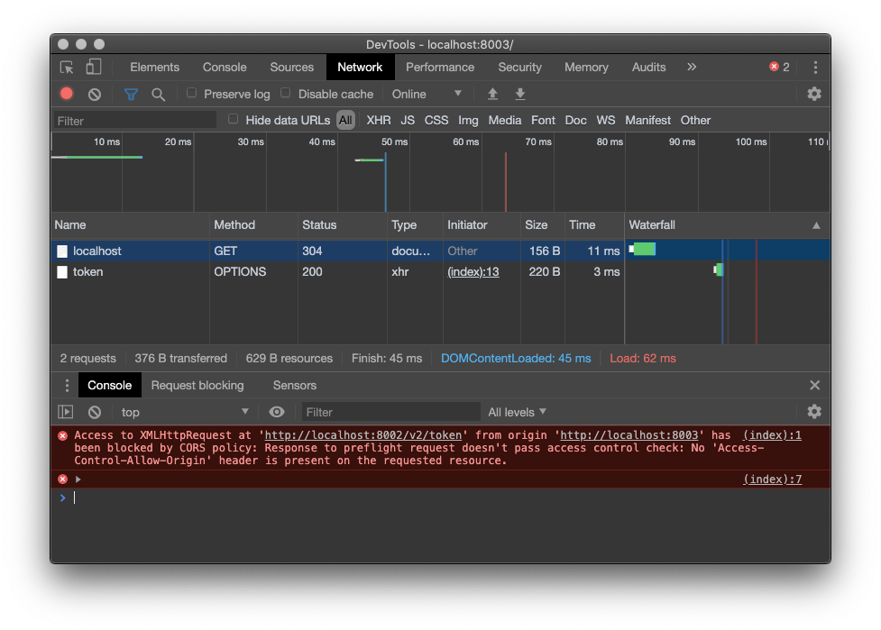
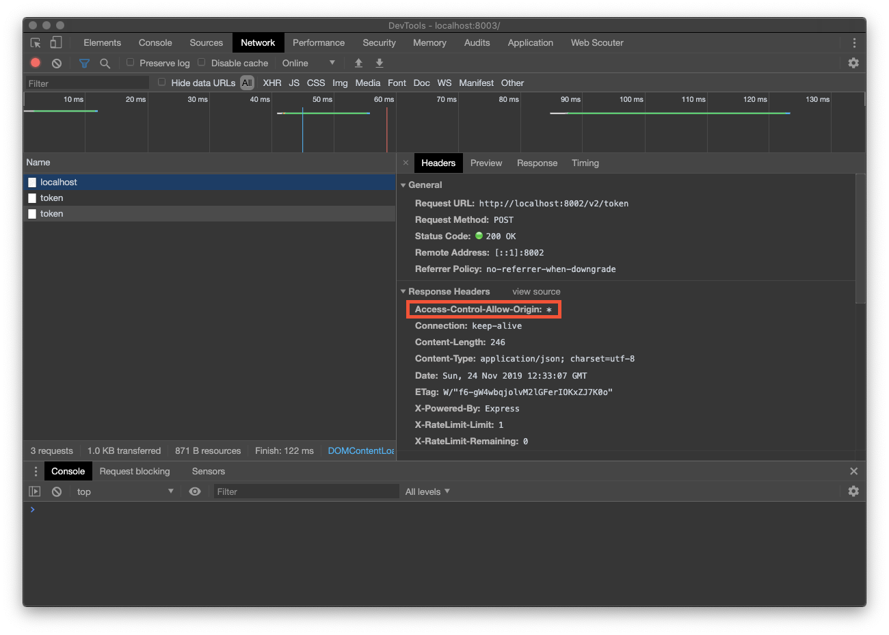
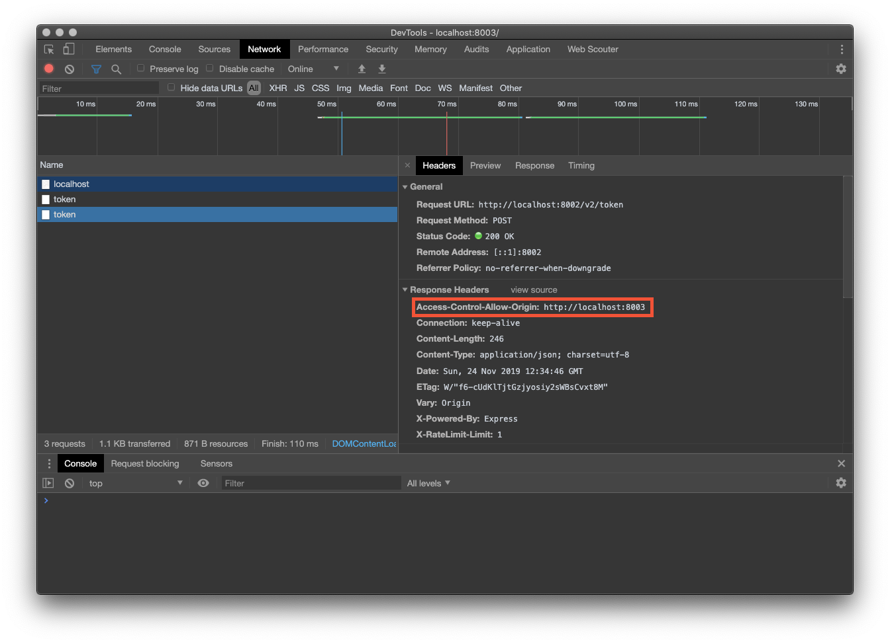
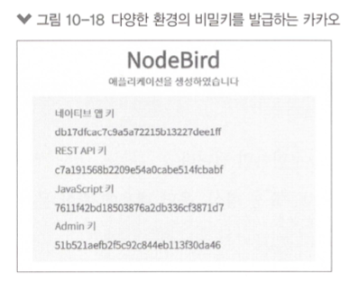

# 웹 API 서버 만들기

## API 서버 이해하기

* 다른 웹 서비스의 기능을 사용하거나 자원을 가져올 수 있는 창구이다.
* 크롤링은 웹 사이트가 자체적으로 제공하는 API가 없거나, API 이용에 제한이 있을 때 사용한다.
* 서비스 제공자 입장에서도 주기적으로 크롤링을 당하면 웹 서버의 트래픽이 증가하여 서버에 무리가 가므로 웹 서비스를 만들 때 공개해도 되는 정보들은 API로 만들어 가져가게 하는 것이 좋다. <- 새로운 관점

앞서 개발한 SNS 서비스와 계정을 함께 사용하며 추가로 domain이라는 테이블을 두어 API 사용자의 domain을 관리할 수 있도록 함.
- 타 도메인에서 호출 시 발생할 수 있는 CORS 문제를 해결하기 위함이라고 함.

### uuid(universally unique identifier) - 범용 고유 식별자

domain 테이블의 clientSecret이라는 컬럼에 unique한 문자열을 주려 사용하였음.

## JWT 토큰으로 인증
JWT(JSON Web Token): JSON 형식의 데이터를 저장하는 토큰

* 헤더: 토큰 종류와 해시 알고리즘 정보
* 페이로드: 토큰의 내용물이 인코딩된 부분
* 시그니처: 일련의 문자열로 시그니처를 통해 토큰이 변조되었는지 체크

```bash
# example - https://jwt.io 참고
eyihbGciOiilUzllNilslnR5cCl6lkpXVCjg.eyipZCl6ljEiLCJuYWlUjoi7KGw]ZiE]JiBIiwibWVzc2FnZSI 6Iuuwl0uztC39.7IIeFTuda7i66CoiabRSnoVyljOV9UqAetMwpidpXbw
```

### 토큰을 사용하는 이유

API의 오남용을 막기 위함

### JWT 토큰을 사용하는 이유

랜덤한 토큰은 매 요청마다 토큰의 주인, 유저의 권한을 디비를 조회하여 체크해야하지만 JWT를 사용하면 secret 키를 알지 않는 이상 변조가 불가하다.

단점: 내용이 들어있기 때문에 용량이 크다.

### 인증토큰 선택 시 아래와 같은 기준으로 선택할 수 있음

1. 랜덤 스트링을 사용해 매번 사용자 정보를 조회하는 작업의 비용
2. JWT 토큰을 사용해 발생하는 데이터 비용이 더 큰지 비교하여 사용

### 인증 사용

인증키 설정

```bash
// .env
JWT_SECRET=jwtSecret
```

req.headers.authorization을 사용. 사용자가 쿠키처럼 헤더에 토큰을 넣어 보낼 것.

```javascript
// routes/middlewares.js
const jwt = require('jsonwebtoken');
...
exports.verifyToken = (req, res, next) => {
    try {
        req.decoded = jwt.verify(req.headers.authorization, process.env.JWT_SECRET);
        return next();
    } catch (error) {
        if (error.name === 'TokenExpiredError') { // 유효기간 초과
            return res.status(419).json({
                code: 419,
                message: '토큰이 만료되었습니다',
            });
        }
        return res.status(401).json({
            code: 401,
            message: '유효하지 않은 토큰입니다',
        });
    }
};
...
```

token 발행을 위한 라우트를 마련하고 사용시엔 req.decoded에 디코딩 된 값이 객체로 할당되어 가져다 사용하면 됨

```javascript
// routes/v1.js
router.post('/token', async (req, res) => {
    const { clientSecret } = req.body;
    try {
        const domain = await Domain.find({
            where: { clientSecret },
            include: {
                model: User,
                attribute: ['nick', 'id'],
            },
        });
        if (!domain) {
            return res.status(401).json({
                code: 401,
                message: '등록되지 않은 도메인입니다. 먼저 도메인을 등록하세요',
            });
        }
        const token = jwt.sign({
            id: domain.user.id,
            nick: domain.user.nick,
        }, process.env.JWT_SECRET, {
            expiresIn: '1m', // 1분
            issuer: 'nodebird',
        });
        return res.json({
            code: 200,
            message: '토큰이 발급되었습니다',
            token,
        });
    } catch (error) {
        console.error(error);
        return res.status(500).json({
            code: 500,
            message: '서버 에러',
        });
    }
});

router.get('/test', verifyToken, (req, res) => {
    res.json(req.decoded);
});
```

## API를 호출하는 Client Server 추가

발급받은 clientSecret 값을 .env에 넣음



```bash
// .env
COOKIE_SECRET=nodebirdcall
CLIENT_SECRET=17627536-8153-4a3c-ba05-007a5d1ca1d3
```

```javascript
// routes/index.js
const express = require('express');
const axios = require('axios');

const router = express.Router();
const URL = 'http://localhost:8002/v2';
axios.defaults.headers.origin = 'http://localhost:8003'; // origin 헤더 추가
const request = async (req, api) => {
    try {
        if (!req.session.jwt) { // 세션에 토큰이 없으면
            const tokenResult = await axios.post(`${URL}/token`, {
                clientSecret: process.env.CLIENT_SECRET,
            });
            req.session.jwt = tokenResult.data.token; // 세션에 토큰 저장
        }
        return await axios.get(`${URL}${api}`, {
            headers: { authorization: req.session.jwt },
        }); // API 요청
    } catch (error) {
        if (error.response.status === 419) { // 토큰 만료시 토큰 재발급 받기
            delete req.session.jwt;
            return request(req, api);
        } // 419 외의 다른 에러면
        return error.response;
    }
};

router.get('/mypost', async (req, res, next) => {
    try {
        const result = await request(req, '/posts/my');
        res.json(result.data);
    } catch (error) {
        console.error(error);
        next(error);
    }
});

router.get('/search/:hashtag', async (req, res, next) => {
    try {
        const result = await request(
            req, `/posts/hashtag/${encodeURIComponent(req.params.hashtag)}`,
        );
        res.json(result.data);
    } catch (error) {
        if (error.code) {
            console.error(error);
            next(error);
        }
    }
});

router.get('/', (req, res) => {
    res.render('main', { key: process.env.CLIENT_SECRET });
});

module.exports = router;
```





## 사용량 제한

과도한 API 사용은 API 서버에 무리르 주기에 이를 막기 위해 일정 기간 내에 API를 사용할 수 있는 횟수를 제한하는 기능을 추가함.

express-rate-limit이라는 모듈을 사용

```javascript
// routes/middlewares.js
const RateLimit = require('express-rate-limit');

exports.apiLimiter = new RateLimit({
    windowMs: 60 * 1000, // 1분
    max: 1,
    delayMs: 0,
    handler(req, res) {
        res.status(this.statusCode).json({
            code: this.statusCode, // 기본값 429
            message: '1분에 한 번만 요청할 수 있습니다.',
        });
    },
});
```

```javascript
// routes/v2.js
const { verifyToken, apiLimiter } = require('./middlewares');

router.get('/posts/my', apiLimiter, verifyToken, (req, res) => {
    Post.findAll({ where: { userId: req.decoded.id } })
        .then((posts) => {
            console.log(posts);
            res.json({
                code: 200,
                payload: posts,
            });
        })
        .catch((error) => {
            console.error(error);
            return res.status(500).json({
                code: 500,
                message: '서버 에러',
            });
        });
});
```

## 하위버전 API deprecate

라우트 파일 상단에서 deprecate 되었다는 메세지와 코드를 뿌려주는 처리를 한다.

```javascript
// routes/middlewares.js
...
exports.deprecated = (req, res) => {
    res.status(410).json({
        code: 410,
        message: '새로운 버전이 나왔습니다. 새로운 버전을 사용하세요.',
    });
};
```

```javascript
// routes/v1.js
const { verifyToken, deprecated } = require('./middlewares');

router.use(deprecated);
...
```

## CORS 처리 - Cross-Origin Resource Sharing

### 개요
클라이언트와 서버의 도메인이 일치하지 않으면 기본적으로는 CORS 정책에 의해 요청이 차단된다.

타 도메인으로 요청을 보낼 시 OPTIONS 메서드로 실제 요청을 보내기 전에 서버가 이 도메인을 허용하는지 체크하는 역할을 한다.



### 해결책

응답 헤더에 Access-Control-Allow-Origin이라는 헤더를 넣어주어야 한다.

res.set 메서드로 직접 넣어도 되지만 cors라는 패키지로 쉽게 구현 가능

### 모든 응답에 헤더 추가

```javascript
// routes/v2.js
const cors = require('cors');

router.use(cors());	// 모든 응답에 헤더 추가
```



### user가 등록한 host를 받아 해당 host만 헤더에 추가

```javascript
// routes/v2.js
const cors = require('cors');

router.use(async (req, res, next) => {
    const domain = await Domain.find({
        where: { host: url.parse(req.get('origin')).host },
    });
    if (domain) {
        cors({ origin: req.get('origin') })(req, res, next);
    } else {
        next();
    }
});
```



