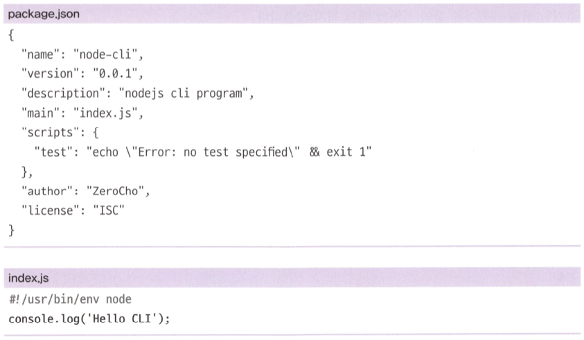
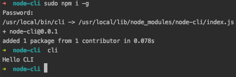
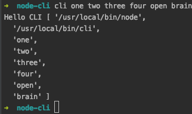
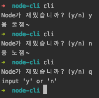
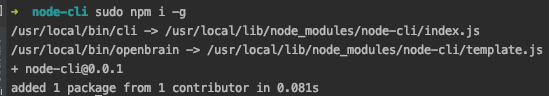
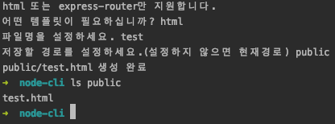
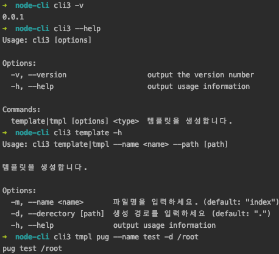
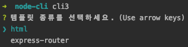
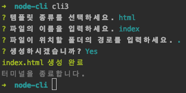

# CLI 프로그램 만들기
npm, nodemon과 같이 커맨드라인 인터페이스 기반으로 동작하는 프로그램을 만든다.

## 간단한 콘솔 명령어 만들기

`$ node [파일명]` 과 같이 콘솔에서 입력해 어떤 동작을 수행하는 문장을 `콘솔 명령어`라고 부른다. 이러한 명령어를 만드는 것이 이 장의 목표!



> /usr/bin/env에 등록된 node 명령어로 이 파일을 실행하라. (윈도우 운영체제에서는 단순한 주석으로 취급)

### package.json에 bin을 추가하여 명령어로 만들기

```javascript
{
  ...
  "license": "ISC",
  "bin": {
    "cli": "./index.js"
  }
}
```

### 실행 방법



> package.json의 bin 속성에 cli 명령어와 index.js를 연결한 셈. 
> 
> cli 명령어가 호출될 때마다 index.js 파일이 실행된다.

### process.argv 로 매개변수를 입력 받을 수 있음

```javascript
// index.js
#!/usr/bin/env node
console.log('Hello CLI', process.argv);
```



### readline package로 입력 받아들이기

```javascript
#!/usr/bin/env node
const readline = require('readline');

const rl = readline.createInterface({
    input: process.stdin,
    output: process.stdout,
});

rl.question('Node가 재밌습니까? (y/n) ', (answer) => {
    if (answer === 'y') {
        console.log('응 꿀잼~');
    } else if (answer === 'n') {
        console.log('응 노잼~');
    } else {
        console.log('input \'y\' or \'n\'');
    }
    rl.close();
});
```



> console.clear() 로 console을 깨끗이 청소할 수 있다...

### 템플릿을 생성해주는 프로그램

```javascript
// template.js
#!/usr/bin/env node
const fs = require('fs');
const path = require('path');
const readline = require('readline');

let rl;
let type = process.argv[2];
let name = process.argv[3];
let directory = process.argv[4] || '.';

const htmlTemplate = `<!DOCTYPE html>
<html>
<head>
  <meta charset="utf-8" />
  <title>Template</title>
</head>
<body>
  <h1>Hello</h1>
  <p>CLI</p>
</body>
</html>`;

const routerTemplate = `const express = require('express');
const router = express.Router();
 
router.get('/', (req, res, next) => {
   try {
     res.send('ok');
   } catch (error) {
     console.error(error);
     next(error);
   }
});
 
module.exports = router;`;

const exist = (dir) => {
    try {
        fs.accessSync(dir, fs.constants.F_OK | fs.constants.R_OK | fs.constants.W_OK);
        return true;
    } catch (e) {
        return false;
    }
};

const mkdirp = (dir) => {
    const dirname = path
        .relative('.', path.normalize(dir))
        .split(path.sep)
        .filter(p => !!p);
    dirname.forEach((d, idx) => {
        const pathBuilder = dirname.slice(0, idx + 1).join(path.sep);
        if (!exist(pathBuilder)) {
            fs.mkdirSync(pathBuilder);
        }
    });
};

const makeTemplate = () => {
    mkdirp(directory);
    if (type === 'html') {
        const pathToFile = path.join(directory, `${name}.html`);
        if (exist(pathToFile)) {
            console.error('이미 해당 파일이 존재합니다');
        } else {
            fs.writeFileSync(pathToFile, htmlTemplate);
            console.log(pathToFile, '생성 완료');
        }
    } else if (type === 'express-router') {
        const pathToFile = path.join(directory, `${name}.js`);
        if (exist(pathToFile)) {
            console.error('이미 해당 파일이 존재합니다');
        } else {
            fs.writeFileSync(pathToFile, routerTemplate);
            console.log(pathToFile, '생성 완료');
        }
    } else {
        console.error('html 또는 express-router 둘 중 하나를 입력하세요.');
    }
};

const dirAnswer = (answer) => {
    directory = (answer && answer.trim()) || '.';
    rl.close();
    makeTemplate();
};

const nameAnswer = (answer) => {
    if (!answer || !answer.trim()) {
        console.clear();
        console.log('name을 반드시 입력하셔야 합니다.');
        return rl.question('파일명을 설정하세요. ', nameAnswer);
    }
    name = answer;
    return rl.question('저장할 경로를 설정하세요.(설정하지 않으면 현재경로) ', dirAnswer);
};

const typeAnswer = (answer) => {
    if (answer !== 'html' && answer !== 'express-router') {
        console.clear();
        console.log('html 또는 express-router만 지원합니다.');
        return rl.question('어떤 템플릿이 필요하십니까? ', typeAnswer);
    }
    type = answer;
    return rl.question('파일명을 설정하세요. ', nameAnswer);
};

const program = () => {
    if (!type || !name) {
        rl = readline.createInterface({
            input: process.stdin,
            output: process.stdout,
        });
        console.clear();
        rl.question('어떤 템플릿이 필요하십니까? ', typeAnswer);
    } else {
        makeTemplate();
    }
};

program();
```

```javascript
{
  ...
  "license": "ISC",
  "bin": {
    "cli": "./index.js",
    "openbrain": "./template.js"
  }
}
```





> package.json 수정 시 재설치 필요 `$ npm i -g`

> `$ npm rm -g node-cli` 명령어로 삭제 가능


## Commander, Inquirer, chalk

* commander: CLI 라이브러리 패키지
* inquirer: 상호작용을 돕는 패키지
* chalk: 콘솔 텍스트에 스타일을 추가하는 패키지

```bash
$ npm i commander inquirer chalk
```

```javascript
#!/usr/bin/env node
const program = require('commander');

program
    .version('0.0.1', '-v, --version')
    .usage('[options]');

program
    .command('template <type>')
    .usage('--name <name> --path [path]')
    .description('템플릿을 생성합니다.')
    .alias('tmpl')
    .option('-m, --name <name>', '파일명을 입력하세요.', 'index')
    .option('-d, --directory [path]', '생성 경로를 입력하세요', '.')
    .action((type, options) => {
        console.log(type, options.name, options.directory);
    });

program
    .command('*', { noHelp: true})
    .action(() => {
        console.log('해당 명령어를 찾을 수 없습니다.');
        program.help();
    });

program
    .parse(process.argv);
```



### 실제로 동작하는 템플릿 생성 프로그램

```javascript
#!/usr/bin/env node
const program = require('commander');
const fs = require('fs');
const path = require('path');
const inquirer = require('inquirer');
const chalk = require('chalk');

const htmlTemplate = `<!DOCTYPE html>
<html>
<head>
  <meta chart="utf-8" />
  <title>Template</title>
</head>
<body>
  <h1>Hello</h1>
  <p>CLI</p>
</body>
</html>`;

const routerTemplate = `const express = require('express');
const router = express.Router();
 
router.get('/', (req, res, next) => {
   try {
     res.send('ok');
   } catch (error) {
     console.error(error);
     next(error);
   }
});
 
module.exports = router;`;

const exist = (dir) => {
    try {
        fs.accessSync(dir, fs.constants.F_OK | fs.constants.R_OK | fs.constants.W_OK);
        return true;
    } catch (e) {
        return false;
    }
};

const mkdirp = (dir) => {
    const dirname = path
        .relative('.', path.normalize(dir))
        .split(path.sep)
        .filter(p => !!p);
    dirname.forEach((d, idx) => {
        const pathBuilder = dirname.slice(0, idx + 1).join(path.sep);
        if (!exist(pathBuilder)) {
            fs.mkdirSync(pathBuilder);
        }
    });
};

const makeTemplate = (type, name, directory) => {
    mkdirp(directory);
    if (type === 'html') {
        const pathToFile = path.join(directory, `${name}.html`);
        if (exist(pathToFile)) {
            console.error(chalk.bold.red('이미 해당 파일이 존재합니다'));
        } else {
            fs.writeFileSync(pathToFile, htmlTemplate);
            console.log(chalk.green(pathToFile, '생성 완료'));
        }
    } else if (type === 'express-router') {
        const pathToFile = path.join(directory, `${name}.js`);
        if (exist(pathToFile)) {
            console.error(chalk.bold.red('이미 해당 파일이 존재합니다'));
        } else {
            fs.writeFileSync(pathToFile, routerTemplate);
            console.log(chalk.green(pathToFile, '생성 완료'));
        }
    } else {
        console.error(chalk.bold.red('html 또는 express-router 둘 중 하나를 입력하세요.'));
    }
};

let triggered = false;
program
    .version('0.0.1', '-v, --version')
    .usage('[options]');

program
    .command('template <type>')
    .usage('--name <name> --path [path]')
    .description('템플릿을 생성합니다.')
    .alias('tmpl')
    .option('-n, --name <name>', '파일명을 입력하세요.', 'index')
    .option('-d, --directory [path]', '생성 경로를 입력하세요', '.')
    .action((type, options) => {
        makeTemplate(type, options.name, options.directory);
        triggered = true;
    });

program
    .command('*', { noHelp: true })
    .action(() => {
        console.log('해당 명령어를 찾을 수 없습니다.');
        program.help();
        triggered = true;
    });

program
    .parse(process.argv);

if (!triggered) {
    inquirer.prompt([{
        type: 'list',
        name: 'type',
        message: '템플릿 종류를 선택하세요.',
        choices: ['html', 'express-router'],
    }, {
        type: 'input',
        name: 'name',
        message: '파일의 이름을 입력하세요.',
        default: 'index',
    }, {
        type: 'input',
        name: 'directory',
        message: '파일이 위치할 폴더의 경로를 입력하세요.',
        default: '.',
    }, {
        type: 'confirm',
        name: 'confirm',
        message: '생성하시겠습니까?',
    }])
        .then((answers) => {
            if (answers.confirm) {
                makeTemplate(answers.type, answers.name, answers.directory);
                console.log(chalk.rgb(128, 128, 128)('터미널을 종료합니다.'));
            }
        });
}
```




