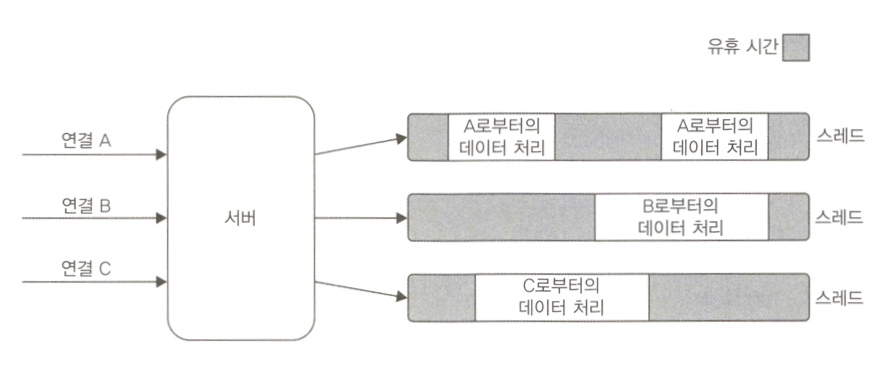
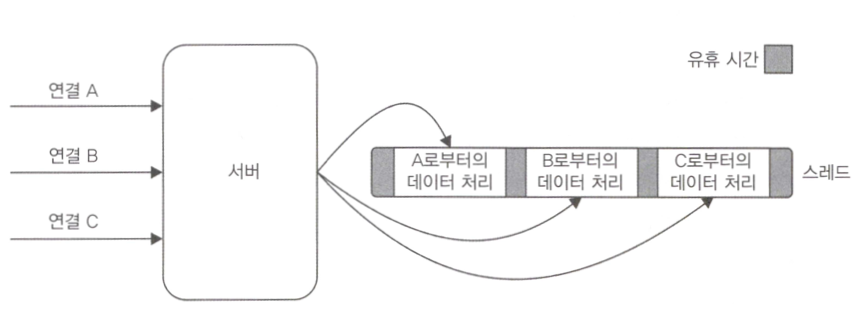
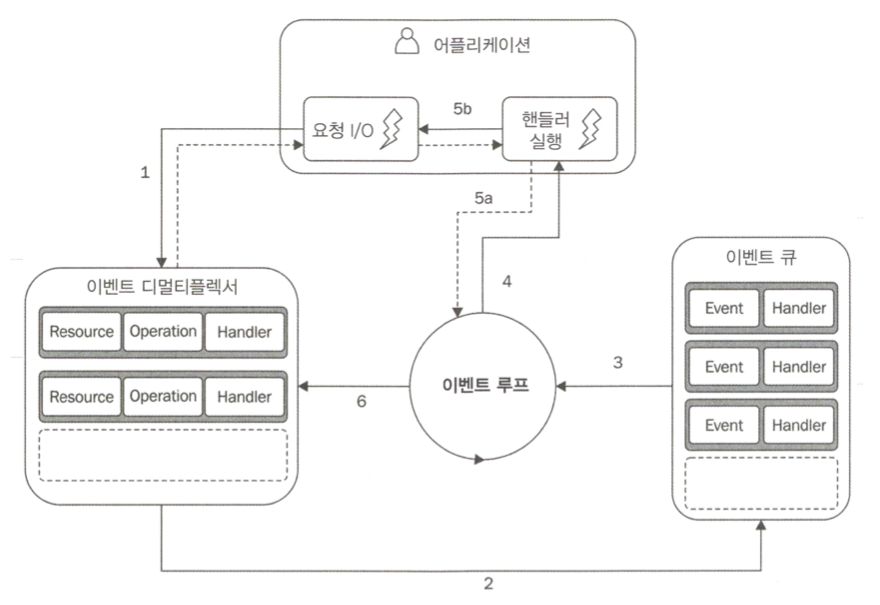
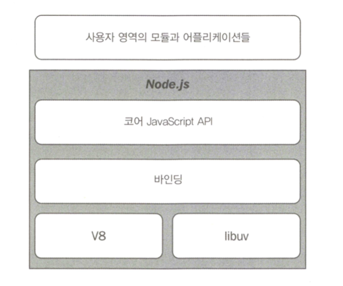

# Node.js 플랫폼에 오신 것을 환영합니다.
## 1. Node.js 철학
### 1.1 경량 코어
코어를 최소의 기능 세트로 하고 나머지를 사용자 영역으로 두어 핵심 모듈의 바깥 영역 모듈들은 생태계에 맡기는 것.

싱글코어를 기본으로하고 이 외 영역은 사용자가 제어한다는 이야기인가?

### 1.2 경량 모듈
모듈 개념을 프로그램 코드를 구성하는 기본 수단으로 사용한다. 코드 크기뿐만 아니라 범위적인 면에서도 작은 모듈을 설계하는 것이 Node.js에서 가장 널리 퍼진 원칙이다.

`npm`의 도움으로 각 패키지가 고유한 별도의 일련의 의존성을 가질 수 있도록 함으로써, 프로그램 충돌 없이 많은 패키지들을 의존할 수 있게 했다.

작은 모듈을 통해 아래와 같은 장점을 갖는다.
* 이해하기 쉽고 사용하기 쉽다
* 테스트 및 유지보수가 훨씬 간단하다
* 브라우저와 완벽한 공유가 가능하다 <-?

### 1.3 작은 외부 인터페이스
모듈의 크기와 범위가 작을 뿐 아니라 최소한의 기능을 노출하는 특성을 갖고 있다. 이로 인해 API의 유용성이 향상된다는 장점을 갖는다. -> API 사용이 보다 명확해지고 잘못된 사용에 덜 노출된다.

모듈을 정의하는 가장 일반적인 패턴 -> _함수나 생성자와 같이 하나의 핵심 기능을 표현_ && 더 많은 고급 기능 및 보조 기능은 노출된 _함수나 생성자의 속성이 되도록_ 함

### 1.4 간결함과 실용주의
> KISS 원칙 "_Keep it small and simple._”, “_Keep it short and simple._", "_Keep it Simple, Stupid_"  
> 간단하고 알기 쉽게 만드는 편이 좋다.  

단순한 설계의 이점
* 구현하는데 소요되는 노력과 자원을 줄여 빠른 보급 가능
* 적응과 유지보수 및 이해가 쉬움
* 커뮤니티의 기여도 높임
* 스프트웨어 자체가 성장 및 향상 될 수 있음

이는 매우 실용적인 언어인 JavaScript에 의해 가능하며 실제로 복잡한 클래스 계층 구조를 대체하는 간단한 함수, 클로저, 및 객체 리터럴을 사용하는 것을 흔히 볼 수 있다.

막대한 노력과 많은 코드를 유지하며 완벽한 소프트웨어를 만들려고 노력하는 것보다는 합리적 수준의 복잡성을 가지고 더 빨리 작업하는 것이 큰 성공이다.

## 2. Node.js 6과 ES2015에 대한 소개
> ES6이 큰 성과를 거두었다... 이 책에서 ES6을 적극적으로 사용할 것이니 이것에 대해 알 필요가 있다는 저자의 말... Strict 모드를 사용하라...  

### 2.1 let, const
* let: 블록 스코프
 `var` 키워드의 단점으로 인해 수많은 버그와 불만이 있었고 이를 해결하기 위해 블록 스코프를 준수하는 `let` 키워드가 ES2015에 추가되었다.
* const: 바인딩된 값은 상수가 됨, 할당된 값이 상수가 되지는 않음
```javascript
const obj = {};
obj.value1 = 'value1';
```

## 3. Reactor 패턴
> Node.js의 비동기 특성의 핵심  

### 3.1 I/O는 속도가 느리다.
* RAM에 비해 디스크/네트워크 엑세스 비용은 비싼 편
* 요청을 보낸 순간부터 작업이 완료되는 순간까지 지연을 동반(블로킹 I/O)

### 3.2 블로킹 I/O
* 전통적인 블로킹 I_O 프로그래밍에서는 I_O 요청에 해당하는 함수 호출은 작업이 완료될 때까지 스레드의 실행이 차단됨(Java)
* 이를 사용하여 구현된 웹 서버(아파치/톰캣)에서 동시성을 처리하기 위해 각각의 연결에 대해 스레드 또는 프로세스를 시작하거나 스레드풀에서 스레드를 꺼내어 재사용
* 스레드는 메모리를 소비하고 컨텍스트 전환을 유발하므로 각 연결에 대해 유휴시간은 리소스 낭비로 이어진다.

```javascript
//blocks the thread until the data is available
data = socket.read();
//data is available
print(data);
```



### 3.3 논 블로킹 I/O
* 시스템 호출이 발생했을 때 데이터가 읽히거나 쓰여질때까지 기다리지 않고 항상 즉시 반환됨
* 가장 기본적인 패턴은 데이터가 반환될 때까지 루프 내에서 리소스를 폴링하는 것(busy-waiting)
* 동일 스레드에서 서로 다른 리소스 처리가 가능하지만 루프의 대부분은 사용할 수 없는 리소스를 반복하는데에 CPU를 사용한다. 폴링 알고리즘은 대부분 엄청난 양의 CPU 시간 낭비를 초래


```javascript
resources = [socketA, socketB, pipeA];
while(!resources.isEmpty()) {
  for(i = 0; i < resources.length; i++) {
    resource = resources[i];
    var data = resource.read();
    if(data === NO_DATA_AVAILABLE)
      continue;
    if(data === RESOURCE_CLOSED)
      resources.remove(i);
    else
      consumeData(data);
  }
}
```

### 3.4. 이벤트 디멀티플렉싱
* 동기 이벤트 디멀티플렉서 / 이벤트 통지 인터페이스 라고도 불림
* 감시된 일련의 리소스들로부터 들어오는 **I/O 이벤트를 수집하여 큐에 넣고** 처리할 수 있는 **새 이벤트가 있을 때까지 차단**한다.

```javascript
socketA, pipeB;
watchedList.add(socketA, FOR_READ);
watchedList.add(pipeB, FOR_READ);
while(events = demultiplexer.watch(watchedList)) {
  //event loop
  foreach(event in events) {
    data = event.resource.read();
    if(data === RESOURCE_CLOSED)
      demultiplexer.unwatch(event.resource);
    else
      consumeData(data);
  }
}
```



### 3.5. Reactor 패턴
1. 어플리케이션이 이벤트 디먹스에 작업과 핸들러(콜백)을 전달. 논 블로킹 호출
2. I/O 작업들이 완료되면 이벤트 디먹스는 이벤트를 이벤트 큐에 push
3. 이벤트 루프가 이벤트 큐에서 이벤트를 뽑아와
4. 각 이벤트에 대한 핸들러를 호출한다.
5. 핸들러 실행이 완료되면 이벤트 루프에 제어를 되돌린다.
6. 이벤트 큐 내의 모든 항목이 처리되면, 루프는 이벤트 디먹스에 블록되고 처리 가능한 이벤트가 있을 때 이 과정이 다시 트리거 된다.


> Linux에서 이벤트 디먹스 역할을 하는 kqueue.c의 poll 로직
> 
> [node/kqueue.c at master · nodejs/node · GitHub](https://github.com/nodejs/node/blob/master/deps/uv/src/unix/kqueue.c#L112)




### 3.7. Node.js 구조

