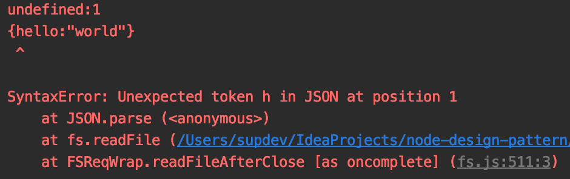
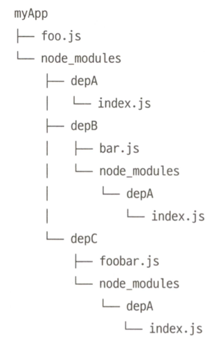
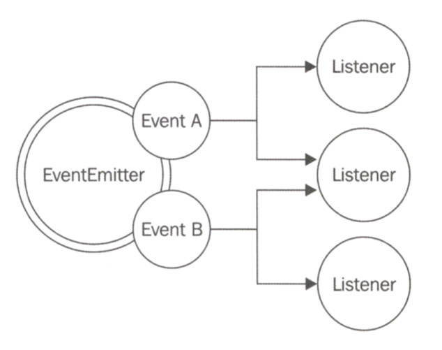

# Node.js 필수 패턴
* 비동기식 프로그래밍에서 파일 읽기 또는 네트워크 요청 수행과 같은 일부 작업들은 백그라운드 작업으로 실행된다.
* 이 작업들은 언제든 완료될 수 있다.
* 비동기 호출이 완료되면 적절한 방식으로 반응하도록 전체 어플리케이션을 프로그래밍 해야 한다.
* 이러한 논 블로킹 방식은 복잡한 제어 흐름이 필요한 고급 어플리케이션을 다룰 때 추적이나 다루기가 어려울 수 있다.
* Node.js의 일련의 도구와 디자인 패턴을 이용해 이해하기 쉽고 디버깅하기 쉬운 어플리케이션을 작성하는 것이 목표!

## 1. 콜백 패턴

### 콜백은?
* 리액터 패턴의 핸들러를 구현한 것이며 작업 결과를 전달하기 위해 호출되는 함수로 비동기 작업 시 반드시 필요하다.
* return 명령의 사용을 대신한다.
* 자바스크립트의 함수는 일급 객체로 콜백을 표현할 수 있는 훌륭한 언어이다.
* 콜백이 언제 호출되던 비동기 작업이 요청된 컨텍스트를 항상 유지할 수 있는 클로저를 활용!

### 1.1 연속 전달 방식(CPS: Continuation-Passing Style)
* 다른 함수에 인수로 전달되는 함수이며 작업이 완료되면 결과로 호출된다.

```javascript
function add(a, b) {
  return a + b;  // 직접 스타일
}
function add(a, b, callback) {
  callback(a + b);  // 동기 연속 전달 방식
}
console.log('before');
add(1, 2, result => console.log('Result: ' + result));
console.log('after');

function addAsync(a, b, callback) {
  setTimeout(() => callback(a + b), 100);   // 비동기 연속 전달 방식
}
console.log('before');
addAsync(1, 2, result => console.log('Result: ' + result));
console.log('after');
```

* 비동기 작업이 완료되면 실행은 비동기 함수에 제공된 콜백에서부터 다시 계속된다.
* 실행은 *이벤트 루프*에서 시작되기 때문에 새로운 스택을 갖는다.
* 클로저 덕분에 콜백이 다른 시점과 다른 위치에서 호출되어도 호출자 컨텍스트를 유지한다.

### 비 연속 전달 방식의 콜백
* 함수에 콜백 인자가 있으면, 함수가 비동기식이거나 연속 전달 방식 사용한다고 가정할 수 있다.
* 콜백은 배열 내의 요수를 반복하는데 사용될 뿐 연산 결과를 전달하지 않는다.
* 이러한 함수들은 콜백의 목적을 API 문서에 잘 명시해 놓는다.
```javascript
const result = [1, 5, 7].map(element => element - 1);
console.log(result); // [0. 4. 6];
```

### 1.2 동기냐? 비동기냐?
* 함수가 동기/비동기 인지에 따라 실행순서가 급격히 변화한다.
* 두 가지 패러다임르 인해 발생할 수 있는 위험에 대해 분석할 것.

```javascript
const fs = require('fs');
const cache = {};
function inconsistentRead(filename, callback) {
  if(cache[filename]) {
    // 동기적으로 호출됨
    callback(cache[filename]);
  } else {
    // 비동기적으로 호출됨
    fs.readFile(filename, 'utf8', (err, data) => {
      cache[filename] = data;
      callback(data);
    });
  }
}

function createFileReader(filename) {
  const listeners = [];
  inconsistentRead(filename, value => {
    listeners.forEach(listeners => listeners(value));
  });

  return {
    onDataReady: listeners => listeners.push(listeners)
  };
}

const reader1 = createFileReader('data.txt');
reader1.onDataReady(data => {
  console.log('First call data: ' + data);

  const reader2 = createFileReader('data.txt');
  reader2.onDataReady(data => {
    console.log('Second call data: ' + data);
  });
});
```
* 위와 같은 버그가 동시에 여러 요청이 존재할 수 있는 웹 서버에서 발생한다고 생각해봐라... 끔찍
* 결론: API의 동기 또는 비동기 특성을 명확하게 정의해라.

### 그래서 위 버그를 동기로 통일하여 고치면?

* 직접 스타일을 사용하여 동기식 API를 구현
* CPS에서 직접 스타일로 혹은 비동기에서 동기로 또는 그 반대로 API를 변경하면 API를 사용하는 모든 코드의 스타일을 변경해야 할 수도 있다.

```javascript
const fs = require('fs');
const cache = {};
function consistentReadSync(filename) {
  if(cache[filename]) {
    return cache[filename]; 
  } else {
    cache[filename] = fs.readFileSync(filename, 'utf8');
    return cache[filename]; 
  }
}
console.log(consistentReadSync('data.txt'));
console.log(consistentReadSync('data.txt'));
```

### 비동기 대신 동기 API 사용 시 주의할 점

* 특정 기능에 대해 항상 동기식 API를 사용할 수 있는 것은 아니다.
* 동기 API는 이벤트 루프를 블록하고 동시 요청을 보류하여 전체 어플리케이션 속도를 떨어뜨린다.

### 지연 실행(완전 비동기로 만들기~)

* process.nextTick()을 사용한다!
* 이벤트 루프의 다음 사이클까지 함수의 실행을 지연시킨다.
* 콜백을 인수로 취하여 대기 중인 I/O 이벤트 대기열의 앞으로 밀어 넣고 즉시 반환한다.
* setImmediate()도 있는데...
* nextTick()으로 지연된 콜백은 다른 I/O 이벤트가 발생 전에 실행되지만, setImmediate()는 이미 큐에 있는 I/O 이벤트들의 뒤에 대기한다.

```javascript
const fs = require('fs');
const cache = {};
function consistentReadAsync(filename, callback) {
  if(cache[filename]) {
    process.nextTick(() => callback(cache[filename]));
  } else {
    //asynchronous function
    fs.readFile(filename, 'utf8', (err, data) => {
      cache[filename] = data;
      callback(data);
    });
  }
}

consistentReadAsync('data.txt', (data) => {
  console.log(data);
  // the next call will read from the cache but still be async
  consistentReadAsync('data.txt', (data) => console.log(data));
});
```

```javascript
// nextTick 실행 시점 example
setTimeout(() => console.log('timeout'));
console.log('before');
process.nextTick(() => console.log('nextTIck'));
console.log('after');
let a = 1;
for (;;) {
  console.log(a++);
  if (a === 10) break;
}
setImmediate(() => console.log('immediate'));
```
nextTick을 사용하는 이유?
1. 사용자가 이벤트 루프를 계속하기 전에 오류를 처리하고 불필요한 자원을 정리하고 요청을 다시 시도할 수 있게 한다.
2. 호출 스택이 풀린 뒤에도 이벤트 루프를 계속 진행하기 전에 콜백을 실행해야 하는 경우가 있다.

### 1.3 Node.js 콜백 규칙(Convention)
1. 콜백은 맨 마지막에 - 함수 호출 가독성을 위해

    ```javascript
    fs.readFile(filename, [options], callback);
    ```

2. 오류는 맨 앞에 - CPS 함수에 의해 생성된 오류는 항상 콜백의 첫 번째 인수
    * 에러는 항상 체크하는 것이 좋다.
    * 오류는 항상 Error type 이어야 한다.

    ```javascript
    fs.readFile('foo.txt', 'utf8', (err, data) => {
      if (err) handleError(err);
      else processData(data);
    })
    ```

3. 오류 전파

    ```javascript
    const fs = require('fs');
    function readJSON(filename, callback) {
      fs.readFile(filename, 'utf8', (err, data) => {
        let parsed;
        if(err) // 오류를 전달하고 현재 함수를 종료
          return callback(err);
    
        try {
          parsed = JSON.parse(data);
        } catch(err) {
          // 에러를 catch
          return callback(err);
        }
        // 에러가 없다면 데이터 전달
        callback(null, parsed);
      });
    }
    
    let cb = (err, data) => {
      if (err) {
        return console.error(err);
      }
      console.log(data)
    };
    readJSON('valid_json.json', cb); // dumps the content
    readJSON('invalid_json.json', cb); // prints error (SyntaxError)
    ```
   
4. 캐치되지 않은 예외
    * 비동기 콜백 내부에서 예외 발생 시 이벤트 루프로 이동하여 다음 콜백으로 전파되지 않음
    * 어플리케이션은 종료되고 stderr 인터페이스를 통해 오류를 출력한다.
    
    ```javascript
    function readJSON(filename, callback) {
      fs.readFile(filename, 'utf8', (err, data) => {
        if(err)
          return callback(err);
    
        callback(null, JSON.parse(data));
      });
    }
    readJSON('invalid_json.json', err => console.log(err));
    ```
   
    ```javascript
    function readFileAfterClose(err) {
     var context = this.context;
     var buffer = null;
     var callback = context.callback;
    
     if (context.err || err)
       return callback(context.err || err);
    
     try {
       if (context.size === 0)
         buffer = Buffer.concat(context.buffers, context.pos);
       else if (context.pos < context.size)
         buffer = context.buffer.slice(0, context.pos);
       else
         buffer = context.buffer;
    
       if (context.encoding)
         buffer = buffer.toString(context.encoding);
     } catch (err) {
       return callback(err);
     }
    
     callback(null, buffer);
    }
    ```
   
    * 블록이 동작하는 스택이 콜백이 호출된 스택과 다르기 때문에 동작하지 않는다.
    ```javascript
    try {
      readJSON('invalid_json.json', err => console.log(err)); // prints error (SyntaxError)
    } catch (e) {
      console.log('Error!');
    }
    ```
    
    
    * 어플리케이션이 중단되기 전 자원을 정리하거나 로그를 남길 수는 있다.
    * 어플리케이션의 일관성을 보장할 수 없는 상태로 만듦으로 실제 운영 환경에서는 어플리케이션을 종료하는 것이 좋겠다.
    ```javascript
    process.on('uncaughtException', (err) => {
      console.error(`This will catch at last the JSON parsing exception: ${err.message}`);
      process.exit(1);
    })
    ```
   
## 2. 모듈 시스템과 그 패턴
모듈은 복잡한 어플리케이션을 구성하기 위한 블록 역할을 하기도 하지만, 캡슐화의 역할도! 

### 2.1 노출식 모듈 패턴
* 전역 범위에서 실행되는 프로그램은 어플리케이션의 종속된 라이브러리 코드의 데이터들로 충돌 발생 가능
* 이 문제를 해결하기 위한 보편적인 기

```javascript
const mod = (() => {
  const privateFoo = () => {};
  const privateBar = [];

  const exported = {
    publicFoo: () => {},
    publicBar: () => {}
  };
  return exported;
})();
console.log(mod);
```

### 2.2 Node.js 모듈 설명

### 직접 만드는 모듈 로더
```javascript
function loadModule(filename, module, require) {
  const wrappedSrc =
    `(function(module, exports, require) {
      ${fs.readFileSync(filename, 'utf8')}
    })(module, module.exports, require);`;
  eval(wrappedSrc); // 예제를 위함. 실제 어플리케이션은 이렇게 동작 안함!
}
const require = (moduleName) => {
  const id = require.resolve(moduleName);      //[1] id라 불리는 모듈의 경로 추출
  if(require.cache[id]) {           //[2]
    return require.cache[id].exports;
  }
  // 모듈 메타데이터
  const module = {               //[3]
    exports: {},
    id: id
  };
  // 캐시 갱신
  require.cache[id] = module;           //[4]

  // 모듈 로드
  loadModule(id, module, require);         //[5]

  // export 된 변수들 반환
  return module.exports;             //[6]
};
``` 

### module.exports 와 exports
* 변수 exports는 module.exports의 초기 값에 대한 참조일 뿐.
```javascript
exports.hello = () => {     // 이건 가능
  console.log('Hello');
}

exports = () => {           // 이건 잘못 된 것
  console.log('Hello');
}

module.exports = () => {    // 이렇게 해야 함
  console.log('Hello');
}

/*
{ hello: [Function] }
{}
[Function]
*/
```

### require 함수는 동기적이다.
* 이렇게 짜지 말아라.
* 원래 Node.js는 비동기 버전의 require()를 사용했으나 과도한 복잡성으로 인해 곧 제거되었다.
```javascript
setTimeout(() => {
  module.exports = function() {...};
});
```

### 해결(resolving) 알고리즘
https://nodejs.org/api/modules.html#modules_all_together
* 의존성 지옥! 공통된 라이브러리를 사용하지만 서로 다른 버전을 필요로 하는 상황
* Node.js는 모듈이 로드되는 위치에 따라 다른 버전의 모듈을 로드할 수 있음

resolving 알고리즘은 크게 세가지로 나눌 수 있다.
1. 파일 모듈
    1. moduleName이 '/'로 시작하면 모듈에 대한 절대 경로로 간주하여 그대로 반환
    2. ./로 시작하면 상대경로로 간주되어 요청한 모듈로부터 시작하여 계산됨
2. 코어 모듈
    * moduleName이 '/' 또는 './'로 시작하지 않으면 알고리즘은 먼저 코어 Node.js 모듈 내에서 검색을 시도
3. 패키지 모듈
    * moduleName과 일치하는 코어 모듈이 없는 경우, 요청 모듈의 경로에서 시작하여 디렉터리 구조를 탐색하여 올라가면서 node_modules 디렉터리를 찾고 그 안에서 일치하는 모듈 찾기를 계속한다.
    * 알고리즘은 파일 시스템의 루트에 도달할 때까지 디렉터리 트리를 올라가면서 다음 node_modules 디렉터리를 탐색하여 계속 일치하는 모듈을 찾는다.


### 모듈 캐시
* require()에서의 중복 호출은 단순히 캐시된 버전을 반환하기 때문에 각 모듈은 처음 로드될 때맏 로드되고 평가된다.
* 성능 외에도 다음과 같은 기능적인 영향을 가짐
    * 모듈 의존성 내에서 순환을 가질 수 있다.
    * 일정한 패키지 내에서 동일한 모듈이 필요할 때는 어느 정도 동일한 인스턴스가 반환된다는 것을 보장한다.
    
* 모듈 캐시는 require.cache 변수를 통해 외부에 노출되므로 필요한 경우 직접 액세스 가능(변수 관련 키를 삭제하여 캐시를 무효화 하는 것이 일반적인 사용)

### 순환 의존성
* 모듈 내부에서 모듈 로드 시 어떤 모듈이 먼저 로딩되는지를 놓치게 되면 매우 불분명한 문제가 될 수 있음
```javascript
// Module a.js
exports.loaded = false;
const b = require('./b');
module.exports = { 
  bWasLoaded: b.loaded, 
  loaded: true
};

// Module b.js
exports.loaded = false;
const a = require('./a');
module.exports = { 
  aWasLoaded: a.loaded,
  loaded: true
};

const a = require('./a');
const b = require('./b');   // cache 된 b를 가져온다.
console.log(a);
console.log(b);
```

### 2.3 모듈 정의 패턴
* exports 지정하기
    ```javascript
    // logger.js
    exports.info = (message) => {    
      console.log(`info: ${message}`);
    };
    exports.info = (message) => {    
      console.log(`verbose: ${message}`);
    };
  
    // main.js
    const logger = require('./logger');
    logger.info('info');
    logger.verbose('verbose');
    ```
* 함수 내보내기
    * Node.js의 모듈은 단일 책임의 원칙(Single Responsibility Principle)을 지킬 것을 강력히 권장함
    * substack 패턴: 하나의 함수만 내보내 모듈의 핵심 기능을 노출, 익스포트된 함수를 네임스페이스로 하여 보조 기능을 노출
    ```javascript
    // logger.js
    module.exports = (message) => {
      console.log(`info: ${message}`);
    };
    // 익스포트된 함수를 다른 public API의 네임스페이스로 제공
    module.exports.verbose = (message) => {
      console.log(`verbose: ${message}`);
    };
  
    // main.js
    const logger = require('./logger');
    logger('info');
    logger.verbose('verbose');
    ```
* 생성자 익스포트
    * subtask 패턴보다 더 많은 모듈의 내부를 노출하지만 기능 확장에 있어 강력할 수 있음
    ```javascript
    // logger.js
    function Logger(name) {
      this.name = name;
    }
    Logger.prototype.log = function(message) {
      console.log(`[${this.name}] ${message}`);
    };
    Logger.prototype.info = function(message) {
      console.log(`info: ${message}`);
    };
    Logger.prototype.verbose = function(message) {
      console.log(`verbose: ${message}`);
    };
    module.exports = Logger;
  
    // main.js
    const Logger = require('./logger');
    const dbLogger = new Logger('DB');
    dbLogger.info('info');
    const accessLogger = new Logger('ACCESS');
    accessLogger.verbose('verbose');
  
    // ES2015 class
    class Logger {
      constructor(name) {
        this.name = name;
      }
      log(message) {
        console.log(`[${this.name}] ${message}`);
      }
      info(message) {
        console.log(`info: ${message}`);
      }
      verbose(message) {
        console.log(`verbose: ${message}`);
      }
    }
    module.exports = Logger;
    ```
    * 모듈을 팩토리로 사용
    ```javascript
    function Logger(name) {
      if(!(this instanceof Logger)) {
        return new Logger(name);
      }
      this.name = name;
    }
  
    // main.js
    const Logger = require('./logger');
    const dbLogger = Logger('DB');
    dbLogger.verbose('verbose');
    ```
    * new.target을 이용한 보호자(guard(?)) 구현 - Node.js version 6부터
    ```javascript
    function Logger(name) {
      if(!new.target) {
        return new LoggerConstructor(name);
      }
      this.name = name;
    }
    ```
* 인스턴스 익스포트 하기
    * require()는 캐싱을 사용하여 생성자나 팩토리를 통해 모듈을 생성하므로 서로 다른 모듈 간에 공유할 수 있는 상태 저장(stateful) 인스턴스를 쉽게 정의할 수 있다.
    * 모듈이 캐시되기 때문에 logger 모듈을 사용하는 모든 모듈들은 실제로 항상 동일한 객체의 인스턴스를 가져와 상태를 공유한다.
    * 싱글톤과 유사하지만 싱글톤처럼 전체 어플리케이션에서 인스턴스의 고유성을 보장하지는 않는다. 
    ```javascript
    function Logger(name) {
      this.count = 0;
      this.name = name;
    }
    Logger.prototype.log = function(message) {
      this.count++;
      console.log(`[${this.name}] ${message}`);
    };
    module.exports = new Logger('DEFAULT');
    
    // main.js
    const logger = require('./logger');
    logger.log('info');
    ```
    * 생성자를 통해 동일한 객체의 새 인스턴스를 만들거나 필요에 따라 확장할 수도 있다.
    ```javascript
    module.exports.Logger = Logger;
  
    // main.js
    const customLogger = new logger.Logger('CUSTOM');
    customLogger.log('info');
    ```
* 다른 모듈 혹은 글로벌 스코프 수정
    * 모듈이 전영 범위의 다른 모듈이나 객체를 수정할 수 있다. 이를 몽키 패치(monkey patching)라고도 한다.
    * 일반적으로 런타임 시 기존 객체를 수정하거나 동작을 변현, 임시 수정을 적용하는 관행을 말한다.
    ```javascript
    // patcher.js
    
    // ./logger는 다른 모듈
    require('./logger').customMessage = () => console.log('custom');
    
    // main.js
    require('./patcher');
    const logger = require('./logger');
    logger.customMessage();
    ```
    * 실제 적용하기에 위험한 기술들이므로 알고만 있어라?

## 3. 관찰자 패턴
* 상태 변화가 일어날 때 관찰자(or Listener)에게 알릴 수 있는 객체(Subject)를 정의하는 것이다.
* 콜백 패턴과의 가장 큰 차이점은 Subject가 실제로 여러 관찰자(Observer)들에게 알릴 수 있다는 점


### 3.1 EventEmitter 클래스
* EventEmitter 클래스를 사용해 특정 유형의 이벤트가 발생되면 호출될 하나 이상의 함수를 Listener로 등록할 수 있다.
```javascript
const EventEmitter = require('events').EventEmitter;
const eeInstance = new EventEmitter();
```

* EventEmitter의 필수 메서드
    * 아래 모든 메서드들을 연결(chaining)할 수 있도록 EventEmitter 인스턴스를 반환한다.
1. on(event, listener): event에 listener를 등록
2. once(event, listener): 첫 이벤트 전달 후 제거되는 listener 등록
3. emit(event, [arg1], [...]): 새 이벤트를 생성하고 listener에게 전달할 추가 인자들을 지원
4. removeListener(event, listener): 지정된 event에 대한 listener 제거

### 3.2 EventEmitter 생성 및 사용
```javascript
const EventEmitter = require('events').EventEmitter;
const fs = require('fs');

function findPattern(files, regex) {
  const emitter = new EventEmitter();
  files.forEach(function(file) {
    fs.readFile(file, 'utf8', (err, content) => {
      if(err)
        return emitter.emit('error', err);
      
      emitter.emit('fileread', file);
      let match;
      if(match = content.match(regex))
        match.forEach(elem => emitter.emit('found', file, elem));
    });
  });
  return emitter;
}

findPattern(
    ['fileA.txt', 'fileB.json'],
    /hello \w+/g
  )
  .on('fileread', file => console.log(file + ' was read'))
  .on('found', (file, match) => console.log('Matched "' + match + '" in file ' + file))
  .on('error', err => console.log('Error emitted: ' + err.message));
```

### 3.3 오류 전파
* 콜백과 같이 에러 처리가 필요하다.

### 3.4 관찰 가능한 객체 만들기
* EventEmitter를 상속하여 구현
* HTTP 모듈인 Server 객체는 listen(), close(), setTimeout()과 같은 메서드를 정의하며 내부적으로 EventEmitter 함수에서 상속받는다.
* 새로운 요청이 수신될 때 request 이벤ㅌ, 새로운 연결 설정 시 connection 이벤트 그리고 서버가 닫히면 closed 이벤트가 생성된다.
```javascript
const EventEmitter = require('events').EventEmitter;
const fs = require('fs');

class FindPattern extends EventEmitter {
  constructor (regex) {
    super();
    this.regex = regex;
    this.files = [];
  }

  addFile (file) {
    this.files.push(file);
    return this;
  }

  find () {
    this.files.forEach( file => {
      fs.readFile(file, 'utf8', (err, content) => {
        if (err) {
          return this.emit('error', err);
        }

        this.emit('fileread', file);

        let match;
        if (match = content.match(this.regex)) {
          match.forEach(elem => this.emit('found', file, elem));
        }
      });
    });
    return this;
  }
}

const findPatternObject = new FindPattern(/hello \w+/);
findPatternObject
  .addFile('fileA.txt')
  .addFile('fileB.json')
  .find()
  .on('found', (file, match) => console.log(`Matched "${match}" in file ${file}`))
  .on('error', err => console.log(`Error emitted ${err.message}`));
```

### 3.5 동기 및 비동기 이벤트
* event를 동기적으로 발생시키려면 EventEmitter 함수가 이벤트를 emit 전에 모든 리스너가 등록되어 있어야 한다.
```javascript
const EventEmitter = require('events').EventEmitter;

class SyncEmit extends EventEmitter {
  constructor() {
    super();
    this.emit('ready');
  }
}

const syncEmit = new SyncEmit();
syncEmit.on('ready', () => console.log('Object is ready to be used'));
```

### 3.6 EventEmitter vs 콜백
* 결과가 비동기 방식으로 반환되어야 하는 경우 콜백을 사용, 작업의 성공 여부와 상관 없이 정확히 한 번 호출됨
* 일어난 무엇인가를 전달할 필요가 있을 때 이벤트를 사용, 동일 이벤트가 여러 번 발생할 수 있고 전혀 발생하지 않을 수도 있음
```javascript
const EventEmitter = require('events').EventEmitter;

// 이것은 기능면에서는 동일한 코드...
function helloEvents(){ // 이벤트를 사용하여 타임아웃이 되었음을 알림
  const eventEmitter = new EventEmitter();
  setTimeout(() => eventEmitter.emit('hello', 'hello world'), 100);
  return eventEmitter;
}

function helloCallback(callback) {  // 호출자에게 콜백을 사용하여 통지하며 내용을 인자로 전달
  setTimeout(() => callback('hello world'), 100);
}

helloEvents().on('hello', (message) => console.log(message));
helloCallback((message) => console.log(message));
```

### 3.7 콜백과 EventEmitter의 결합
* 콜백을 받아들이고 EventEmitter를 반환하는 함수를 만듦으로써 두가지 토끼를 다 잡았돠?
```javascript
const glob = require('glob');

glob('data/*.txt', (error, files) => console.log(`All files found: ${JSON.stringify(files)}`))
  .on('match', match => console.log(`Match found: ${match}`))
;
```
