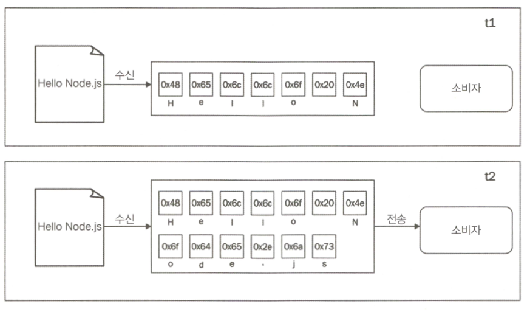
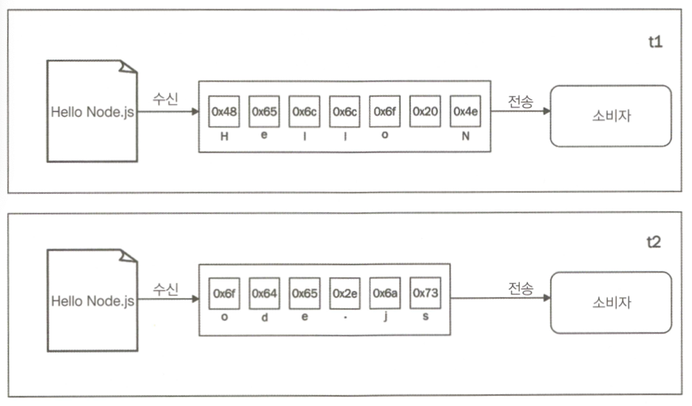
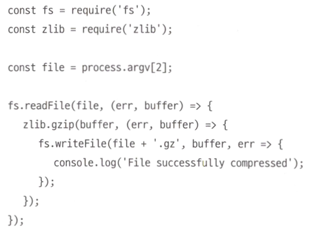
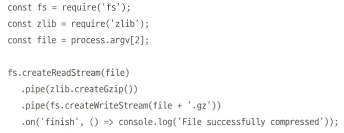
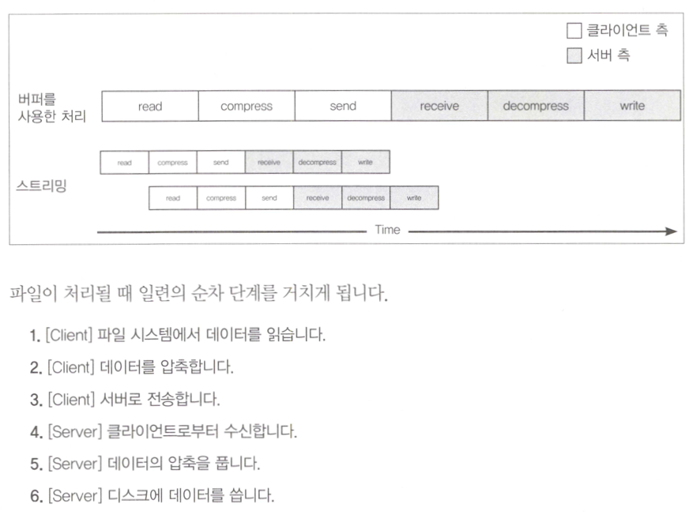
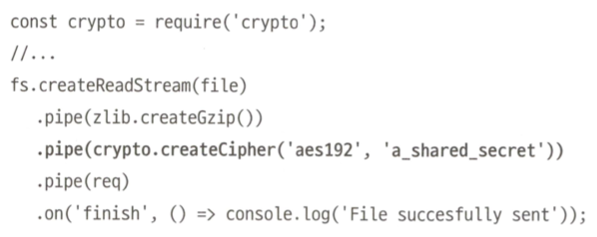
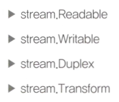

# 스트림 코딩

## 1. 스트림의 중요성

### 1.1 버퍼링 대 스트리밍

**<버퍼링>**



**<스트리밍>**



### 1.2 공간 효율성
* 모든 크기의 파일에 대해 프로그램이 이상적으로 일정한 메모리 사용률을 가지고 실행된다.

**<버퍼링>**



**<스트리밍>**



### 1.3 시간 효율성
* 스트림을 사용하면 모든 데이터를 한꺼번에 읽고 처리하기 위해 시간을 낭비하지 않으므로 전체 프로세스의 시간이 단축된다.



* 스트림 사용시 전체 파일을 읽을때까지 기다리지 않고 첫 번째 데이터 덩어리를 수신하자마자 조립 라인이 시작된다.
* 조립 라인이 병렬로 처리되기 때문에 데이터의 다음 덩어리가 사용 가능한 상태가 될 때, 이전 작업들이 완료될때까지 기다릴 필요가 없다.

### 1.4 결합성
* 스트림은 I/O를 다루는 것뿐만 아니라 코드를 단순화하고 모듈화하는 수단으로 사용되기도 한다.



## 2. 스트림 시작하기

### 2.1 스트림의 구조
* createReadStream(), createWriteStream() 그리고 HTTP request 및 response 객체는 기본적으로 스트림이다.



* 노드에서 모든 스트림은 스트림의 코어 모듈에서 사용할 수 있는 네가지 추상 클래스 중 하나의 구현체이다.

### 2.2 Readable 스트림
* Readableabstract 클래스를 사용하여 구현된다.
* Readable 스트림의 데이터 수신 방법은 `non-flowing`, `flowing` 이렇게 두 가지가 있다.

> non-flowing 모드

* readable 이벤트에 listener를 등록
* read()로 버퍼에서 동기식으로 꺼낸다.
* java에서 scanner.readLine()와 유사하게 동작한다. 엔터 치면 readable 신호로 간주하는 듯

```javascript
process.stdin
    .on('readable',() =>{
        let chunk;
        console.log('New data available');
        while((chunk = process.stdin.read()) !== null){
            console.log(`Chunk read: (${chunk.length}) "${chunk.toString()}"`);
        }
    })
    .on('end', () => process.stdout.write('End of stream'));
```

```
/* 실행 결과 */
hello world!
New data available
Chunk read: (13) "hello world!
"
```

> flowing 모드

* data 이벤트에 리스너를 등록
* read()를 사용해 꺼내지 않고 데이터가 도착하자마자 해당 리스너에 전달됨

```javascript
process.stdin
    .on('data', chunk => {
        console.log('New data available');
        console.log(
            `Chunk read: (${chunk.length}) "${chunk.toString()}"`
        );
    })
    .on('end', () => process.stdout.write('End of stream'));
```

실행 결과는 같음

> Readable 스트림 구현하기

* stream.Readable의 prototype을 상속한 클래스를 만들어야 한다.

```javascript
const stream = require('stream');
const Chance = require('chance');
const chance = new Chance();

class RandomStream extends stream.Readable {
    constructor(options) {
        super(options);
    }

    _read(size) {
        const chunk = chance.string();
        console.log(`Pushing chunk of size: ${chunk.length}`);
        this.push(chunk, 'utf8');
        if (chance.bool({likelihood: 5})) {
            this.push(null);
        }
    }
}
module.exports = RandomStream;
```

```javascript
"use strict";

const RandomStream = require('./randomStream');
const randomStream = new RandomStream();

randomStream.on('readable', () => {
    let chunk;
    while ((chunk = randomStream.read()) !== null) {
        console.log(`Chunk received: ${chunk.toString()}`);
    }
})
```

### 2.3 Writable 스트림
```javascript
"use strict";

const Chance = require('chance');
const chance = new Chance();

require('http').createServer((req, res) => {
  res.writeHead(200, {'Content-Type': 'text/plain'});
  while(chance.bool({likelihood: 95})) {	# 95% 확률로 true를 반환
    res.write(chance.string() + '\n');
  }
  res.end('\nThe end...\n');
  res.on('finish', () => console.log('All data was sent'));
}).listen(8080, () => console.log('Listening on http://localhost:8080'));
```

### 백프레셔

* 스트림이 소비하는 것 보다 데이터가 빠르게 쓰여질 경우 병목현상이 발생할 수 있음
* 이를 해결하기 위한 메커니즘으로 데이터를 버퍼링하는 것
* Writable 스트림의 속성인 highWatermark는 내부 버퍼 크기 제한으로 이 제한을 초과하면 writable.write()가 false를 반환 이 때는 더 이상 데이터를 쓰지 말아야한다.
* 버퍼가 비워지면 drain 이벤트가 발생하여 데이터를 다시 쓰게 할 수 있다.

```javascript
"use strict";

const Chance = require('chance');
const chance = new Chance();

require('http').createServer((req, res) => {
  res.writeHead(200, {'Content-Type': 'text/plain'});

  function generateMore() {             //[1]
    while(chance.bool({likelihood: 95})) {
      let shouldContinue = res.write(
        chance.string({length: (16 * 1024) - 1})     //[2]
    );
      if(!shouldContinue) {             //[3]
        console.log('Backpressure');
        return res.once('drain', generateMore);
      }
    }
    res.end('\nThe end...\n',() => console.log('All data was sent'));
  }
  generateMore();
}).listen(8080, () => console.log('Listening on http://localhost:8080'));
```

### Writable 구현하기

```javascript
"use strict";

const stream = require('stream');
const fs = require('fs');
const path = require('path');
const mkdirp = require('mkdirp');

class ToFileStream extends stream.Writable {
  constructor() {
    super({objectMode: true});
  }

  _write (chunk, encoding, callback) {
    mkdirp(path.dirname(chunk.path), err => {
      if (err) {
        return callback(err);
      }
      fs.writeFile(chunk.path, chunk.content, callback);
    });
  }
}
module.exports = ToFileStream;
```

### 2.4 양방향(Duplex) 스트림

* Readable과 Writable 모두가 가능한 스트림
* 소켓처럼 데이터 소스와 데이터 목적지를 모두 가지는 항목을 다룰 때 유용하다.
* 커스텀 양방향 스트림을 생성하려면 _read()와 _write()를 구현하면 된다.

### 2.5 Transform 스트림
* 양방향 스트림에서 중간에 데이터를 변형할 수 있는 것
* 새로운 Transform 스트림을 구현할 때는 transform()과 _flush 메소드를 추가로 작성해야한다.

```javascript
"use strict";

const stream = require('stream');
const util = require('util');

class ReplaceStream extends stream.Transform {
  constructor(searchString, replaceString) {
    super();
    this.searchString = searchString;
    this.replaceString = replaceString;
    this.tailPiece = '';
  }

  _transform(chunk, encoding, callback) {
    const pieces = (this.tailPiece + chunk)         //[1]
      .split(this.searchString);
    const lastPiece = pieces[pieces.length - 1];
    const tailPieceLen = this.searchString.length - 1;

    this.tailPiece = lastPiece.slice(-tailPieceLen);     //[2]
    pieces[pieces.length - 1] = lastPiece.slice(0,-tailPieceLen);

    this.push(pieces.join(this.replaceString));       //[3]
    callback();
  }

  _flush(callback) {
    this.push(this.tailPiece);
    callback();
  }
}

module.exports = ReplaceStream;
```

### 파이프를 통한 스트림 연결

* pipe() 메서드는 readable 스트림에서 만들어진 데이터를 취하여 주어진 write 스트림으로 보내준다.
* readable 스트림이 end 이벤트를 전달하면 writable 스트림은 종료된다.

```javascript
"use strict";

const ReplaceStream = require('./replaceStream');
process.stdin
  .pipe(new ReplaceStream(process.argv[2], process.argv[3]))
  .pipe(process.stdout);
```

### 스트림 작업을 위한 Through & from

`const transform = through2 ([options], [_transform], [_flush])`

`const readable = from2 ([options], _read)`

## 3. 스트림을 사용한 비동기 제어 흐름

* 스트림을 활용하여 비동기식 제어 흐름(control flow)를 흐름 제어(flow control)로 전환할 수 있다.
* 제어 흐름과 흐름 제어..?
* 제어 흐름: 프로그램이 실행 중일 때 함수 호출, 명령문이 실행되거나 평가되는 순서
* 흐름 제어: 통신 장치와의 데이터 흐름의 차이를 보완하는 메커니즘 또는 코드
* 송신 컴퓨터가 수신 컴퓨터보다 빠르기 때문에 데이터 통신 흐름 제어가 필요하다.
* 데이터를 너무 빨리 보내면 오류가 발생하거나 데이터가 손실되기 때문

### 3.1 순차 실행