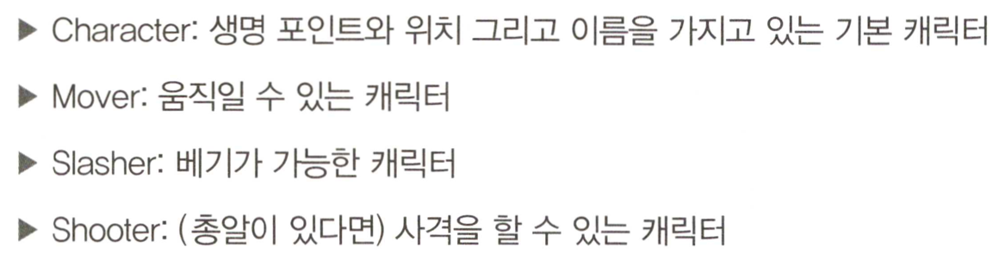
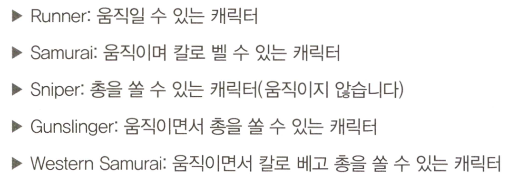
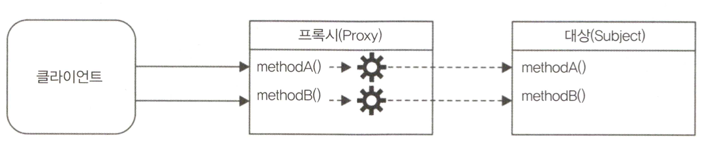
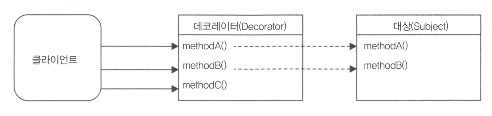
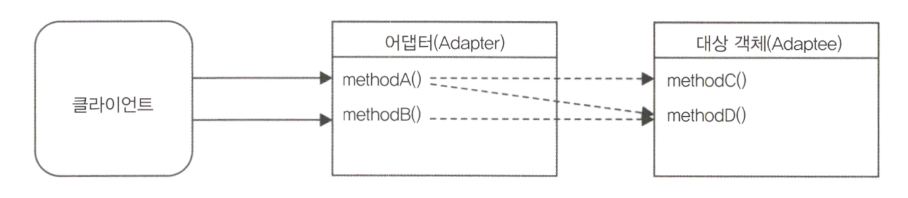
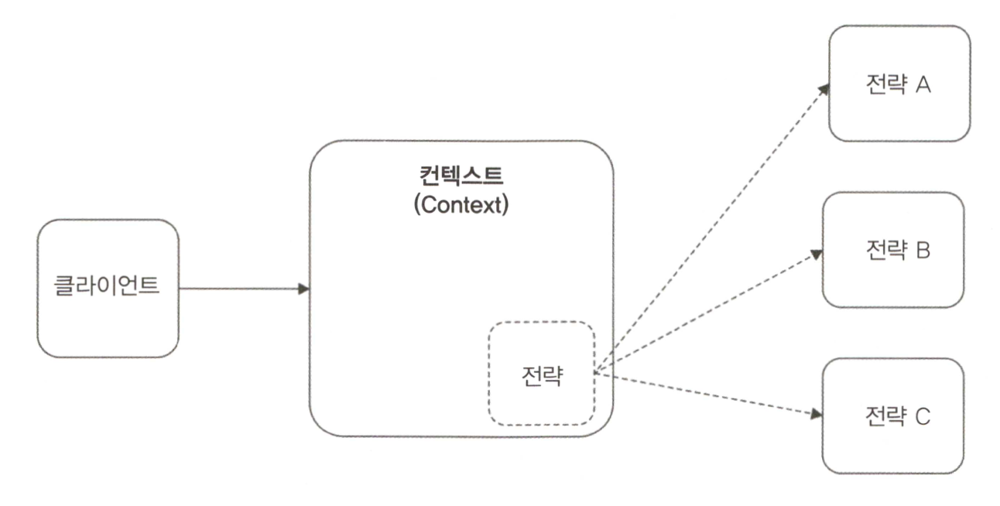

# 디자인 패턴
* GoF 디자인패턴을 참조하였다.
* 사실 JS에 객체지향 디자인 패턴을 적용하는건 Java 에서 처럼 선형적, 정석적이지 않다.
* 하지만 각 패턴에 기반한 아이디어, 해결 해야 할 문제 그리고 해결책의 핵심에 있는 개념은 변하지 않는다.

## 1. 팩토리(Factory)
### 1.1 객체를 생성하기 위한 제너릭 인터페이스
* 인스턴스 생성 시 new or Object.create()를 사용하는 대신 팩토리를 호출하면 여러 면에서 편리하고 유연하다.
* 객체 생성을 구현과 분리할 수 있다. - 팩토리 소비자는 인스턴스 새엇ㅇ이 수행되는 방법에 대해서는 전적으로 알 필요가 없다.
```javascript
function createImage(name) {
  return new Image(name);
}
const image = createImage('photo.jpeg');
// const image = new Image(name) : new 사용시 하나의 유형의 객체 만을 바인딩할 수 있다.

function createImage(name) {
  if(name.match(/\.jpeg$/)) {
    return new JpegImage(name);
  } else if(name.match(/\.png/)) {
    return new PngImage(name);
  }
}
```

### 1.2 캡슐화를 강제하기 위한 메커니즘 feat.Closure
* JS 에는 private 과 같은 접근 수준 지정자가 없다. 따라서 캡슐화를 위해 function scopes 와 클로저를 사용한다.
1. http://crockford.com/javascript/private.html
2. http://fitzgeraldnick.com/weblog/53/
3. https://developer.mozilla.org/en-US/docs/Archive/Add-ons/Add-on_SDK/Guides/Contributor_s_Guide/Private_Properties
```javascript
function createPerson(name) {
  const privateProperties = {};

  const person = {
    setName: name => {
      if(!name) throw new Error('A person must have a name');   // name의 입력을 강제할 수 있다.(일반 속성에서는 불가)
      privateProperties.name = name;
    },
    getName: () => {
      return privateProperties.name;
    }
  };

  person.setName(name);
  return person;
}

const person = createPerson('James Joyce');
console.log(person.getName(), person);
```

### 1.3 간단한 코드 프로파일러 작성하기
* 객체의 생성을 추상화
* 동적 타입 결정으로 온전한 객체와 mock 객체를 리턴 - duck typing 이라고도 부름
```javascript
class Profiler {
  constructor(label) {
    this.label = label;
    this.lastTime = null;
  }

  start() {
    this.lastTime = process.hrtime();
  }

  end() {
    const diff = process.hrtime(this.lastTime);
    console.log(
      `Timer "${this.label}" took ${diff[0]} seconds and ${diff[1]} nanoseconds.`
    );
  }
}

module.exports = function(label) {
  if(process.env.NODE_ENV === 'development') {
    return new Profiler(label);        //[1]
  } else if(process.env.NODE_ENV === 'production') {
    return {             //[2]
      start: function() {},
      end: function() {}
    }
  } else {
    throw new Error('Must set NODE_ENV');
  }
};

// profilerTest.js
const profiler = require('./profiler');

function getRandomArray(len) {
  const p = profiler(`Generating a ${len} items long array`);
  p.start();
  const arr = [];
  for (let i = 0; i < len; i++) {
    arr.push(Math.random());
  }
  p.end();
}

getRandomArray(1e6);
console.log('Done');

/*
Timer "Generating a 1000000 items long array" took 0 seconds and 38784023 nanoseconds.
Done
*/
```

### 1.4 합성 가능한(Composable) 패곹리 함수
* 복잡한 클래스 계층 구조를 만들지 않고 다양한 소스에서 동작하며 속성을 상속하는 객체를 만들 때 유용하다.

**기본 능력(?)**


**능력들을 조합하여 만들 것**


* stampit: 합성 가능한 팩토리 함수를 정의할 수 있도록 하는 라이브러리
```javascript
const stampit = require('stampit');

const character = stampit().
  props({
    name: 'anonymous',
    lifePoints: 100,
    x: 0,
    y: 0
  })
;

const mover = stampit().
  methods({
    move(xIncr, yIncr) {
      this.x += xIncr;
      this.y += yIncr;
      console.log(`${this.name} moved to [${this.x}, ${this.y}]`);
    }
  })
;

const slasher = stampit().
  methods({
    slash(direction) {
      console.log(`${this.name} slashed to the ${direction}`);
    }
  })
;

const shooter = stampit().
  props({
      bullets: 6
  }).
  methods({
    shoot(direction) {
      if (this.bullets > 0) {
        --this.bullets;
        console.log(`${this.name} shoot to the ${direction}`);
      }
    }
  })
;

const runner = stampit.compose(character, mover);
const samurai = stampit.compose(character, mover, slasher);
const sniper = stampit.compose(character, shooter);
const gunslinger = stampit.compose(character, mover, shooter);
const westernSamurai = stampit.compose(gunslinger, samurai);

const gojiro = westernSamurai();
gojiro.name = 'Gojiro Kiryu';
gojiro.move(1,0);
gojiro.slash('left');
gojiro.shoot('right');
```

### 1.5 실전에서는 어떻게 사용되는가
1. Dnode: Node.js 용 원격 프로시저 호출(RPC) 시스템
2. Restify: REST API를 만들기 위한 프레임워크 - restify.createServer()를 통해 서버 인스턴스를 생성하는데 내부적으로는 Server 클래스의 새 인스턴스를 생성
3. http-proxy, Core Node.js HTTP 서버 등...
4. stampit과 유사한 기능의 패키지: react-stampit, redis 기반의 remitter

## 2 공개 생성자(Revealing constructor)
* Promise와 같은 일부 핵심 라이브러리에서 사용됨
```javascript
const promise = new Promise(function (resolve, reject)) {
  // ...
}
```

* Promise는 생성자의 인자로 함수를 받아들임. 이 함수를 **executor 함수** 라고 한다.
* 객체의 내부 상태를 변경할 수 있도록 resolve와 reject 함수를 외부에 노출하는 메커니즘을 제공
* 장점 - 생성자 코드만 resolve, reject에 접근할 수 있고, 프로미스 객체가 생성되면 주위에 안전하게 전달될 수 있다는 것
* 참고: https://blog.domenic.me/the-revealing-constructor-pattern/

### 2.1 읽기 전용 이벤트 이미터
* 이 이미터는 emit 메서드를 호출할 수 없는 특별한 종류의 이미터이다.
```javascript
// roee.js
const EventEmitter = require('events');

module.exports = class Roee extends EventEmitter {
  constructor (executor) {
    super();
    const emit = this.emit.bind(this);
    this.emit = undefined;
    executor(emit);
  }
};

// ticker.js
const Roee = require('./roee');

const ticker = new Roee((emit) => {
  let tickCount = 0;
  setInterval(() => emit('tick', tickCount++), 1000);
});

module.exports = ticker;

// main.js
const ticker = require('./ticker');

ticker.on('tick', (tickCount) => console.log(tickCount, 'TICK'));
// ticker.emit('something', {}); <-- 요것은 에러남
```

### 2.2 실전에서는 어떻게 사용되는가
* 프라미스 생성자
* 5장에서 ParallelStream 클래스를 구현할 때 

## 3 프록시(Proxy) -> 서로게이트(surrogate)
* 다른 객체에 대한 접근을 제어하는 객체. 다른 객체를 대상(Subject)라고 한다.
* 프록시와 대상은 동일한 인터페이스를 가지고 있다.
* 프록시는 대상(Subject)에서 실행될 작업의 전부 또는 일부를 가로채 해당 동작을 향상시키거나 보완한다.



프록시가 유용한 케이스
1. 데이터 유효성 검사: 프록시가 입력을 대상(Subject)으로 전달하기 전 유효성을 검사
2. 보안: 클라이언트가 작업을 수행할 권한이 있는지 확인하고 true일 경우만 요청을 대상(Subject)으로 전달한다.
3. 캐싱: 프록시가 내부 캐시를 유지하여 데이터가 캐시에 없는 경우만 대상(Subject)에서 작업이 실행되도록 한다.
4. 지연 초기화: 대상(Subject)의 생성 비용이 비싸다면 프록시는 그것을 필요로 할 때까지 연기할 수 있다.
5. 로깅: 메서드 호출과 상대 매개 변수를 인터셉트하고 이를 기록 - java에 filter?
6. 원격 객체: 원격 위치에 있는 객체를 가져와 로컬처럼 보이게 할 수 있다.

### 3.1 프록시 구현 기술

**오브젝트 컴포지션**

* 컴포지션은 기능을 확장하거나 사용하기 위해 객체가 다른 객체와 결합되는 기술
* 대부분의 메서드를 위임하는 프록시를 만들 때 delegate 라이브러리가 유용하다고 함
```javascript
// createProxy.js
function createProxy(subject) {
  const proto = Object.getPrototypeOf(subject);

  function Proxy(subject) {
    this.subject = subject;
  }

  Proxy.prototype = Object.create(proto);

  // 프록시된 메서드
  Proxy.prototype.hello = function(){
    return this.subject.hello() + ' world!';
  };

  // 그대로 위임된 메서드
  Proxy.prototype.goodbye = function(){
    return this.subject.goodbye
      .apply(this.subject, arguments);
  };

  return new Proxy(subject);
}
module.exports = createProxy;

// main.js
const createProxy = require('./createProxy');

class Greeter {
  hello() {
    return 'Hello';
  }

  goodbye() {
    return 'Goodbye';
  }
}

const greeter = new Greeter();
const proxy = createProxy(greeter);

console.log(proxy.hello());
console.log(proxy.goodbye());
```

```javascript
// 사실 위 예제는 아래처럼 구현해도 됨
function createProxy(subject) {
  return {
    hello: () => (subject.hello() + ' world'),
    goodbye: () => (subject.goodbye().apply(subject, arguments))
  };
}
```

**객체 증강**

* 객체 증강(또는 몽키 패치)은 객체의 개별 메서드를 프록시하는 실용적인 방법
* 메서드를 프록시된 구현체로 대체하여 직접 대상(subject)을 수정 - 장점이자 다넞ㅁ
```javascript
// createProxy.js
function createProxy(subject) {
  const helloOrig = subject.hello;
  subject.hello = () => (helloOrig.call(this) + ' world!');

  return subject;
}
module.exports = createProxy;

// main.js
const createProxy = require('./createProxy');

class Greeter {
  hello() {
    return 'Hello';
  }

  goodbye() {
    return 'Goodbye';
  }
}

const greeter = new Greeter();
const proxy = createProxy(greeter);

console.log(proxy.hello());
console.log(proxy.goodbye());
```

### 3.2 다른 기술의 비교
* 컴포지션 프록시
    * 상속을 이용 -> 모든 메서드를 수동으로 위임(delegate)해야 한다는 것이 단점
    * 대상을 필요한 경우에만 생성하기 위해 대상의 초기화를 제어해야 할 경우 사용됨
* 객체 증강 프록시
    * 대상(Subject)을 직접 수정하므로 위임과 관련된 불편함이 없다.
    * 대상을 직접 수정하는 것이 큰 문제가 되지 않는 모든 상황에서 선호됨


### 3.3 Writable 스트림 로그 작성
* Writable 스트림의 write() 메서드의 대한 모든 호출을 가로채고 메시지를 기록하는 예제 
```javascript
const fs = require('fs');

function createLoggingWritable(writableOrig) {
  const proto = Object.getPrototypeOf(writableOrig);

  function LoggingWritable(writableOrig) {
    this.writableOrig = writableOrig;
  }

  LoggingWritable.prototype = Object.create(proto);

  LoggingWritable.prototype.write = function(chunk, encoding, callback) {
    if(!callback && typeof encoding === 'function') {
      callback = encoding;
      encoding = undefined;
    }
    console.log('Writing ', chunk);
    return this.writableOrig.write(chunk, encoding, function() {
      console.log('Finished writing ', chunk);
      callback && callback();
    });
  };

  LoggingWritable.prototype.on = function() {
    return this.writableOrig.on
      .apply(this.writableOrig, arguments);
  };

  LoggingWritable.prototype.end = function() {
    return this.writableOrig.end
      .apply(this.writableOrig, arguments);
  };

  return new LoggingWritable(writableOrig);
}

const writable = fs.createWriteStream('test.txt');
const writableProxy = createLoggingWritable(writable);

writableProxy.write('First chunk');
writableProxy.write('Second chunk');
writable.write('This is not logged');
writableProxy.end();
```

### 3.4 function hooks 및 AOP
* 프록시 생성 관련 라이브러리들이 많이 볼 수 있는데 대부분 객체 증강 방식으로 구현되어있다.
* 이를 함수 후킹 / 프록시 어플리케이션의 공통 영역인 AOP라고도 한다.
* AOP에서 이러한 라이브러리는 개발자가 특정 메서드 전후에 실행 후크를 설정할 수 있도록 한다.
* 미들웨어 패턴에서 볼 수 있는 것과 같이 어떤 함수의 입력/출력 전처리와 후처리를 할 수 있기 때문에 프록시를 종종 미들웨어라고 한다.
* 프록시로 때로는 미들웨어와 유사하게 파이프라인을 사용해 동일한 메서드에 대해 여러 후크를 등록할 수도 있다.

### 3.5 ES2015 Proxy
* ES2015 에서 Proxy라는 전역 객체가 도입, 이 객체는 버전 6부터 Node.js에서 사용 가능 
* target은 대상(Subject)를 나타내며 handler는 프록시의 동작을 정의하는 특수 객체이다.
* 핸들러 객체에는 해당 작업이 프록시 인스턴스에서 수행될 때 자동으로 호출되는 트랩 메서드(ex: apply, get, set, has)라는 사전에 정의된 이름을 가진 선택적 메서드들이 존재

* 이 Proxy는 target 객체 내의 일반 속성에 대한 접근을 가로채는데, API가 단순히 프록시 객체의 생성을 용이하게 하는 단순한 래퍼가 아니라는 것을 의미.
* Javascript 언어 내에 깊이 통합된 기능으로, 이를 통해 개발자가 객체에서 수행할 수 있는 많은 작업을 가로채서 사용자 정의화할 수 있다. 
```javascript
const scientist = {
  name: 'nikola',
  surname: 'tesla'
};

const uppercaseScientist = new Proxy(scientist, {
  get: (target, property) => target[property].toUpperCase()
});

console.log(uppercaseScientist.name, uppercaseScientist.surname); // NIKOLA TESLA
```

* 모든 짝수를 포함하는 가상의 배열을 만들며(내부에 데이터를 저장하지는 않음) 이것을 정규 배열로 사용할 수 있다.
* 어떻게 동작하는거지..?
참고: https://developer.mozilla.org/ko/docs/Web/JavaScript/Reference/Global_Objects/Proxy
```javascript
const evenNumbers = new Proxy([], {
  get: (target, index) => index * 2,
  has: (target, number) => number % 2 === 0
});

console.log(2 in evenNumbers); // true
console.log(5 in evenNumbers); // false
console.log(evenNumbers[7]); // 14
```

### 3.6 실전에서 어떻게 사용되는가
* Mongoose 내부적으로 hooks 패키지를 사용하여 Documnent 객체의 init, validation, save, remove 메서드에 대한 실행 전후 후크를 제공

## 4 데코레이터(Decorator)
* 데코레이터는 기존 객체의 동작을 동적으로 증강시키는 구조적 패턴
* 동일한 클래스의 모든 객체에 추가되지 않고 명시적으로 데코레이트한 인스턴스에만 추가되기 때문에 고전적인 상속과 다르다.



### 4.1 데코레이터 구현 기법
* 프록시와 데코레이터는 서로 다른 의도를 가진 패턴이지만 구현 전략을 공유한다.

**컴포지션**
* 프록시의 컴포지션에 새로운 메서드를 추가하는 버전인 듯
```javascript
function decorate(component) {
  const proto = Object.getPrototypeOf(component);
  
  function Decorator(component) {
    this.component = component;
  }
  
  Decorator.prototype = Object.create(proto);
  
  // 새로운 메서드
  Decorator.prototype.greetings = function() {
    return 'Hi!';
  };
  
  // 위임 메서드
  Decorator.prototype.hello = function() {
    return this.component.hello.apply(this.component, arguments); 
  };
  
  return new Decorator(component);
}

class Greeter {
  hello(subject) {
    return `Hello ${subject}`;
  }
}

const decoratedGreeter = decorate(new Greeter());
console.log(decoratedGreeter.hello('world')); // 기존 메서드 사용
console.log(decoratedGreeter.greetings()); // 새로운 메서드 사용
```

**객체 증강**
* 프록시에서와 같이 객체에 직접 접근하여 새 메서드를 추가
```javascript
function decorate(component) {
  // 새로운 메서드 추가
  component.greetings = function() {
    return 'Hi!';
  };
  
  return component;
}

class Greeter {
  hello(subject) {
    return `Hello ${subject}`;
  }
}

const decoratedGreeter = decorate(new Greeter());
console.log(decoratedGreeter.hello('world')); // 기존 메서드 사용
console.log(decoratedGreeter.greetings()); // 새로운 메서드 사용
```

## 4.2 LevelUP 데이터베이스 데코레이팅
* LevelUP은 Chrome 브라우저에서 IndexedDB를 구현하기 위해 만들어진 key/value 스토리지인 Google LevelDB와 관련된 Node.js 래퍼
* LevelDB는 데이터베이스 계의 Node.js?로 정의되었다고... 모든 종류의 데이터베이스를 이 위에 구축할 수 있음

**LevelUP 플러그인 구현하기**
* 편의상 levelup, leveldown이라는 기본 어댑터를 묶은 level 패키지를 사용. 이것은 LevelDB를 백엔드로 사용
* 만들고자 하는 것: 특정 패턴으로 객체가 DB에 저장될 때 마다 알림을 받을 수 있는 플러그인 
```javascript
module.exports = function levelSubscribe(db) {
  db.subscribe = (pattern, listener) => {       //[1]
    db.on('put', (key, val) => {         //[2]
      const match = Object.keys(pattern).every(
        k => (pattern[k] === val[k])     //[3]
      );
      
      if(match) {
        listener(key, val);            //[4]
      }
    });
  };
  return db;
};

// main.js
const level = require('level');           //[1]
const levelSubscribe = require('./levelSubscribe');     //[2]

let db = level(__dirname + '/db', {valueEncoding: 'json'});

db = levelSubscribe(db);
db.subscribe(
  {doctype: 'tweet', language: 'en'},     //[3]
  (k, val) => console.log(val)
);

db.put('1', {doctype: 'tweet', text: 'Hi', language: 'en'}); //[4]
db.put('2', {doctype: 'company', name: 'ACME Co.'});
```

### 4.3 실전에서는 어떻게 사용되는가
* level-inverted-index: LevelUP DB에 역색인을 추가하는 플러그인
* level-plus: LevelUP DB에 원자적 업데이트? 를 추가하는 플러그인

## 5 어댑터(Adapter)
* 다른 인터페이스를 사용하여 객체의 함수를 액세스할 수 있다.
* 어댑터(Adapter)가 본질적으로 다른 인터페이스를 노출하는 객체(Adaptee)의 래퍼(wrapper)임을 보여준다.
* 어댑터의 동작이 대상 객체에 대한 하나 이상의 메소드 호출로 구성될 수 있음을 보여준다.



### 5.1 파일 시스템 API를 통한 LevelUP 사용
* LevelUP API로 어댑터를 구축하여 fs 모듈과 호환되는 인터페이스로 변환
* readFile(), writeFile() -> db.get(), db.put()
```javascript
const path = require('path');

module.exports = function createFsAdapter(db) {
  const fs = {};

  fs.readFile = (filename, options, callback) => {
    if (typeof options === 'function') {
      callback = options;
      options = {};
    } else if(typeof options === 'string') {
      options = {encoding: options};
    }

    db.get(path.resolve(filename), {         //[1]: filename을 키로 get db.호출(여기선 파일의 전체 경로)
        valueEncoding: options.encoding
      },
      (err, value) => {
        if(err) {
          if(err.type === 'NotFoundError') {       //[2]: 키가 발견되지 않았을 때 ENOENT(파일 없음 나타내는 fs 모듈의 에러 코드) 에러 발생
            err = new Error(`ENOENT, open "${filename}"`);
            err.code = 'ENOENT';
            err.errno = 34;
            err.path = filename;
          }
          return callback && callback(err);
        }
        callback && callback(null, value);       //[3]: get이 성공하면 콜백을 호출하여 값 반환
      }
    );
  };

  fs.writeFile = (filename, contents, options, callback) => {
    if(typeof options === 'function') {
      callback = options;
      options = {};
    } else if(typeof options === 'string') {
      options = {encoding: options};
    }

    db.put(path.resolve(filename), contents, {
      valueEncoding: options.encoding
    }, callback);
  };

  return fs;
};

// testFs.js: 기존 fs만을 사용해 실행
const fs = require('fs');

fs.writeFile('file.txt', 'Hello!', () => {
  fs.readFile('file.txt', {encoding: 'utf8'}, (err, res) => {
    console.log(res);
  });
});

//try to read a missing file
fs.readFile('missing.txt', {encoding: 'utf8'}, (err, res) => {
  console.log(err);
});

// testFsAdapter.js: 어댑터를 적용해 실행
const levelup = require('level');
const fsAdapter = require('./fsAdapter');

const db = levelup('./fsDB', {valueEncoding: 'binary'});
const fs = fsAdapter(db);

fs.writeFile('file.txt', 'Hello!', () => {
  fs.readFile('file.txt', {encoding: 'utf8'}, (err, res) => {
    console.log(res);
  });
});

//try to read a missing file
fs.readFile('missing.txt', {encoding: 'utf8'}, (err, res) => {
  console.log(err);
});
```

### 5.2 실전에서는 어떻게 사용되는가
* LevelUP이 본래의 LevelDB로부터 브라우저에서 쓸 수 있는 IndexedDB까지 다양한 저장소의 백엔드로 사용될 수 있다는 것을 알았다.
* Jugglingdb는 다중 데이터베이스 ORM이며 다양한 DB와의 호환을 위해 어댑터를 사용한다.
* 위 예제를 완벽히 구현하고 있는 패키지 level-filesystem.

## 6 전략(Strategy)
* 전략 패턴은 컨텍스트(Context)라 불리는 객체를 상호 교환 가능한 개별 전략이라는 객체들로 추출함으로써 연산 로직의 변형을 지원한다.
* 컨텍스트에 일련의 알고리즘의 공통 로직을 구현하고 개별 전략은 컨텍스트에 적용할 수 있도록 변경 가능한 부분을 구현한다. like a 기계 부품



### 6.1 다중 형식의 환경설정 객체
* DB Config 객체의 변수 부분을 전략으로 분리할 것
```javascript
const fs = require('fs');
const objectPath = require('object-path');

class Config {
  constructor(strategy) {
    this.data = {};
    this.strategy = strategy;
  }

  get(path) {
    return objectPath.get(this.data, path);
  }

  set(path, value) {
    return objectPath.set(this.data, path, value);
  }

  read(file) {
    console.log(`Deserializing from ${file}`);
    this.data = this.strategy.deserialize(fs.readFileSync(file, 'utf-8'));
  }

  save(file) {
    console.log(`Serializing to ${file}`);
    fs.writeFileSync(file, this.strategy.serialize(this.data));
  }
}

module.exports = Config;

// strategies.js
const ini = require('ini');

module.exports.json = {
  deserialize: data => JSON.parse(data),
  serialize: data => JSON.stringify(data, null, '  ')
};

module.exports.ini = {
  deserialize: data => ini.parse(data),
  serialize: data => ini.stringify(data)
};

// test.js
const Config = require('./config');
const strategies = require('./strategies');

const jsonConfig = new Config(strategies.json);
jsonConfig.read('samples/conf.json');
jsonConfig.set('book.nodejs', 'design patterns');
jsonConfig.save('samples/conf_mod.json');

const iniConfig = new Config(strategies.ini);
iniConfig.read('samples/conf.ini');
iniConfig.set('book.nodejs', 'design patterns');
iniConfig.save('samples/conf_mod.ini');
```

### 6.2 실전에서는 어떻게?
* Passport.js의 인증 과정 중 인증 단계를 분리하는데 Strategy 패턴을 사용한다.
