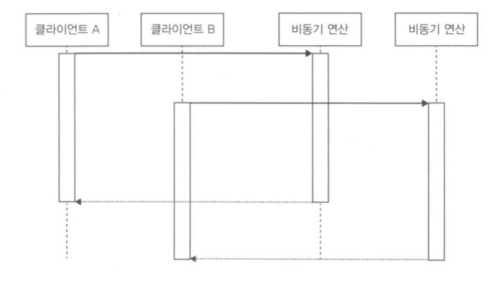
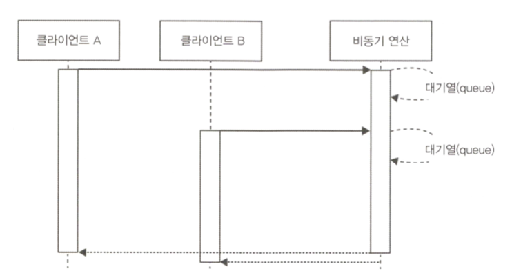
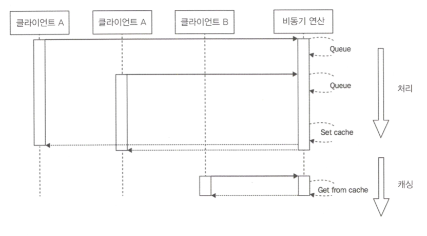

# 고급 비동기 레시피

Node.js 개발하며 직면할 수 있는 문제들을 효율적으로 해결하기 위한 몇 가지 방법을 제시

## 1. 비동기 초기화 모듈 처리
require()가 동기적으로 작동하고 module.exports를 비동기적으로 설정할 수 없다고 하였다.

그러나 핸드셰이크 프로토콜과 같이 초기화 단계에서 네트워크를 사용하는 구성 요소에 대해서는 API가 항상 동기적으로 사용되지 않을 수 있다. (이는 DB Driver, 메시지 큐와 같은 미들웨어 시스템 클라이언트를 포함한다.)

* 모듈이 초기화 되지 않은 경우(10초 동안) 에러 메세지를 출력.
* 모듈이 초기화 된 후에는 정상적인 메세지를 출력

```javascript
// asyncModule.js
const asyncModule = module.exports;

asyncModule.initialized = false;		// 초기화 flag
asyncModule.initialize = callback => {
  setTimeout(() => {
    asyncModule.initialized = true;
    callback();
  }, 10000);
};

asyncModule.tellMeSomething = callback => {
  process.nextTick(() => {
    if(!asyncModule.initialized) {		// 초기화 flag에 따라 동작 분기
      return callback(
        new Error('I don\'t have anything to say right now')	// 초기화가 되어있지 않으면 바로 에러를 던짐
      );
    }
    callback(null, 'Current time is: ' + new Date());
  });
};
```

```javascript
// routes.js
const asyncModule = require('./asyncModule');	// asyncModule 사용

module.exports.say = (req, res) => {
  asyncModule.tellMeSomething((err, something) => {
    if(err) {	// 에러 발생 시 상태 코드 500을 던지며 에러 메세지 출력
      res.writeHead(500);
      return res.end('Error:' + err.message);
    }
    res.writeHead(200);
    res.end('I say: ' + something);
  });
};
```

``` javascript
// app.js
const http = require('http');
const routes = require('./routes');
const asyncModule = require('./asyncModule');

asyncModule.initialize(() => {
  console.log('Async module initialized');
});

http.createServer((req, res) => {
  if (req.method === 'GET' && req.url === '/say') {	// 라우팅 처리 http://localhost:8000/say
    return routes.say(req, res);
  }
  res.writeHead(404);
  res.end('Not found');
}).listen(8000, () => console.log('Started'));
```

### 위 케이스를 유연하게 해결하기 위한 큐 사용

```javascript
const asyncModule = require('./asyncModule');

const asyncModuleWrapper = module.exports;
asyncModuleWrapper.initialized = false;
asyncModuleWrapper.initialize = function() {
  activeState.initialize.apply(activeState, arguments);
};

asyncModuleWrapper.tellMeSomething = function() {
  activeState.tellMeSomething.apply(activeState, arguments);
};

// 모듈이 초기화되지 않았을 때 사용되는 상태(State)
let pending = [];
let notInitializedState = {

  initialize: function(callback) {
    asyncModule.initialize(function() {
      asyncModuleWrapper.initalized = true;
      activeState = initializedState;		// 상태 교체
      
      pending.forEach(function(req) {	// 큐에 쌓여있던 메서드 실행
        asyncModule[req.method].apply(null, req.args);
      });
      pending = [];
      
      callback();
    });
  },
  
  tellMeSomething: function(callback) {	// 큐에 메서드 적재
    return pending.push({
      method: 'tellMeSomething',
      args: arguments
    });
  }
  
};

// 모듈 초기화가 완료되었을 때 사용할 상태(State)
let initializedState = asyncModule;

// 초기화 되지 않은 상태 세팅
let activeState = notInitializedState;
```

### 실제 몽구스가 이 패턴을 사용하고 있다.
DB 연결이 완료될 때 까지 기다리지 않고, 각 작업을 큐에 넣은 후 DB 연결이 완료된 후에 각 작업들을 실행한다.

## 2. 비동기 배치(일괄 처리) 및 캐싱

비동기 작업에 캐싱을 적용하는 방법과 높은 부하 처리 방법을 알아본다.

### 2.1 캐싱 또는 일괄 처리가 없는 서버 구현



모든 row의 amout를 더해 return하는 서버

```javascript
// tatalSales.js
const level = require('level');
const sublevel = require('level-sublevel');

const db = sublevel(level('example-db', {valueEncoding: 'json'}));
const salesDb = db.sublevel('sales');

module.exports = function totalSales(item, callback) {
  console.log('totalSales() invoked');
  let sum = 0;
  salesDb.createValueStream()  // Stream 생성
    .on('data', data => {
      if(!item || data.item === item) {  // item과 일치하는 부분이면 더한다.
        sum += data.amount;
      }
    })
    .on('end', () => {
      callback(null, sum);  // [3]
    });
};
```

```javascript
// app.js
const http = require('http');
const url = require('url');
const totalSales = require('./totalSales');

http.createServer((req, res) => {
  const query = url.parse(req.url, true).query;
  totalSales(query.item, (err, sum) => {
    res.writeHead(200);
    res.end(`Total sales for item ${query.item} is ${sum}`);
  });
}).listen(8000, () => console.log('Started'));
```

```javascript
const sublevel = require('level-sublevel');
const level = require('level');
const uuid = require('node-uuid');
const async = require('async');

const db = sublevel(level('example-db', {valueEncoding: 'json'}));
const salesDb = db.sublevel('sales');
const items = ['book', 'game', 'app', 'song', 'movie'];

async.times(100000, (n, callback) => {
  salesDb.put(uuid.v4(), {
    amount: Math.ceil(Math.random() * 100),
    item: items[Math.floor(Math.random() * 5)]
  }, callback);
}, err => {
  if(err) {
    return console.log(err);
  }
  console.log('DB populated');
});
```

```javascript
// loadTest.js
const request = require('request');
const http = require('http');

const start = Date.now();
let count = 20;
const interval = 200;
let completed = count;
const agent = new http.Agent();
agent.maxSockets = count;
const query = process.argv[2] ? process.argv[2] : 'item=book';
const id = setInterval(() => {
  request({
    url: 'http://localhost:8000?'+query,
    pool: agent
  },
  (err, res) => {
    if (err) return console.log(err);
    console.log(res.statusCode, res.body);
    if (!--completed) {
      console.log(`All completed in: ${Date.now() - start}ms`);
    }
  });
  if (!--count) {
    clearInterval(id);
  }
}, interval);
```

### 2.2 큐를 활용한 일괄 처리

* Queue를 통해 수행이 완료되기 이전 요청들을 모아뒀다가 완료되면 한번에 방출



```javascript
const totalSales = require('./totalSales');

const queues = {};
module.exports = function totalSalesBatch(item, callback) {
  if(queues[item]) {  // item이 queue에 이미 있으면 queue에 콜백을 추가하고 즉시 복귀
    console.log('Batching operation');
    return queues[item].push(callback);
  }
  
  queues[item] = [callback];  // 새로운 대기열을 만들고 현재 콜백 함수로 초기화 한다.
  totalSales(item, (err, res) => {
    const queue = queues[item];  // 요청이 완료되면 기존 큐를 초기화 하고 큐에 있던 콜백을 반복하여 실행
    queues[item] = null;
    queue.forEach(cb => cb(err, res));
  });
};
```

### 2.3 비동기 요청 캐싱

* 이 예제는 캐싱과 일괄 처리를 결합하여 사용하는 것이 특징
* 캐시가 아직 설정되지 않은 상태에서 효율을 발휘할 수 있다.



```javascript
const totalSales = require('./totalSales');

const queues = {};
const cache = {};

module.exports = function totalSalesBatch(item, callback) {
  const cached = cache[item];
  if (cached) {		// 캐싱 처리
    console.log('Cache hit');
    return process.nextTick(callback.bind(null, null, cached));
  }
  
  if (queues[item]) {	// 배치 처리
    console.log('Batching operation');
    return queues[item].push(callback);
  }
  
  queues[item] = [callback];
  totalSales(item, (err, res) => {
    if (!err) {
      cache[item] = res;	// 캐시 등록
      setTimeout(() => {
        delete cache[item];
      }, 30 * 1000); 		// expire time 30초
    }
    
    const queue = queues[item];
    queues[item] = null;
    queue.forEach(cb => cb(err, res));
  });
};
```

### 2.4 프라미스를 활용한 일괄처리와 캐싱

```javascript
// totalSalesPromises.js
const pify = require('pify');
const totalSales = pify(require('./totalSales')); // 콜백 대신 프로미스를 반환하는 모듈

const cache = {};
module.exports = function totalSalesPromises(item) {
  if (cache[item]) {  // 캐시가 있으면 즉시 반환
    return cache[item];
  }

  cache[item] = totalSales(item)  // 캐시에 프라미스가 없으면 totalSales를 호출하여 프라미스 생성
    .then(res => {  // 프라미스가 성공하면 캐시 세팅 후 res를 반환 -> 프라미스를 listen하고 있는 모든 then() 리스너에 전파된다.
      setTimeout(() => {delete cache[item]}, 30 * 1000); //30 seconds expiry
      return res;
    })
    .catch(err => {  // 에러 발생으로 reject시 즉시 캐시를 제거하고 오류를 던져 프라미스 체인에 전파
      delete cache[item];
      throw err;
    });
  return cache[item];  // 생성한 프라미스를 반환
};
```

```javascript
// appPromises.js
const http = require('http');
const url = require('url');
const totalSales = require('./totalSalesPromises');

http.createServer(function(req, res) {
  const query = url.parse(req.url, true).query;
  totalSales(query.item).then(function(sum) {
    res.writeHead(200);
    res.end(`Total sales for item ${query.item} is ${sum}`);
  });
}).listen(8000, function() {console.log('Started')});
```